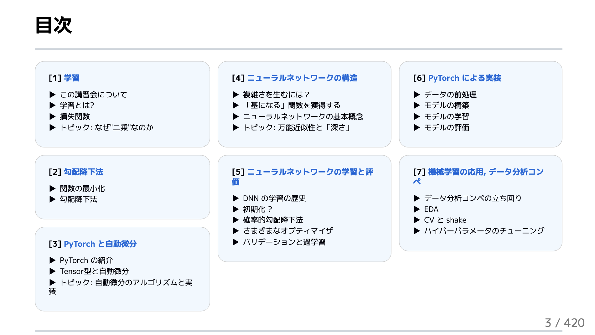

## ml-lecture

このレポジトリは、 [東京工業大学デジタル創作同好会 traP Kaggle班](https://trap.jp/kaggle/) で 2024年に実施した 
「機械学習講習会」の資料をまとめたレポジトリです。

機械学習に初めて触れる学部一年生のメンバーが

- 基本的な機械学習のアイデアを理解　して、
- 最終的にニューラルネットワークを実際の問題解決に使えるようになること

を目指しています。

## Links

このレポジトリから、資料を GitHub Pages で公開しています。

- https://abap34.github.io/ml-lecture/

このページで各回の資料などを閲覧できます。

## Contents

