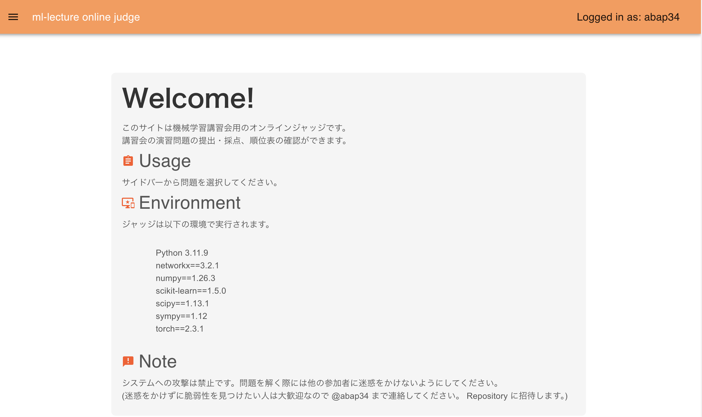
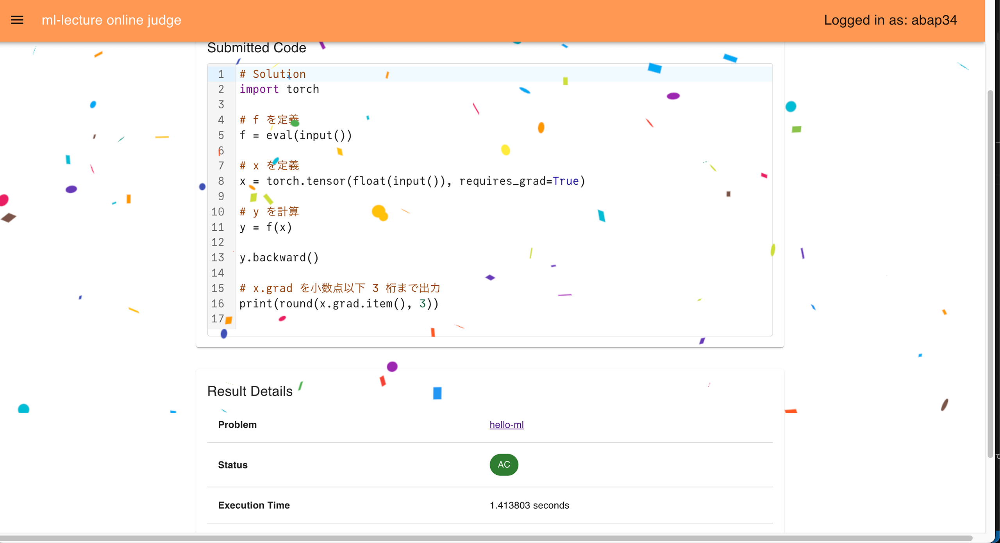
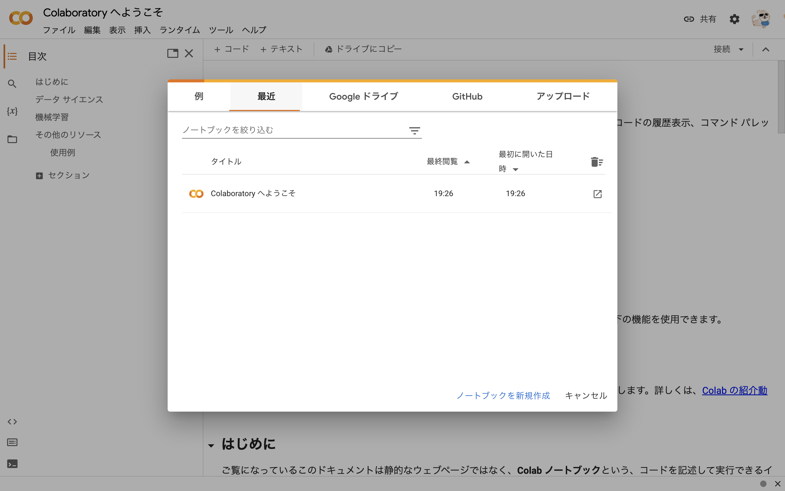
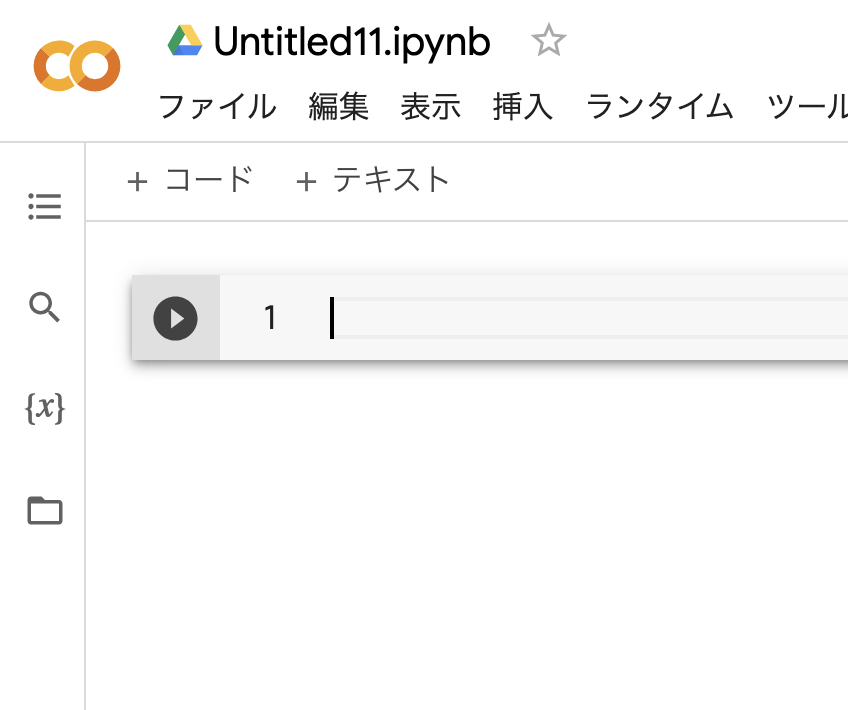
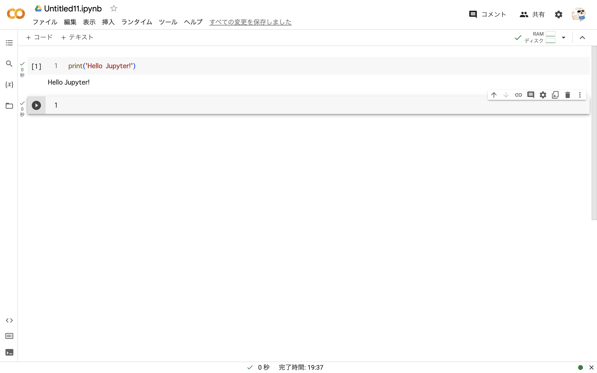
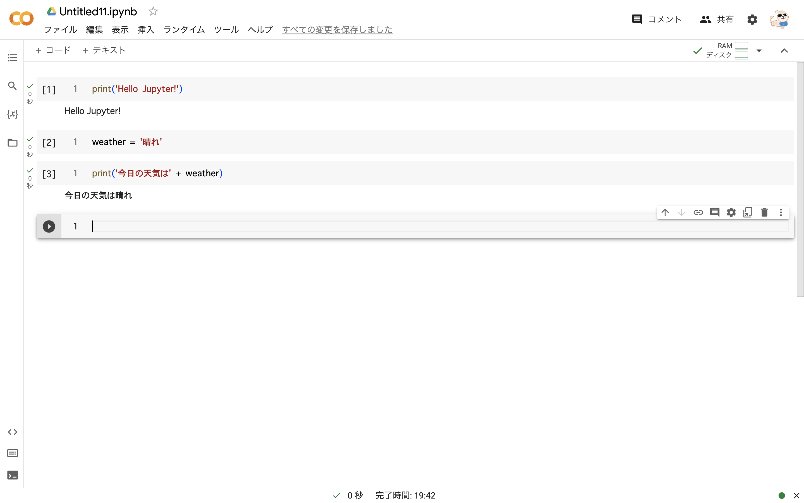

このページは、[東京工業大学デジタル創作同好会traP Kaggle班](https://trap.jp/kaggle/) の主催する、「機械学習講習会」 の資料です。　

## 機械学習講習会の目標

機械学習講習会は、以下のようなことを目標にしています。


1. **はじめて見た問題に対して、機械学習を使ってアプローチできるようになること**
2. **今後、機械学習のさまざまな手法を学ぶときに基礎になる力をつけること**
  
機械学習は問題解決の非常に強力な道具になります。
一方で、道具の使い方ばかりを勉強しても未知の問題に対して適切なアプローチをすることは難しいです。

逆に、機械学習を実際に問題解決の手段に使うにはプログラムを書くことが必ず必要です。
もちろん、既存の優れたライブラリを利用する力も必要です。


「理論だけで実際に問題解決の手段としては使えない」、あるいは「ライブラリの使い方をなぞるだけで背景は何も理解していない」とならないよう、
この講習会では実装も理屈もバランスよく扱うつもりです。

逆に、次のようなことは目標にしていません。


1. **機械学習のさまざまな手法を網羅的に学ぶこと**
2. **性能向上のための繊細なテクニックや実装技法を身につけること**

機械学習は非常に多くの手法、側面を持つ分野なので、全七回の講習会で全てを網羅することはできません。

そのため、この講習会ではとくに一部の題材をしっかりめに取り上げることで機械学習の基本的なアイデアを理解することにしています。

そして、とくに取り上げる題材としては **「ディープラーニング」** を選びました。

ディープラーニングは、インパクトのある成果を次々生み出している、
機械学習の中でも特に注目されている手法です。　

おそらく講習会に参加する人も興味がある人が多いと思います。

やはり興味があるものを学ぶのが一番楽しいと思うので、この講習会ではディープラーニングをとくに取り上げて、それを通じて機械学習の面白さを体験してもらえればと思います。


**機械学習は、数学とコンピュータサイエンスの力を使って鮮やかに問題を解決することができる、とても面白い分野です。**
**ぜひ楽しんでください！**


## 具体的な内容について

この講習会は、全七回 (+ この前書き) の構成です。


- 第一回 6/24 : 学習 
- 第二回 6/25 : 勾配降下法
- 第三回 6/28 : 自動微分とPyTorch 
- 第四回 7/01 : ニューラルネットワークの構造
- 第五回 7/03 : ニューラルネットワークの学習と評価
- 第六回 7/04 : ニューラルネットワークの実装 
- 第七回 7/12 : 機械学習の応用、データ分析コンペ

全体の流れとしては、まずは機械学習の枠組みを理解し、それに必要なアルゴリズムを学んだのち、
ニューラルネットワークについて詳しく扱って実装できるようになる
## 演習問題とコンペ
#### 1. オンラインジャッジシステムについて
最初に書いたように、機械学習アルゴリズムを実際に使うには実装に習熟する必要があります。
(つまり、手を動かしてほしいです！)

そこでこの講習会のためのオンラインジャッジシステムを開発しました。




この講習会で扱ったアルゴリズムや、主要な機械学習に関連するパッケージの使用方法に関連する問題を用意しているので、
学んだことの実践の場として活用してください。



(更新予定: 講習会が終了次第、開発したオンラインジャッジシステムはOSSとして公開する予定です)

#### コンペについて
機械学習講習会で学んだ内容の実践の場として、最終課題としてデータ分析コンペを開催します。

このコンペは 3人チームで参加してもらう予定です。

上位チームには賞品を用意しています。


(更新予定: 講習会が終了次第、開発したコンペプラットフォームはOSSとして公開する予定です)


## 環境構築について
この講習会では、基本的に Python を使うことを想定しています。

また多くの場合、対話的な Python の実行環境である Jupyter Notebook を使うと便利な場面が多いです。

ここでは、環境構築にあまり慣れていない人むけに Google Colaboratory というサービスを使ってこれらを利用する方法を紹介します。

### Google Colaboratory の使い方

まずは、 [https://colab.research.google.com/?hl=ja](https://colab.research.google.com/?hl=ja) にアクセスしてみてください。


このような画面が出てきたかと思います。
まずは、右上の青い「ログイン」を押してください。




するとこのような画面になると思うので、
次に真ん中のポップアップの下にある青い文字の「ノートブックを新規作成」をクリックしてください。


このような画面になっていれば成功です！

それでは次にこの画面の意味や JupyterNotebook そのものについて見ていきます。
この画面は開いたままにして、次へ進んでください！

### Jupyter Notebook とは

いきなり馴染みのない画面に飛ばされて困惑している人もいるかもしれないですが、ひとまずこれが何者なのか確かめようと思います。

まず、先ほどの画面の「1」と書いてあるところの右をクリックしてみてください。
入力可能になっているかと思います。




そこに　`print('Hello Jupyter!')` と書き、左の再生ボタンをクリックしてみましょう。
(初めてこれをクリックした場合は、接続が入って少し待たされますが正常なのでじっと待ってください)





`Hello Jupyter` と表示されました！
いうまでもなく、これは Python のコードを実行した結果です。

このように、 JupyterNotebook では、
この入力可能な欄に Python のプログラムの書き込み、実行ができます。

もう少し進めてみましょう。
まずは、次の入力欄に次のようなコードを書きます。

`weather = '晴れ'`

これを実行して、そのまた次の入力欄に

`print('今日の天気は' + weather)` と書き、実行してみます。



すると、`今日の天気は晴れ` と表示されました。

このように、 Jupyter Notebook の各欄では変数などが共有されていて、全体として一つのプログラムのように振舞います。

それぞれの入力欄のことを「セル」と呼びます。つまり、今回は三つのセルに分けてコードを書いたわけです。

今後 JupyterNotebook を使い倒すことになると思うので、
色々なプログラムの実装を試してみて慣れておくとスムーズにいきそうです。


### なぜ Jupyter Notebook を使うのか？
他の言語の実行方法や、競技プログラミングに取り組んでいる人などからすると、"通常の" 実行方式、つまり
「ファイル作成 → `python {ファイル名}.py` 」 という方法を使えばいいじゃないか、と思うかもしれません。

しかし、 Jupyter Notebook はデータ分析・機械学習をに関わる多くのエンジニア・研究者にとって**必須**のツールになっています。

利点はさまざまありますが、簡単には次のようなところが支持されていると思います。

#### 1. 処理を簡単に切り分けられる
データ分析、機械学習は試行錯誤が多い作業です。

Jupyter Notebook を使うと、セルごとに処理を切り分けることで極めて簡単に試行錯誤をする
部分を小さくしていくことができます。

#### 2. データの可視化が簡単
これはその目で確かめるのがいいと思います。

次のコードを貼り付けて実行してみてください。

```python
import seaborn as sns
import matplotlib.pyplot as plt

sns.set(style="whitegrid", context="talk", palette="viridis")
titanic = sns.load_dataset('titanic')
plt.figure(figsize=(14, 8))

histplot = sns.histplot(data=titanic, x='age', hue='survived', multiple='stack', palette='viridis', kde=True)

plt.title('Age Distribution of Titanic Passengers', fontsize=20, fontweight='bold')
plt.xlabel('Age', fontsize=16)
plt.ylabel('Count', fontsize=16)
plt.legend(title='Survived', labels=['Not Survived', 'Survived'], fontsize=14, title_fontsize=16)
plt.grid(True, linestyle='--', linewidth=0.7, alpha=0.7)
plt.gca().set_facecolor('#f0f0f0')

plt.show()
```

真下に、なかなか綺麗なグラフが表示されると思います。

Jupyter Notebook は各セルの出力としてテキストだけでなく画像なども表示でき、対話的にデータを確認するのに非常に便利です。
(ちなみに、このグラフは有名なタイタニック号沈没事故の乗客の年齢分布を生存者と非生存者で比較したものです)


Jupyter Notebook をうまく活用して、データ分析や機械学習の作業を効率的に進めていきましょう。

## 謝辞
この資料は、 [@abap34](https://x.com/abap34) が2023年度に作成したスライドを文字起こししたものです。

作成にあたり、多くの方に助言をいただきました。

とくに資料のチェックを手伝っていただいた東京工業大学の @YumizSui さん、 @idaten さん, @kobakos さん、
演習問題の作成に協力していただいた @kobakos さん、 @konkoma さん、 @Umin さんにこの場を借りて感謝いたします。


内容についてのご指摘は [@abap34](https://x.com/abap34) までご連絡ください。