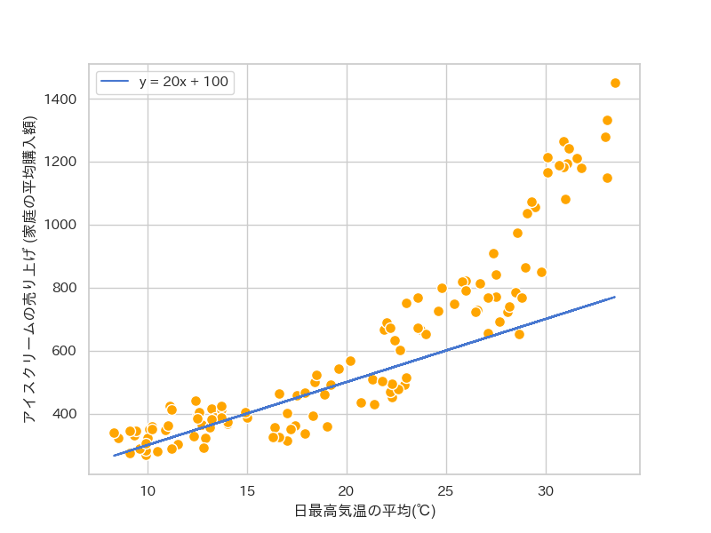

<!-- _class: lead -->

# **機械学習講習会**
## **[1] 「学習」**

**2024/06/24** 
**traP Kaggle班**

---

# **はじめに**

---
 

<!-- _header: この講習会のゴール　-->

## ✅ 機械学習の基本的なアイデアを理解して
## 問題解決の手段として使えるようになる.

---

<!-- _header: おしながき　-->

第1回 │ 学習
第2回 │ 勾配降下法
第3回 │ 自動微分
第4回 │ ニューラルネットワークの構造
第5回 │ ニューラルネットワークの学習と評価
第6回 │ PyTorch による実装
第7回 │ 機械学習の応用, データ分析コンペ

---

<!-- _header: この講習会で扱うこと・扱わないこと　-->

 

機械学習は非常に広大な分野 ⇨ 全7回ではちょっと限界がある

今回の講習会ではとくに**ディープラーニング**についてメインに扱います

- ツールを触るだけで原理は全然やらない
- 原理をやるだけで全然使えない

にならないようにどちらもバランス良くやります

---

<!-- _header: 最終的には...-->

 

✅ 機械学習の基本的なアイデアを説明できるようになる
✅ ライブラリに頼らず基本的なアルゴリズム, モデルを実装できるようになる
✅ PyTorch を使った基本的なニューラルネットの実装ができるようになる

---

<!-- _header: 使うプログラミング言語 -->

##  Python を使います　

**慣れている人へ**
→ Jupyter Notebook と numpy, matplotlib, scipy, PyTorch  あたりのライブラリを使えるようにしておいてください

**慣れていない人へ**
→ https://abap34.github.io/ml-lecture/supplement/colab.html をみて Google Colaboratory の使い方を覚えておいてください

 

---

<!-- _header: 使うプログラミング言語や前提知識など -->
 

### 1.Pythonを使った初歩的なプログラミング
- if文, for文, 関数 など
- 外部パッケージの利用
  
  (そこまで高度なことは求めません **ググり力とかの方が大事**)

### 2.数学の初歩的な知識
- 基本的な行列の演算や操作 (積,転置など)
- 基本的な微分積分の知識 (偏微分など)
  
(1年前期の (線形代数)　+ (微分積分のさわり) くらい)

---
<!-- _header: がんばりましょう -->

(ここだけの話機械学習はめちゃくちゃおもしろい)

 

# 全7回がんばりましょう！！

---

<!-- _class: lead-->

# **第一回: 学習**

---

<!-- _header: おしながき -->
   
### 今日の目標

機械学習の基本的な用語を整理して
「学習」ということばをきちんと説明できるようになる.

---

<!-- _header: 機械学習 or AI？　-->

- AI(人工知能)
「人間っぽい知能」を実現しようとする分野・あるいは知能そのもの
- 機械学習(Machine Learning, ML)　
様々な情報から「学習」をして動作するアルゴリズム
人工知能の一つのかたちと見られることが多い 

⬇︎ つまり？

---

<!-- _header: 機械学習 or AI？　-->

## **機械学習** で **人工知能** を実現

### ($\leftrightarrow$  **スーパーカー** で **爆速移動** を実現)

ここでは一つの定義を紹介しましたが, 実際この二つの言葉に明確に定義や合意があるわけではないです.
手法を厳密に分類してもあまり嬉しいことはないと思いますが, とりあえずこの講習会ではこういう形で整理してみることにします.

---

<!-- _header: 学習ってなに？　-->

- 機械学習(Machine Learning, ML)　
様々な情報から「**学習**」をして動作するアルゴリズム

  
 

↑ **学習**って何？ 

---

### 今日のテーマ:

## ✅ 「学習」を説明できるようになる

---

<!-- _header: 「気温」と「アイス」 　-->

 
 

- 気温↑　→　売れそう
- 気温↓　→　売れなさそう

「アイスの売り上げ」は
「気温」からある程度わかりそう？

 

  < ...来月の売り上げが予想できたらどのくらい牛乳仕入れたらいいかわかって嬉しいな.

データは https://okumuralab.org/~okumura/stat/160118.html　から引用

---

<!-- _header: アイスの売り上げを予測するAIをつくる.　-->

 

 < なんか来月の予想平均気温30度って気象庁が言ってたな.

   < !!!!!

---

<!-- _header: アイスの売り上げを予測するAIをつくる.　-->

  < 過去に30℃のときは...

---

<!-- _header: 過去を参照すると...　-->

一番簡単な方法: 過去の全く同じ状況を参照する

 < これでアイスの売り上げを予測するAIの完成や！

 

 

 **<そのまた来月の予想平均気温は40℃です.**

 **< !?**

気象庁ロゴは https://www.jma.go.jp/jma/kishou/info/logo.html より

---

<!-- _header: 詰んだ -->

    < 40℃ないやんけ

---

<!-- _header: 「予測」を考える -->

「予測」ってなんだっけ？
→ 入力を受け取ってそれっぽい出力をすること

⇩

今回は 「入力: 気温」 → 「出力: アイスの売り上げ」

そして ✅  **入力は知ってるものだけとは限らない**

---

<!-- _header: 予測できるようになる ↔︎  ?　-->

 ← こいつが本当にやらなくてはいけなかったことは...

## 売り上げ = $f$(気温) となる関数 $f$ の推定

このような入力データを受け取り結果を返す $f$ を**モデル**と呼ぶ

---

<!-- _header: 線形回帰 -->

売り上げ = $f$(気温) となる関数 $f$ を作りたい.

⇨ 一旦話を簡単にするために

「**$f$(気温) = $a \times$気温 + $b$**」

のかたちであることにしてみる.

---

<!-- _header: ためしてみる -->

$a = 20, \ b=100$ のとき...

 < わるくない

---

<!-- _header: ためしてみる -->

$a = -20, \ b=1000$ のとき...

 < おわてます

---

<!-- _header: パラメータ -->

$a, b$ を変えることでモデル $f$ の具体的な形が変わった！

このように各モデルが固有に持ってモデル自身の性質を定める
数を 「パラメータ」という. ( $f$ は $a, b$ をパラメータとして持つ )

⬇︎

$f$ の構造を決めておけば...

### 「$f$ の推定 $\leftrightarrow$ $f$ のパラメータの推定」

関数 $f$ がパラメータ $\boldsymbol{\theta}$ を持つことを陽に示すために $f(x; \boldsymbol{\theta})$ と書くことがあります. 今回の場合は $f(x; a, b)$ となります. 

---

<!-- _header: ちょっとまとめ　-->

- アイスの売り上げを予測するには, 気温から売り上げを予測する
  「関数」を構築するのが必要であった.
- いったん, 今回は関数の形として $f(x) = ax + b$ (一次関数) に限って関数を決めることにした.
- この関数はパラメータとして $(a, b)$ をもち, $(a, b)$ を変えることで
  性質が変わるのがわかった
- これからやる仕事は,
  「$(a, b)$ をいい感じのものにする」ことで「いい感じの $f$ を作る」こと

---

<!-- _header: さっきの例 -->

 

$a = 20, \ b=100$ のとき...

 < わるくない

$a = -20, \ b=1000$ のとき...

 < おわてます

⇩ なぜ？

##   < グラフを見ればわかる.

---

<!-- _header: いい勝負? -->

上: $a = 20, \ b=100$
下: $a = 50, \ b=-300$

---

<!-- _header: 破綻 -->

🤔💭 湿度や人口、子供の割合なんかも売り上げとは関係しそうだからこれらも入力に入れたいな。

$y = f$(気温, 湿度, 人口, $\cdots$)

⇩ **グラフが書けない！**

案1. 高次元の存在になる
案2. 定量的な指標を考える

---

<!-- _header: 定量的な指標を考える: 損失関数の導入 -->

良さとは？

⇩

悪くなさ

⇩

悪くなさとは何か？

⇩

データと予測の遠さ

---

<!-- _header: 平均二乗誤差(Mean Squared Error)  -->

## 平均二乗誤差(Mean Squared Error)

$$
\dfrac{1}{n}\sum_{i=0}^{n-1} \ (y_i - f(x_i))^2
$$

 

$y_i$ : 実際の値　(確定値) ... 過去のアイスの売り上げ
$f$ : モデル
$x_i$ : 入力データ　(確定値) ... 過去の気温

なぜ差を二乗するのか疑問に思った人もいるかもしれません.　
全てをここで話すと情報量過多なので一旦置いといてあとで軽く議論します.(末尾の付録)

---

<!-- _header: 計算例  -->

 

$\boldsymbol{x} = (50, 80)^T$, $\boldsymbol{y} = (140, 200)^T$, $f(x) = 2x + 50$ のとき,

$$
\begin{aligned}
\dfrac{1}{n}\sum_{i=0}^{n-1} \ (y_i - f(x_i))^2 &= \dfrac{1}{2} \left( (140 - (2 \times 50 + 50))^2 + (200 - (2 \times 80 + 50))^2 \right) \\
&= \dfrac{1}{2} \left( (140 - 150)^2 + (200 - 210)^2 \right) \\
&= \dfrac{1}{2} \left( (-10)^2 + (-10)^2 \right) \\
&= \dfrac{1}{2} \times 200 \\
&= 100
\end{aligned}
$$

---

<!-- _header: 損失関数  -->

このモデルの悪くなさを定義する関数を「損失関数」と呼ぶ.

 

 学習とは？ 
## ⇨ ✅ 「損失関数を最小にする $f$ のパラメータを探す過程」

---

<!-- _header: 何を動かして損失を小さくする？ -->

Q. 損失は何の関数？ (何を動かして損失を小さくする？)

✅  各 $x_i, y_i$ は変数みたいな見た目だけど 「もう観測された確定値」 

$$
\mathcal{L}(a, b) = \dfrac{1}{n}\sum_{i=0}^{n-1} \ (y_i - f(x_i; a, b))^2
$$

ものすごく進んだ話: たまに「入力データ」っぽいものに当たるものについても変数とみることもあります.
自分の知っている話だと DeepSDF という三次元形状を表現する NN では latent code と呼ばれる物体固有の表現を表すベクトルも変化させて損失関数を最小化していました. 

---

<!-- _header: いい勝負だったやつの計算例 -->

上: $a = 20, \ b=100$
下: $a = 50, \ b=-300$

頑張って計算すると,

$$
\begin{aligned}
\mathcal{L}(20, 100) &= 40268.55 \\
\mathcal{L}(50, -300) &= 39310.45
\end{aligned}
$$

⇩

$a = 50, \ b=-300$ $\ \large{win}$

---

<!-- _header: 実は今回は -->

$a \approx 36.00780537461501$
$b \approx 126.12821494344632$ 

で $\mathcal{L}(a, b)$ が最小

---

<!-- _header: 当然の疑問 -->

# いや
# それ
# どう
# やったの

---

<!-- _class: lead -->

## 次回予告
## $\Large{第二回: 勾配降下法}$

---

<!-- _header: まとめ -->

- アイスの売り上げを予測するには気温から売り上げを予測する
  「関数」を構築するのが必要であった.
- いったん, 今回は関数の形として $f(x) = ax + b$ (一次関数) に限って,関数を決めることにした.
- この関数はパラメータとして $(a, b)$ をもち, $(a, b)$ を変えることで
  性質が変わるのがわかった
- モデルの「よさ」のめやすとして 「損失関数」を導入した
- パラメータを変えることで損失関数を最小化する過程のことを「学習」と呼ぶ

---

<!-- _header: 付録: なぜ二乗するのか？ -->

### レベル1の説明

⇨ 性質がいいから

- 微分可能で導関数も簡単　(絶対値関数は微分不可能な点がある)
- 計算もそんなに大変ではない (百乗誤差などと比べて)

理論的なことを考えると微分可能でないと大変なことが多いです.

一方で現実の最適化だと微分不可能な点が有限個(何なら可算無限個) あっても何とかなることが多いです.

---

<!-- _header: 付録: なぜ二乗するのか？ -->

### レベル2の(ちゃんとした)説明

⇨ 誤差が正規分布 $\mathcal{N}(0, \sigma^2)$ にしたがうと仮定したとき,
二乗誤差の最小化は尤度の最大化に対応する

---

<!-- _header: 付録: なぜ二乗するのか？ -->

 

### [証明]

$y_i = f(x_i) + \epsilon_i$, $\epsilon_i \overset{\text{i.i.d.}}{\sim} \mathcal{N}(0, \sigma^2)$ とする.

このとき $y_i \overset{\text{i.i.d.}}{\sim} \mathcal{N}(f(x_i), \sigma^2)$　より
尤度は

$$
\prod_{i=0}^{n-1} \dfrac{1}{\sqrt{2\pi\sigma^2}} \ \exp \left( -\dfrac{(y_i - f(x_i))^2}{2\sigma^2} \right)
$$

$\sigma^2$ が固定されていることに注意すると,
これの最大化は結局 $\sum_{i=0}^{n-1} (y_i - f(x_i))^2$ の最小化に帰着する. $\square$

