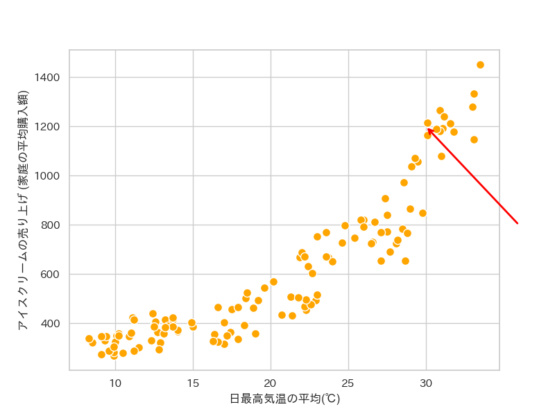
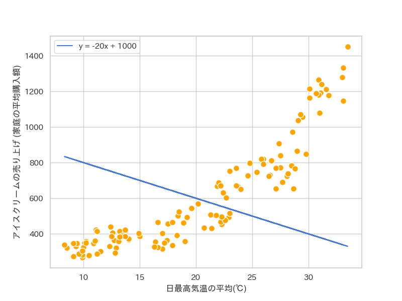
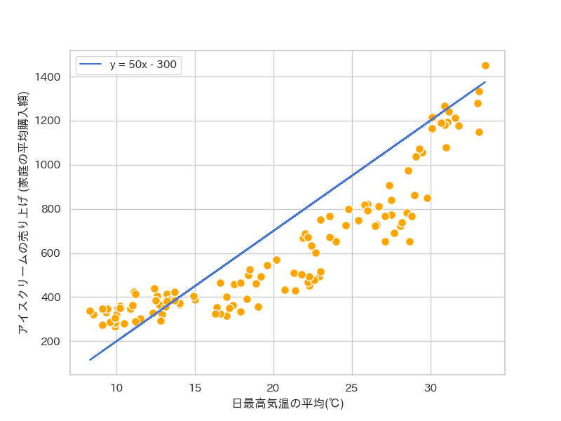

**✅ 今日の目標: 機械学習の基本的な概念である「学習」を理解できるようになる**

**スライド: [https://abap34.github.io/ml-lecture/ch01/lecture.pdf](https://abap34.github.io/ml-lecture/ch01/lecture.pdf)**

## 用語の整理

さて、まずはこの講習会のタイトルにもなっている「機械学習」という言葉について整理してみます。

よく同じ場面で使われる言葉として、「AI」とか「人工知能」と呼ばれるものがあります。

これらと機械学習という言葉の関係を簡潔にまとめると、

- AI(人工知能): 「人間っぽい知能」を実現しようとする 分野 ・あるいは 知能そのもの
- 機械学習(Machine Learning, ML)　: 様々な情報から「学習」をして動作する 手法・ アルゴリズム 

つまり、「機械学習」という手段を使って、「人工知能」を実現する。という関係になっています。

(ちょうど「スーパーカー」という手段を使って「爆速移動」を実現する、というのと同じような関係です)

:::warning
ここでは一つの定義を紹介しましたが、実際この二つの言葉に明確に定義や合意があるわけではないです。
手法を厳密に分類してもあまり嬉しいことはないと思いますが、とりあえずこの講習会ではこういう形で整理してみることにします。
:::

## 「学習」

前の節では断りもなく「学習」という言葉を使いました。

日常の意味で「学習」という言葉にみんなが納得する説明をつけるのは大変ですが、
機械学習の文脈ではもう少しきちんと定義できる学術用語として「学習」という言葉が使われています。

**今日の目標は、この「学習」という言葉を説明できるようになることです。**

## アイス屋の悩み

ここから色々な概念を勉強していくわけですが、抽象的な話が続くと大変なので具体的なタスクについて考えながら勉強していこうと思います。

ここでは「アイスの売り上げ予測」という有名なタスクを取り上げようと思います。

アイスの売り上げは、気温が上がれば盛り上がり、気温が下がれば振るわなくなりそうで、
気温からある程度予測できそうです。

そこで、過去の気温のデータと売り上げのデータを使って、アイス屋さんのために気温からアイスの売り上げを予測してあげましょう。

需要予測が可能になれば、牛乳をどのくらい仕入れておけばいいかがわかり、利益につながります。

 

### データを見てみる

まずは、今回使うデータを見てみます。

(データは [https://okumuralab.org/~okumura/stat/data/icecream.csv](https://okumuralab.org/~okumura/stat/data/icecream.csv), [https://okumuralab.org/~okumura/stat/data/tokyo-weather-2003-2012.csv](https://okumuralab.org/~okumura/stat/data/tokyo-weather-2003-2012.csv) を利用させていただいています。)

このデータをプロットすると、気温と売り上げの関係はこのようになっています。

やはり気温が上がるとより多くのアイスが売れることがわかります。

では実際に売り上げの予測に挑戦してみましょう。

### アホのアイス屋

最も素直な予測の仕方は、過去のデータをそのまま使うことでしょう。

例えば、気象庁が「来月の気温は平均30度になる」と発表したとしたなら、データで 30℃ になっているところを見れば良いです。

これで無事に売り上げ予測AIが完成しました！

なわけがなく、これでは「未知のデータに対応できない」という深刻な問題が発生します。

### 「予測」ってなんだっけ

「予測」という言葉をもう一度考え直すことにしましょう。

「予測」というのはつまり「入力」を受け取ってそれらしい「出力」をすることです。

つまり、今回の場合は「気温」が入力で「売り上げ」が出力です。

そして、「入力」は必ずしも知っているものとは限りません。

例えば *「来月の平均気温は 40℃ だよ」* と気象庁から発表があった場合、このアプローチは破綻してしまいます。

### 「関数」を作る

では私たちが本当にしなければいけなかった仕事は何でしょうか。

結論から言うとこれはあらゆる入力に対応できる「関数」を作ることです。

例えば (これが妥当なわけがないですが、) 

**予測結果 = f(気温) = sin(気温) + 100** なのだ！　

としてしまえば、どんな入力に対しても予測をすることができます。

このように、入力データを受け取り予測結果を返す $f$ を **モデル** と呼びます。

ここで、 $f$ は必ずしも数学的な表現で書かれた関数でなくても良いです。
何かを入れたら何かが返ってくる箱くらいに考えてもらうのが実態に近いです。

したがって、今からどのように $f$ を作るのか、という話を進めていこうと思います。

## 線形回帰

一度にむずかしいことをたくさんやるのは大変なので、ここでは純粋に話を簡単にするために

$f(気温) = a \times 気温 + b$ 

という形の関数のみを考えることにします。

例えば、 $a = 20, \ b = 100$ のときは、気温 10℃のとき 売上額は300円であると予測することになります。

プロットすると、

となります。　割と悪くなさそうです。

つぎに $a = -20, \ b = 1000$ のときは、

です。これはちょっとダメそうです。

### パラメータ

$a, \ b$ を変えることで、モデル $f$ の具体的な形が変化しました。

このように、各モデルが固有に持ってモデル自身の性質を定める数を、「**パラメータ**」といいます。 

つまり、 今回の $f$ は $a, \ b$ をパラメータとして持つわけです。

したがって、今回のように $f$ の構造として $a \times 気温 + b$ を固定しておけば、

$f$ の推定 $\Leftrightarrow$ パラメータの推定

となります。

ちなみに、関数 $f$ がパラメータ $\boldsymbol{\theta}$ を持つことを陽に示すために、$f(x; \boldsymbol{\theta})$ と書くことがあります。 

つまり、今回は $f(x; a, b)$ と書きます。

ここまでの内容を一旦まとめておきましょう。

---

# ここまでのまとめ

:::success
- アイスの売り上げを予測するには、気温から売り上げを予測する
  「関数」を構築するのが必要であった。
- いったん、関数の形として $f(x) = ax + b$ に限って、関数を決めることにした。
- この関数は、パラメータとして $a, \ b$ をもち、$a, \ b$ を変えることで
  性質が変わるのがわかった
- これからやる仕事は、 
  「$a, \ b$ をいい感じのものにする」ことで「いい感じの $f$ を作る」こと
:::

---

## いい感じの f が何かを考える

まとめに書いたように今からは  「$a, \ b$ をいい感じのものにする」ことで「いい感じの $f$ を作る」ことを考えます。

ですが、まずは「いい感じの $f$ 」を定義しないことには話になりません。

先ほど出した $a, \ b$ の例を再掲します。

これはどう見ても一つめの方が「いい感じ」です。

ではこの二つではどうでしょうか。

甲乙つけがたい感じがします。

さらに、今は入力が気温だけですが、アイスの売り上げにはもっと色々な要素が影響しているかもしれません。

例えば気温と湿度を入力とすることにするとグラフは三次元になるわけですが、

例えば湿度や風の強さ、他にも地域の人口や子供の割合、曜日なんかも影響してくるかもしれません。

これらも入力に含む、つまり

売り上げの予測 = f(気温, 湿度, 風速, $\cdots$) 

としたとき、予測結果をグラフで見ることは困難です。

これを克服するには

1. 高次元の存在になる
2. $f$ の「よさ」を計算できる量で定義する

ことのどちらかが必要です。

これを読んでいる多くの人にとって 1. は難しいと思うので、 2. について考えていきましょう。

## 損失関数の導入

「よさ」を定義することを考えます。

ここでは、次のような言い換えによって「よさ」を定めます。

良さとは？

⇩

悪くなさ

⇩

悪くなさとは何か？

⇩

データと予測の遠さ

と、いうわけでやや天下り的ですが、今回は次のように計算される「遠さ」によってモデルの良さを定義することにします。

:::definition
**平均二乗誤差(Mean Squared Error, MSE)**

$$
\large \dfrac{1}{n}\sum_{i=0}^{n-1} \ (y_i - f(x_i))^2
$$
:::

なぜ二乗するのか？が気になった人へ

鋭い人だと、なぜ二乗するのか？絶対値をとるとか、百乗するとかではダメなのか？と思うかもしれません。

ここでは二乗する理由を簡単に説明します。

まず簡単なレベル1の説明としては、 $x^2$ の性質の良さがあります。微分可能で、計算コストもあまり高くありません。
絶対値関数は、微分不可能な点がありますし、 百乗するのも大変です。

一方、実用的にはせいぜい有限個の微分不可能な点があってもなんとかなることも多いです。

そしてレベル2の説明として、(これは少し統計の知識が必要になるので、読み飛ばしても問題ありません)
二乗誤差の最小化は誤差として $\mathcal{N}(0, \sigma^2)$ と仮定したときの尤度の最大化と等価であるという事実を紹介します。

$y_i = f(x_i) + \epsilon_i$, $\epsilon_i \sim \mathcal{N}(0, \sigma^2)$ とします。

このとき、 $y_i \overset{\text{i.i.d.}}{\sim} \mathcal{N}(f(x_i), \sigma^2)$　より
尤度は $\prod_{i=0}^{n-1} \frac{1}{\sqrt{2\pi\sigma^2}} \exp \left( -\frac{(y_i - f(x_i))^2}{2\sigma^2} \right)$ です。　$\sigma^2$ が固定されていることに注意すればこれの最大化は結局 $\sum_{i=0}^{n-1} (y_i - f(x_i))^2$ の最小化に帰着します。

ここで、 $x_i, \ y_i$ は **実際に観測された** 入力と予測の目標値,
$f$ はモデルです。

つまり今回の場合は、
- $x_i$ : 過去の気温
- $y_i$ : 過去の売り上げ

になります。

例えば

$\boldsymbol{x} = (50, 80)^T$, $\boldsymbol{y} = (140, 200)^T$, $f(x) = 2x + 50$ のとき、

$$
\begin{aligned}
\dfrac{1}{n}\sum_{i=0}^{n-1} \ (y_i - f(x_i))^2 &= \dfrac{1}{2} \left( (140 - (2 \times 50 + 50))^2 + (200 - (2 \times 80 + 50))^2 \right) \\
&= \dfrac{1}{2} \left( (140 - 150)^2 + (200 - 210)^2 \right) \\
&= \dfrac{1}{2} \left( (-10)^2 + (-10)^2 \right) \\
&= \dfrac{1}{2} \times 200 \\
&= 100
\end{aligned}
$$

と計算できます。

このような、モデルの悪くなさ、つまり良さを定義する関数を「**損失関数**」といいます。

われわれは、予測してくれるモデルを作るためにパラメータを動かして良さを最大化しようとしていたわけですから、
結局する仕事は、「損失関数の最小化」に帰着しました。

つまり、次のような結論が導かれました。

:::definition

**学習とは何か？**

### ⇨ 学習とは、損失関数を最小化するパラメータを見つける過程。

:::

:::danger
ここで強調しているように、動かすのは基本的には「パラメータ」であることに注意してください。
各 $x_i, y_i$ は変数のような見た目ですが、実際は 「確定値」 です。
明確に書くとすれば、学習の際に考える損失は
$\mathcal{L}(a, b) = \dfrac{1}{n}\sum_{i=0}^{n-1} \ (y_i - f(x_i; a, b))^2$ です。
:::

### モデルの良さを改めて評価する

先ほどみた甲乙つけがたいモデルの例を再掲します。

計算すると、今回は

$$
\begin{aligned}
\mathcal{L}(20, 100) &= 40268.55 \\
\mathcal{L}(50, -300) &= 39310.45
\end{aligned}
$$

になります。　(末尾の付録参照)

したがって、

$a = 50, \ b=-300$ の方がいまのところの定義では「よい」モデルといえそうです。 

## どう得る？

ここまでの議論で目標が定まりました。

そして結論からいうと、
今回は

$a = 36.00780537461501, \ b = 126.12821494344632$ 

で $\mathcal{L}(a, b)$ が最小になります。

これをどう計算するのか？

というテーマが第二回「勾配降下法」です。

では次回をお楽しみに！

---

# 今日のまとめ

:::success

- アイスの売り上げを予測するには、気温から売り上げを予測する
  「関数」を構築するのが必要であった。
- いったん、今回は関数の形として $f(x) = ax + b$ (一次関数) に限って、関数を決めることにした。
- この関数は、パラメータとして $a, \ b$ をもち、$a, \ b$ を変えることで
  性質が変わるのがわかった
- パラメータを変えることで損失関数を最小化する過程のことを「学習」と呼ぶ

:::

---

## おまけ

今回の資料で登場したグラフなどを作成するプログラムの例を以下に示します。

以下のプログラムは編集かつ実行可能です。

(おまけなので、プログラムの内容は理解しなくても今後の講習会の内容には影響ありません)

:::loadlib
pandas
matplotlib
:::

### データを見てみる

まずは、今回使うデータを読み込んでみます。

(データは [https://okumuralab.org/~okumura/stat/data/icecream.csv](https://okumuralab.org/~okumura/stat/data/icecream.csv), [https://okumuralab.org/~okumura/stat/data/tokyo-weather-2003-2012.csv](https://okumuralab.org/~okumura/stat/data/tokyo-weather-2003-2012.csv) から取得されるようになっています。)

:::code
import pandas as pd
icecream = pd.read_csv("/icecream.csv", header=1)
weather = pd.read_csv("/weather.csv")

print(icecream.head())
print("-------")
print(weather.head())
:::

これを加工して、まずは平均気温と売り上げの散布図を見てみましょう。

:::code
import matplotlib.pyplot as plt

data = pd.merge(icecream, weather, on=["年", "月"])
data = data.rename(columns={"日最高気温の平均(℃)":"temp", "アイスクリーム": "ice"})

x = data["temp"]
y = data["ice"]
plt.clf()
plt.scatter(x, y)
plt.xlabel("temperature")
plt.ylabel("ice sales")
plt.show()
plt.close()

:::

では $f$ を定義して、プロットしてみます。

:::code
from dataclasses import dataclass

@dataclass
class LinearRegressionModel:
    a: float
    b: float

    def __repr__(self):
        if self.b > 0:
            return f"y = {self.a}x + {self.b}"
        elif self.b == 0:
            return f"y = {self.a}x"
        else:
            return f"y = {self.a}x - {-self.b}"
        
    def __call__(self, x: float) -> float:
        return self.a * x + self.b

def plot_reg(model, x=x, y=y):
    plt.clf()
    plt.scatter(x, y)
    plt.plot(x, model(x), color="red")
    plt.xlabel("temperature")
    plt.ylabel("ice sales")
    plt.show()
    plt.close()

plot_reg(LinearRegressionModel(20, 100))
:::

:::code
plot_reg(LinearRegressionModel(-20, 1000))
:::

損失関数を計算してみます。

:::code
def loss(a, b, x=x, y=y):
    return ((y - (a * x + b))**2).mean()

print("a =  20, b =  100: ", loss(20, 100))
print("a = -20, b = 1000: ", loss(-20, 1000))
print("a =  50, b = -300: ", loss(50, -300))
:::

最適な $a, b$ を求めてみます。

:::code
import numpy as np
a, b = np.polyfit(x, y, 1)
plot_reg(LinearRegressionModel(a, b))
:::

