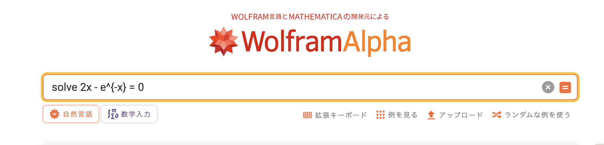
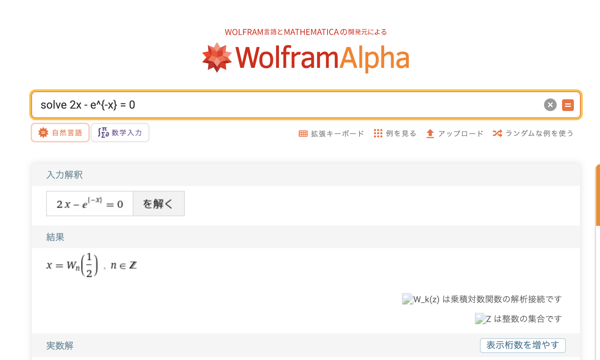
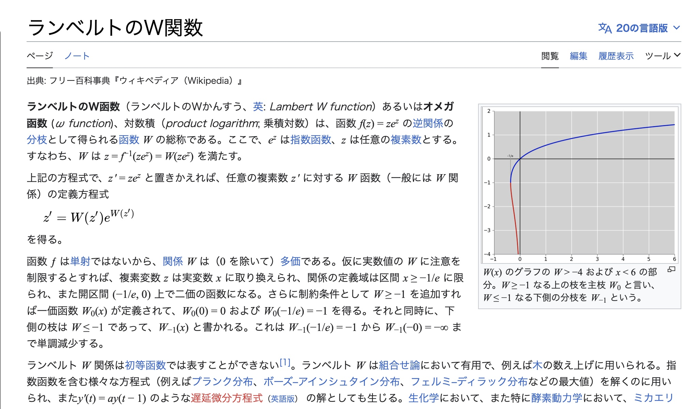
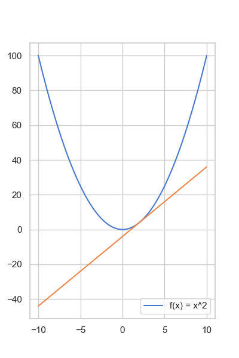
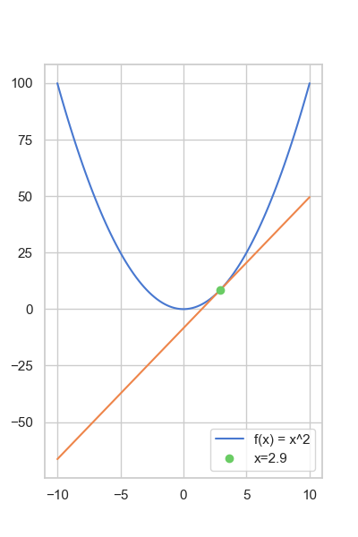
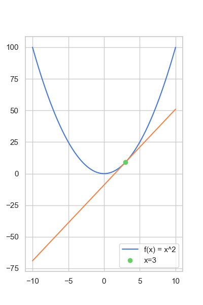
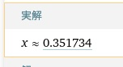
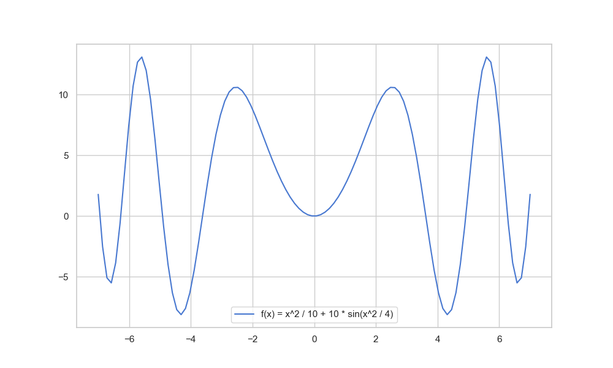
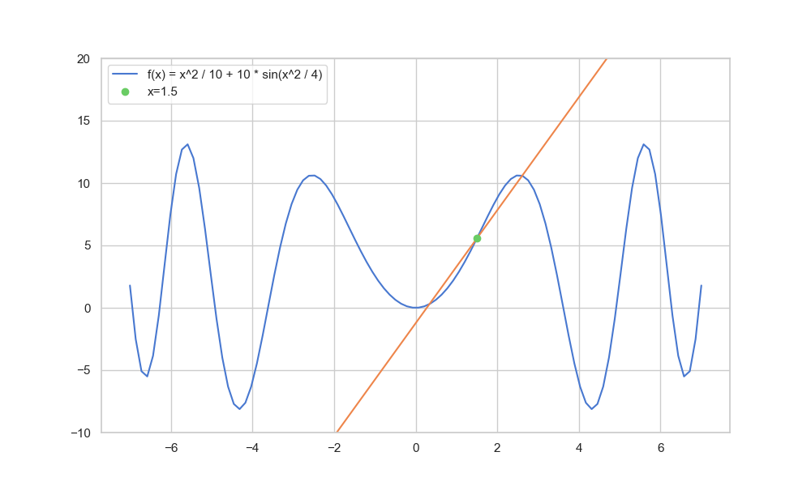

<!-- _class: lead -->

# **機械学習講習会**
## **[2] 「勾配降下法」**

**2024/06/25** 
**traP Kaggle班**

---


<!-- _header: まとめ -->


- アイスの売り上げを予測するには、気温から売り上げを予測する
  「関数」を構築するのが必要であった。
- いったん、今回は関数の形として $f(x) = ax + b$ (一次関数) に限って、関数を決めることにした。
- この関数は、パラメータとして $a, b$ をもち、$a, b$ を変えることで
  性質が変わるのがわかった
- パラメータを変えることで損失関数を最小化する過程のことを「学習」と呼ぶ


---


<!-- _header: 前回到達したところ... -->


$a, \ b$ を動かすことで....

$\displaystyle \mathcal{L}(a, b) = \dfrac{1}{n}\sum_{i=0}^{n-1} \ (y_i - f(x_i; a, b))^2$ を小さくしたい🥺


---


<!-- _header: 「関数の最小化」を考える -->

## 問題 

<div class="def">

最小化してください。

$$
f(x) = x^2 + 4x + 6
$$ 


</div>

---

<!-- _header: 「関数の最小化」を考える -->

<br>

## 問題 

<div class="def">

最小化してください。

$$
f(x) = x^2 + 4x + 6
$$ 


</div>

## 解答

<div class="proof">

<div style="text-align: center;">

$f(x) = x^2 + 4x + 6 = (x + 2)^2 + 2$ 


$\therefore \ x = -2$ のとき最小値

</div>


</div>


---

<!-- _header: どう「解けた」？？ -->


- 簡単な数式の操作で解けた！
- 機械的に書くなら、
 「 $ax^2 + bx + c$ を最小にする $x$ は $x = -\dfrac{b}{2a}$ 」 という公式を使った


プログラムに起こすと...

```python
# ax^2 + bx + c を最小にする x を返す関数.
def solve(a, b, c):
    return -b / (2 * a)
```

---


<!-- _header: 第二問 -->


<div class="def">

最小化してください。

$$
f(x) = x^2 + e^{-x}
$$


</div>


---


<!-- _header: 第二問 -->

$f'(x) = 2x - e^{-x}$ なので、最小値であることの必要条件 $f'(x) = 0$ を調べると...

$$
2x - e^{-x} = 0
$$ 

を満たす $x$ を考えると。。。。。。。


<div style="text-align: center;">

### ❓

</div>


---

<!-- _header: ❓ -->


---

<!-- _header: ❓ -->


---


<!-- _header: ❓ -->




---

<!-- _header: ❓ -->




---



---


# ？

---


<!-- _header: 一般の関数の最小化 -->


いいたかったこと

✅ **このレベルの単純な形の関数でも、解をよく知っている形で書き表すことは難しい**

---


<!-- _header: もう一度目的を整理する -->


われわれの目標...

## 誤差 $\mathcal{L}(a, b)$ を最小化したかった。 
　

---


<!-- _header: 効いてくる条件① -->

<br>

<div style="text-align: center;">

## Q. 厳密な最小値を得る必要があるか？

</div>

---

<!-- _header: 効いてくる条件① -->


## A. No. <span class="lined">厳密に最小値を得る必要はない</span>

数学の答案で最小値 1 になるところを 1.001と答えたら当然 🙅


### 一方、 <span class="lined">「誤差 1」 が 「誤差1.001」 になってもほとんど変わらない</span>

---

<!-- _header: 効いてくる条件② -->

<br>

## $\mathcal{L}$ は非常に複雑になりうる

第一回では **話を簡単にするために** $f(x) = ax + b$ の形を考えたが...

<br>

(特にニューラルネットワーク以降は) **非常に複雑になりうる** 

$$
\mathcal{L}(\mathbf{W^{(1)}}, \mathbf{W^{(2)}}, \cdots, \mathbf{W^{(n)}}, \mathbf{b^{(1)}}, \mathbf{b^{(2)}}, \cdots, \mathbf{b^{(n)}}) = \dfrac{1}{n} \sum_{i=0}^{n-1} \left( y_i - {W^{(n)}}^T \sigma \left( \cdots \sigma \left( {W^{(1)}}^T x_i + b^{(1)} \right) \cdots + b^{(n-1)} \right) \right)^2, \ \sigma(x) = \dfrac{1}{1 + e^{-x}}
$$

$$
\mathcal{L} (\boldsymbol{\theta}) = \dfrac{\sum_{p \in S} |f(p; \boldsymbol{\theta}) - \mathcal{F}(p)|^2 \cdot \omega_p}{\sum_{p \in S} \omega_p}
$$

$$
\vdots
$$

<div class="cite">

複雑そうな式をおもむろに乗せただけなのであまり意図はありません

</div>


---

<!-- _header: われわれに必要な道具 -->

## ✅　 非常に広い範囲の関数に対して
## そこそこ小さい値を探せる方法


---

<!-- _header: われわれに必要な道具 -->

# 勾配降下法


---

<!-- _header: 微分のおさらい -->

<div class="def">

## 微分係数

関数 $f$ の $x$ における微分係数

<br>

$$
\large \lim_{h \to 0} \dfrac{f(x + h) - f(x)}{h}
$$

<br>

</div>

---

<!-- _header: 微分は「傾き」 -->

### 微分係数



<div style="text-align: center;">

  $f'(x)$ は、 $x$ における接線の傾き


</div>

---

<!-- _header: 微分は「傾き」 -->

### 微分係数


<div style="text-align: center;">

  $f'(x)$ は、 $x$ における接線の傾き

  ⬇︎

  <div class="proof">
  
  
  $-f'(x)$ **方向に関数を
  すこし動かすと、関数の値はすこし小さくなる**

  
  </div>

</div>

---

<!-- _header: 「傾き」で値を更新してみる -->


例) $f(x) = x^2$  

$x = 3$ で $f(3) = 9, \ f'(3) = 6$

$\therefore -f'(x)$ は負の方向

<div style="text-align: center;">

⬇︎

</div>

すこし負の方向に $x$ を動かしてみる

$f(2.9) = 8.41<9$


✅　小さくなった




---

<!-- _header: 「傾き」で値を更新してみる -->

例) $f(x) = x^2$  

$x = 2.9$ で $f(2.9) = 8.41, \ f'(2.9) = 5.8$

$\therefore -f'(x)$ は負の方向

<div style="text-align: center;">

⬇︎

</div>


すこし負の方向に $x$ を動かしてみる

$f(2.8) = 7.84 <8.41$


✅　小さくなった


---


<!-- _header: 「傾き」で値を更新してみる -->

## これを繰り返すことで小さい値まで到達できそう！

---

<!-- _header: 勾配降下法 -->


<div class="def">


## 勾配降下法


関数 $f(x)$ と、初期値 $x_0$ が与えられたとき、
次の式で $\{x_k\}$ を更新するアルゴリズム

$$
x_{k+1} = x_k - \eta f'(x_k)
$$

($\eta$ は**学習率**と呼ばれる定数)

</div>


<div class="cite">


正確にはこれは最急降下法と呼ばれるアルゴリズムで、「勾配降下法」は勾配を使った最適化手法の総称として用いられることが多いと思います。
(そこまで目くじらを立てる人はいないと思いますし、勾配降下法あるいは勾配法と言われたらたいていの人がこれを思い浮かべると思います。)


</div>

---

<!-- _header:  勾配降下法  -->

マイナーチェンジが大量！
(実際に使われるやつは第五回で予定)

$$
x_{n+1} = x_n - \eta f'(x_n)
$$

<br>

#### 抑えてほしいこと 👀

1. 値が $-f'(x)$ の方向に更新される
2. 学習率によって更新幅を制御する

</div>


<!-- > 大抵はそうなのですが、固定幅で収束が早いという主張の手法もあったりして(https://arxiv.org/abs/2302.06675)　一概には言えないのですが、大体この通りであることは確かです。 -->

---


<!-- _header:  勾配降下法のお気持ち  -->


<div style="text-align: center;">

**値が $-f'(x)$ の方向に更新される**
  
(さっきの説明の通り)

</div>




<div class="cite">

る

</div>

---


<!-- _header: 学習率による更新幅の制御 -->

<br>

✅ 微分はあくまで「<span class="dot-text">その点</span>の情報」

<div style="text-align: center;">

傾向が成り立つのはその周辺だけ

⬇︎

ちょっとずつ更新していく必要がある

⬇︎

小さな値 **学習率** $\eta$ をかけることで
少しずつ更新する

</div>


---

<!-- _header: 実際にやってみる  -->

$f(x) = x^2$

初期値として、$x_0 = 3$ 
学習率として、$\eta = 0.1$ を設定。(この二つは自分で決める！)

$x_1 = x_0 - \eta f'(x_0) = 3 - 0.1 \times 6 = 2.4$
$x_2 = x_1 - \eta f'(x_1) = 2.4 - 0.1 \times 4.8 = 1.92$
$x_3 = x_2 - \eta f'(x_2) = 1.92 - 0.1 \times 3.84 = 1.536$
$\cdots$
$x_{100} = 0.0000000006111107929$

#### ✅ 最小値を与える $x = 0$ に非常に近い値が得られた！

---
 
<!-- _header: 勾配降下法のココがすごい！  -->


**✅ その式を (解析的に) 解いた結果が何であるか知らなくても、**
**導関数さえ求められれば解を<span class="lined">探しにいける</span>**


---

<!-- _header: 実際にやってみる2  -->


## 第二問

<div class="def">

最小化してください。

$$
f(x) = x^2 + e^{-x}
$$


</div>


---

<!-- _header: 実際にやってみる2  -->

$f'(x) = 2x - e^{-x}$. 

初期値として $x = 3$, 学習率として $\eta = 0.01$ を設定。

$x_0 = 3$
$x_1 = 2.9404978706836786$
$\vdots$
$x_{1000} =  0.35173371125366865$




### ヨシ！😺


---

<!-- _header: Pythonによる実装 -->

```python
from math import exp

x = 3
# （注意: $\eta$ は、学習率 (learning rate) の略である lr としています。）
lr = 0.0005

# 最小化したい関数
def f(x):
  return x ** 2 + exp(-x)

# f の x での微分係数
def grad(x):
    return 2 * x - exp(-x)
```

---


<!-- _header: Pythonによる実装 -->


$x_{n+1} = x_n - \eta f'(x_n)$ をコードに起こす


```python
for i in range(10001):
    # 更新式
    x = x - lr * grad(x)
    if i % 1000 == 0:
        print('x_', i, '=', x , ', f(x) =', f(x))
```

```
x_ 0 = 2.997024893534184 , f(x) = 9.032093623218246
x_ 1000 = 1.1617489280037716 , f(x) = 1.6625989669983947
x_ 2000 = 0.5760466279295902 , f(x) = 0.8939459518186053
x_ 3000 = 0.4109554481889124 , f(x) = 0.8319008499233866
...
x_ 9000 = 0.3517515401706734 , f(x) = 0.8271840265571999
x_ 10000 = 0.3517383210080008 , f(x) = 0.8271840261562484
```

---

<!-- _header: 常に上手くいく？  -->


✅ 勾配降下法があまりうまくいかない関数もある


例) $f(x) = \dfrac{x^2}{10} + 10 \sin \left(\dfrac{x^2}{4} \right)$




---

<!-- _header: うまくいかない例　 -->





---

<!-- _header: 局所最適解への収束 -->

**局所最適解** ... 付近では最小値
**大域最適解** ... 全体で最小値


---


<!-- _header: マイナーチェンジ -->

<br>
<br>

⇨ なるべく局所最適解にハマりまくらないように色々と工夫 (詳しくは第5回)

- Momentum
$$
v_{n+1} = \alpha v_n - \eta f'(x_n) \\
$$
$$
x_{n+1} = x_n + v_{n+1}
$$
- AdaGrad
$$
h_{n+1} = h_n + f'(x_n)^2 \\
$$
$$
x_{n+1} = x_n - \dfrac{\eta}{\sqrt{h_{n+1}}} f'(x_n)
$$
$$
\vdots
$$


---

<!-- _header: 多変数関数への応用 -->


多変数関数の場合は、微分係数→勾配ベクトル　に置き換えればOK

$$
\boldsymbol{x_{n+1}} = \boldsymbol{x_n} - \eta  \nabla f(\boldsymbol{x_n})
$$


<div class="cite">

勾配ベクトルとは、各変数の偏微分係数を並べたものです。
例えば、$f(x, y) = x^2 + y^2$ の $(x, y)$ における勾配ベクトルは $(2x, 2y)$ です。
これを$\nabla f(x, y) = (2x, 2y)$ と書きます。
一年生はちょうど微分積分学第一でやるころかと思うので大きくは扱いませんでしたが、
一変数の場合できちんと理解できていれば大丈夫です。

</div>


---

<!-- _header: 再掲: 一般の関数の最小化 -->

## 第三問

<div class="def">


最小化してください。

$$
- \dfrac{1}{(x^2 + 1)}\log\left(\dfrac{1}{1 + e^{-x}} + 1\right)
$$


</div>

<div class="cite">

嫌です。

</div>


---

<!-- _class: lead -->
<!-- _header: 次回予告 -->

# 第三回　自動微分
