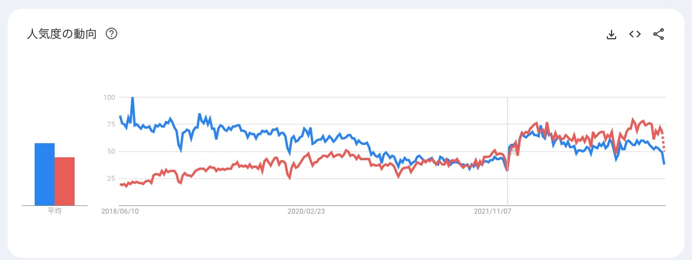
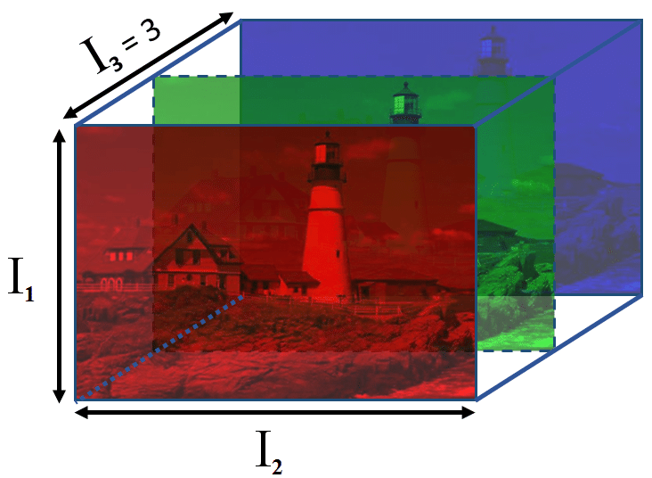
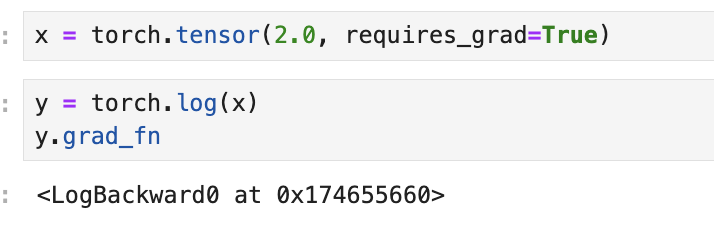
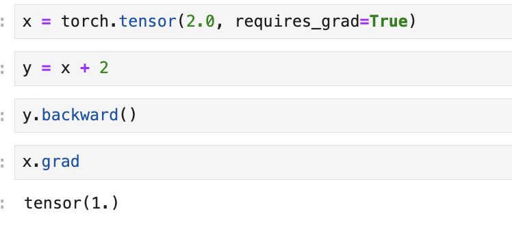
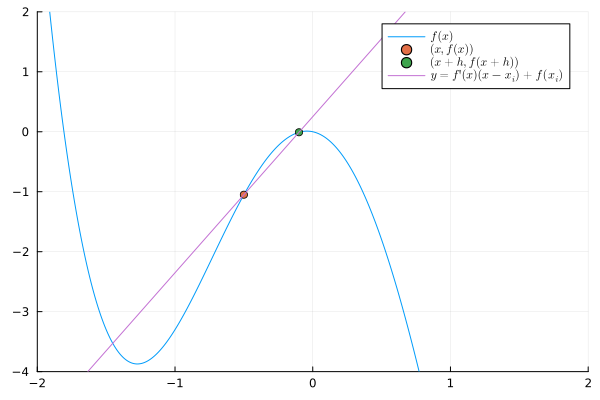
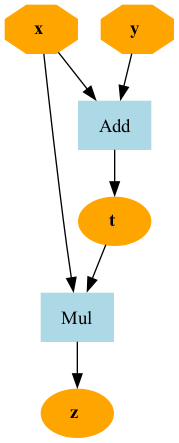
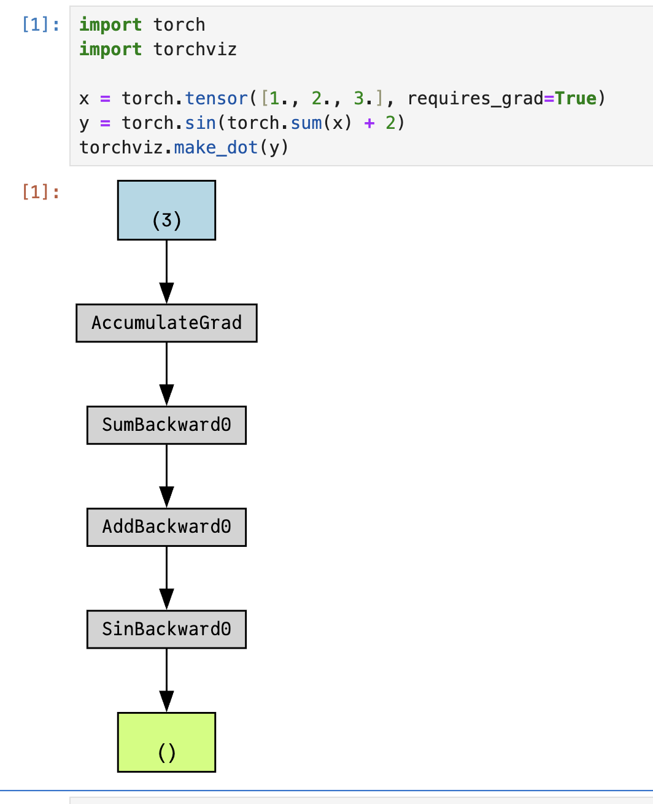
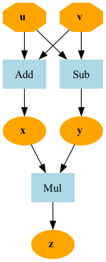
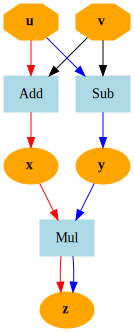

<!-- _class: lead-->

# 機械学習講習会 第三回
## - 「自動微分」


**traP Kaggle班**
2024/06/28


---

<!-- _header: 前回のまとめ　-->

- 損失関数の最小化を考える上で, 一般の関数の最小化を考えることにした
- 損失関数の厳密な最小値を求める必要はなく, また損失関数は非常に複雑になりうるので, 広い範囲の関数に対してそこそこ上手くいく方法を考えることにした
- たいていの関数に対して, 導関数を求めることさえできればそれなりに小さい値を探しに行けるようになった
- 逆に, <span class="lined">**「導関数」は自分で求める必要がある**</span>

---

<!-- _header: 実は -->

# いまはね


---

<!-- _header: 思い出すシリーズ: 一般の関数の最小化 -->

## 第三問


<div class="def">


最小化してください.

$$
- \dfrac{1}{(x^2 + 1)}\log\left(\dfrac{1}{1 + e^{-x}} + 1\right)
$$


</div>

---

<!-- _class: lead -->
# 😅

---

<!-- _header: 思い出すシリーズ-->

<br>

## $\mathcal{L}$ は非常に複雑になりうる

第一回では **話を簡単にするために** $f(x) = ax + b$ の形を考えたが...

<br>

(特にニューラルネットワーク以降は) **非常に複雑になりうる** 

$$
\mathcal{L}(\mathbf{W^{(1)}}, \mathbf{W^{(2)}}, \cdots, \mathbf{W^{(n)}}, \mathbf{b^{(1)}}, \mathbf{b^{(2)}}, \cdots, \mathbf{b^{(n)}}) = \dfrac{1}{n} \sum_{i=0}^{n-1} \left( y_i - {W^{(n)}}^T \sigma \left( \cdots \sigma \left( {W^{(1)}}^T x_i + b^{(1)} \right) \cdots + b^{(n-1)} \right) \right)^2, \ \sigma(x) = \dfrac{1}{1 + e^{-x}}
$$

$$
\mathcal{L} (\boldsymbol{\theta}) = \dfrac{\sum_{p \in S} |f(p; \boldsymbol{\theta}) - \mathcal{F}(p)|^2 \cdot \omega_p}{\sum_{p \in S} \omega_p}
$$

$$
\vdots
$$


---

<!-- _header: 自動微分 -->

✅ 人間が微分を行うのは限界がある
⇨ 計算機にやらせよう！


<div style="text-align: center;">

<div class="def">

<br>

# 自動微分
### (Automatic Differentiation)

</div>

</div>

<div class="cite">

正確には「自動微分」は, コンピュータに自動で微分を行わせる手法のうち, とくに関数を単純な関数の合成と見て連鎖律を利用して, 陽に導関数を求めることなく微分を行う手法を指します. (より狭義に, back propagationを用いるもののみを指すこともあるようです).　

</div>


---

<!-- _header: おしながき -->


- PyTorchの導入
- PyTorchを使った自動微分
- 自動微分を使った勾配降下法の実装
- 自動微分の理論とアルゴリズム


---

<!-- _header: PyTorch -->


---

<!-- _header: 自動微分 -->

結論から言うと... **PyTorchを使うと微分ができる.**

```python
>>> x = torch.tensor(2.0, requires_grad=True)
>>> def f(x):
...     return x ** 2 + 4 * x + 3
... 
>>> y = f(x)
>>> y.backward()
>>> x.grad
tensor(8.)
```


( $f(x) = x^2 + 4x + 3$ の $x = 2$ における微分係数 $8$ が計算されている)

---

<!-- _header: そもそもPyTorchとは？　〜深層学習フレームワーク〜 -->

事実: 

<div class="def">

ニューラルネットワークのさまざまな派生系の


- 基本的な部品
- 部品に対してやる作業


は大体同じ！


</div>


---


<!-- _header: そもそもPyTorchとは？　〜深層学習フレームワーク〜 -->


例) 新しい車を開発するときも,部品は大体同じ,組み立ても大体同じ

<div style="text-align: center;">

⇩
 毎回同じことをみんながそれぞれやるのは面倒
⇩
<span class="dot-text">共通基盤</span> を提供するソフトウェアの需要がある

</div>


---

<!-- _header: どの組み立て機を使う？ 有名なフレームワークたち -->

<br>

- TensorFlow
    - (主に) Googleが開発したフレームワーク
    - 産業界で人気 (が, 最近はPyTorchに押され気味)
- PyTorch
    - (主に) Facebookが開発したフレームワーク
    - 研究界で人気 (最近はみんなこれ？)
- Keras
    - いろんなフレームワークを使いやすくしたラッパー (おもに TensorFLow)
    - とにかくサッと実装できる
- JAX/Flax, Chainer, MXNet, Caffe, Theano, ...

---

<!-- _header: そもそもPyTorchとは？　〜深層学習フレームワーク〜 -->

<br>

<div style="text-align: center;">

どれがいいの？
⇨ PyTorchを使っておけば間違いない (と, 思います)


</div>



<div style="text-align: center;">
(赤: PyTorch, 青: TensorFlow)
</div>

---

<!-- _header: なので -->

### 今回は **PyTorch** を使います！


- 高速な実行
- 非常に柔軟な記述
- 大きなコミュニティ
- 超充実した周辺ライブラリ
- サンプル実装の充実 (**← 重要!!**)

<div class="cite">

大体の有名フレームワークにそこまで致命的な速度差はなく, 記述に関しては好みによるところも多いです.PyTorchの差別化ポイントは, 有名モデルの実装サンプルが大体存在するという点です.
実際に論文を読んで実装するのは骨の折れる作業なので, サンプルが充実していのはとても大きな利点です.

</div>

---

<!-- _header: 今日のお話 -->

<div style="text-align: center;">


✅ 自動微分ライブラリとしての PyTorch の使い方を習得して,


## 手で微分するのをやめる

</div>


---

<!-- _header: `Tensor` 型 -->

数学の 「数」 に対応するオブジェクトとして,PyTorchでは

<div style="text-align: center;">

#  `Tensor` 型

</div>


を使う

---

<!-- _header: Tensor とは？ -->

<div class="def">

### Tensor (テンソル) 

スカラー ▶︎ ベクトル　▶︎ 行列 ... を一般化したもの。

添字 $D$ 個によって表現される量を $D$ 階のテンソルという

</div>


---

<!-- _header: Tensor とは？ -->

- スカラー: 添字 $0$ 個で値が決まる $\rightarrow$ $0$ 階のテンソル
- ベクトル: 添字 $1$ 個で値が決まる $\rightarrow$ $1$ 階のテンソル (`v = [1, 2, 3], v[0] = 1`) 
- 行列: 添字 2 個で値が決まる $\rightarrow$ $2$ 階のテンソル 
(`M = [[1, 2], [3, 4]], M[0][0] = 1`)

<div style="text-align: center;">

⇩ 例えば

</div>

`T = [[[1, 2], [3, 4]], [[5, 6], [7, 8]]]` は $3$ 階のテンソル (`T[0][0][0] = 1`)

---

<!-- _header: テンソルの例 -->

例) RGB 画像は $3$ 階のテンソル！

**$I_{i,j,k} = (i, j)$ 画素の $k$ 番目の色の強さ**

<div style="text-align: center;">
⇩　

</div>

$n$ 枚の画像をまとめたものは $4$ 階のテンソル.

**$I_{l,i,j,k} = l$ 番目の画像の $(i, j)$ 画素の $k$ 番目の色の強さ**




<div class="cite">

画像は Quantifying Blur in Color Images using Higher Order Singular Values - Scientific Figure on ResearchGate. Available from: https://www.researchgate.net/figure/3rd-order-Tensor-representation-of-a-color-image_fig2_307091456 より

</div>

---


<!-- _header: `Tensor` 型のつくりかた -->


<div class="box" style="border-width: 3px;">

## `torch.tensor(data, requires_grad=False)`

- `data`: 保持するデータ(配列**っぽい**ものならなんでも)
  - リスト, タプル, NumPy配列, スカラ, ...
- `requires_grad`: 勾配 (gradient)を保持するかどうかのフラグ
  - デフォルトは `False`
  - 勾配の計算(自動微分)を行う場合は `True` にする 
  - このあとこいつを微分の計算に使いますよ〜という表明


</div>


---

<!-- _header: `Tensor` 型 -->

```python
>>> x = torch.tensor(2.0, requires_grad=True)
```
$2.0$ というスカラを保持する `Tensor` 型のオブジェクトを作成

```python
>>> x = torch.tensor([1.0, 2.0, 3.0], requires_grad=True)
```
$(1.0, 2.0, 3.0)$ というベクトルを保持する `Tensor` 型のオブジェクトを作成

<div class="cite">

かつては自動微分には `Variable` という名前の型が使われていて, (現在は `Tensor` 型に統合)　`Tensor` と数学の変数の概念にある程度の対応があることがわかります.


</div>

---


<!-- _header: `Tensor` 型 -->

```python
>>> x = torch.tensor([[1.0, 2.0, 3.0], [4.0, 5.0, 6.0]], requires_grad=True)
```
$\begin{pmatrix} 1.0 & 2.0 & 3.0 \\ 4.0 & 5.0 & 6.0 \end{pmatrix}$ という行列を保持する`Tensor` 型のオブジェクトを作成


(`requires_grad=True`とすれば, 勾配計算が可能な `Tensor` 型を作成できる)

---

<!-- _header: 演習1 -->

これらを勾配計算が可能な`Tensor` 型として表現してください.

1. $x = 3.0$
2. $\vec{x} = (3.0, 4.0, 5.0)$
3. $X = \begin{pmatrix} 3.0 & 4.0 & 5.0 \\ 6.0 & 7.0 & 8.0 \end{pmatrix}$

(このページの内容は, 実際にやらなくてもやり方がわかればOKです)

↓ 問題の続き次のページへ


---

<!-- _header: 演習1 -->

(実際にやってください)

4. **整数** $x = 3$ を勾配計算が可能な`Tensor` 型として表現することを試みてください.また,その結果を確認して説明できるようにしてください.

<div style="text-align: center;">

※ 次のページにヒントあり
</div>

---

<!-- _header: 演習1 ヒント -->

**1, 2, 3**: 講義資料を遡って, `torch.tensor`の第一引数と作成される`Tensor` 型の対応を見比べてみましょう.

**4**: Pythonのエラーは, 
```
~~たくさん書いてある~
~~Error: {ここにエラーの端的な内容が書いてある}
```
という形式です."~~Error"というところのすぐ後に書いてある内容を読んでみましょう.


---

<!-- _header: 演習1 解答 -->


1~3.

```python
# 1
x = torch.tensor(3.0, requires_grad=True)
# 2
x = torch.tensor([3.0, 4.0, 5.0], requires_grad=True)
# 3
x = torch.tensor([[3.0, 4.0, 5.0], [6.0, 7.0, 8.0]], requires_grad=True)
```


次のページへ

---

<!-- _header: 演習1: 解答 -->

4.  
```python
x = torch.tensor(3, requires_grad=True)
```

としてみると

>RuntimeError: Only Tensors of floating point and complex dtype can require gradients

と出力されます. これは「勾配が計算可能なのは浮動小数点数型と複素数型を格納する `Tensor`のみである」 という PyTorch の仕様によるエラーです.

---

<!-- _header: `Tensor` 型に対する演算 -->

`Tensor` 型は 「数」なので当然各種演算が可能

```python
x = torch.tensor(2.0, requires_grad=True)
```

例) 四則演算

```python
x + 2 
# -> tensor(4., grad_fn=<AddBackward0>)
```
```python
x * 2
# -> tensor(4., grad_fn=<MulBackward0>)
```

---

<!-- _header: `Tensor`型に対する演算 -->

平方根を取ったり $\sin$ や $\exp$ を計算することも可能

```python
torch.sqrt(x)
# -> tensor(1.4142, grad_fn=<SqrtBackward0>)
```

```python   
torch.sin(x)    
# -> tensor(0.9093, grad_fn=<SinBackward0>)
```

```python   
torch.exp(x)
# -> tensor(7.3891, grad_fn=<ExpBackward0>)
```

---

<!-- _header: PyTorch と 自動微分 -->

ここまでの内容は別にPyTorchを使わなくてもできること
PyTorchは **計算と共に勾配の計算ができる！**

抑えてほしいポイント:

<div class="def">

##  `requires_grad=True` である `Tensor` 型に対して計算を行うと 行われた演算が記録された `Tensor` ができる.

</div>


---


<!-- _header: PyTorch と 自動微分 -->


```python
x = torch.tensor(2.0, requires_grad=True)
```

足し算をする.
```python
y = x + 2
```


---


<!-- _header: PyTorch と 自動微分 -->


```python
print(y)
```

これの出力は,

<div class="thm">

<div style="text-align: center;">

## `tensor(4., grad_fn=<AddBackward0>)`

⇩

### 「**`Add`** という演算によって作られた」という情報を `y` が持っている！


</div>

</div>

---


<!-- _header: PyTorch と 自動微分 -->


普通の Pythonの数値では,
```python
x = 2
y = x + 2
print(y) # -> 4
```

`y`がどこから来たのかはわからない (値として $4$ を持っている **だけで、他にはない**)

---

<!-- _header: PyTorch と 自動微分 -->

## PyTorch のしている仕事

<div class="proof" style="border-radius: 100px;">

#### 1. 演算を記録してくれる
</div>


<div style="text-align: center">
⇩
</div>





---

<!-- _header: PyTorch と 自動微分 -->


<div class="thm">

## ✅ PyTorchは `backward` 関数をつかって
## 記録された演算を **辿る** ことで 勾配を計算できる


</div>

---

<!-- _header: `backward` による勾配計算 -->

<br>
<br>


## 1. `Tensor` 型のオブジェクトをつくる

```python
x = torch.tensor(2.0, requires_grad=True)
```

## 2. 計算を行う

```python
y = x + 2
```

## 3. `backward` メソッドを呼ぶ

```python
y.backward()
```

すると...


---

<!-- _header: `backward` による勾配計算 -->

<div style="text-align: center;">


## ✅ `x.grad` に計算された勾配が格納される！！


</div>

```python
print(x.grad) # -> tensor(1.)
```

<div style="text-align: center;">


( $y = x + 2$ の $\dfrac{dy}{dx} \bigg|_{x=2} = 1$ が計算されている )


</div>


---


<!-- _header: PyTorch と 自動微分 -->

## PyTorch のしている仕事

<div class="proof" style="border-radius: 100px;">

#### <span style="color: gray;"> 1. 演算を記録してくれる　</span>
</div>


<div style="text-align: center">
⇩
</div>


<div class="proof" style="border-radius: 100px;">

<!-- gray -->
#### 2. 記録された演算を辿って勾配を計算する 

</div>





---

<!-- _header: 自動微分の流れ -->

1. 変数 (`Tensor` 型)の定義
2. 計算
3. backward()
   
```python
# 1. 変数(`Tensor` 型)の定義
x = torch.tensor(2.0, requires_grad=True)
# 2. 計算
y = x + 2
# 3. backward()
y.backward()
```

すると `x.grad`に計算された勾配が格納される.


---

<!-- _header: 演習2: 100回唱えよう！ -->


定義→計算→backward(),   定義→計算→backward(),   定義→計算→backward(), 定義
定義→計算→backward(),   定義→計算→backward(),   定義→計算→backward(), 定義
定義→計算→backward(),   定義→計算→backward(),   定義→計算→backward(), 定義
定義→計算→backward(),   定義→計算→backward(),   定義→計算→backward(), 定義
定義→計算→backward(),   定義→計算→backward(),   定義→計算→backward(), 定義
定義→計算→backward(),   定義→計算→backward(),   定義→計算→backward(), 定義
定義→計算→backward(),   定義→計算→backward(),   定義→計算→backward(), 定義
定義→計算→backward(),   定義→計算→backward(),   定義→計算→backward(), 定義
定義→計算→backward(),   定義→計算→backward(),   定義→計算→backward(), 定義
定義→計算→backward(),   定義→計算→backward(),   定義→計算→backward(), 定義
定義→計算→backward(),   定義→計算→backward(),   定義→計算→backward(), 定義
定義→計算→backward(),   定義→計算→backward(),   定義→計算→backward(), 定義
定義→計算→backward(),   定義→計算→backward(),   定義→計算→backward(), 定義
定義→計算→backward(),   定義→計算→backward(),   定義→計算→backward(), 定義
定義→計算→backward(),   定義→計算→backward(),   定義→計算→backward(), 定義
定義→計算→backward(),   定義→計算→backward(),   定義→計算→backward(), 定義
定義→計算→backward(),   定義→計算→backward(),   定義→計算→backward(), 定義
定義→計算→backward(),   定義→計算→backward(),   定義→計算→backward(), 定義

---

<!-- _header: ありとあらゆる演算が自動微分可能 -->

例1) $f(x) = \sin((x + 2) + (1 + e^{x^2}))$　の微分
```python 
x = torch.tensor(2.0, requires_grad=True)
y = y = torch.sin((x + 2) + (1 + torch.exp(x ** 2))) 
y.backward()
print(x.grad()) # -> tensor(-218.4625)
```
例2) $y = x^2, z = 2y + 3$ の微分($\frac{dz}{dx}$)
```python
x = torch.tensor(2.0, requires_grad=True)
y = x ** 2
z = 2 * y + 3
z.backward()
print(x.grad) # -> tensor(8.)  ... backward()した変数に対する勾配！(この場合はz)
```

---

<!-- _header: ベクトル, 行列演算の勾配 -->

```python
x = torch.tensor([1.0, 2.0, 3.0], requires_grad=True)
y = 2 * x[0] + 3 * x[1] + 4 * x[2]
y.backward()
print(x.grad) # -> tensor([2., 3., 4.])
```

$$
\vec{x} = (x_1, x_2, x_3)^\mathsf{T} \\
$$

$$
y = 2x_1 + 3x_2 + 4x_3 
$$

$$
\frac{dy}{d\vec{x}} = \left(\frac{dy}{dx_1}, \frac{dy}{dx_2}, \frac{dy}{dx_3}\right)^\mathsf{T} = (2, 3, 4)^\mathsf{T}
$$

と対応

---

<!-- _header: ベクトル, 行列演算の勾配 -->

```python
A = torch.tensor([[1.0, 2.0, 3.0], [4.0, 5.0, 6.0]], requires_grad=True)
y = torch.sum(A)
y.backward()
print(A.grad) # -> tensor([[1., 1., 1.],
              #          [1., 1., 1.]])
```

$$
A = \begin{pmatrix}
1 & 2 & 3 \\
4 & 5 & 6
\end{pmatrix}, \ y = \sum_{i=1}^2 \sum_{j=1}^3 a_{ij} = 21
$$


$$
\frac{dy}{dA} = \begin{pmatrix}
\frac{dy}{da_{11}} & \frac{dy}{da_{12}} & \frac{dy}{da_{13}} \\
\frac{dy}{da_{21}} & \frac{dy}{da_{22}} & \frac{dy}{da_{23}}
\end{pmatrix} = \begin{pmatrix}
1 & 1 & 1 \\
1 & 1 & 1
\end{pmatrix}
$$

と対応


---

<!-- _header: 多変数関数の微分 -->

```python
x = torch.tensor(2.0, requires_grad=True)
y = torch.tensor(3.0, requires_grad=True)
z = 2 * x + 4 * y
z.backward()
print(x.grad) # -> tensor(2.)
print(y.grad) # -> tensor(4.)
```

$$
z = 2x + 4y \\
$$
$$
\dfrac{\partial z}{\partial x} = 2, \ \dfrac{\partial z}{\partial y} = 4
$$

に対応

---

<!-- _header: 注意: 実際に適用される演算さえ微分可能ならOK -->

<br>

```python
x = torch.tensor(2.0, requires_grad=True)

def f(x):
    return x + 3
def g(x):
    return torch.sin(x) + torch.cos(x ** 2)

if rand() < 0.5:
    y = f(x)
else:
    y = g(x)
```
✅  実際に適用される演算は実行してみないとわからない... 
が, 適用される演算はどう転んでも微分可能な演算なのでOK !
(if 文があるから, for 文があるから, 自分が定義した関数に渡したから...ということは関係なく, <span class="lined">**実際に Tensor に適用される演算のみが問題になる**</span>)


---


<!-- _header: 自動微分 -->

### 抑えてほしいポイント 👀

- 任意の(勾配が定義できる)計算を `Tensor` 型に対して適用すれば常に自動微分可能
- **定義→計算→backward()** の流れ
- ベクトル, 行列など任意の `Tensor` 型について微分可能. 多変数関数の場合も同様
- 「実際に適用される演算」さえ微分可能ならOK
  
---

<!-- _header: 演習3: 自動微分 -->


1. $y = x^2 + 2x + 1$ の $x = 3.0$ における微分係数を求めよ.
(https://oj.abap34.com/problems/autograd-practice-1)

1. $y = f(x_1, x_2, x_3) = x_1^2 + x_2^2 + x_3^2$ の $x_1 = 1.0, \ x_2 = 2.0, \ x_3 = 3.0$ における勾配を求めよ.
(https://oj.abap34.com/problems/autograd-practice-2)

1. $f(\boldsymbol{x_1}) = \boldsymbol{x_1}^T \begin{pmatrix}
1 & 2 \\
2 & 1 \\
\end{pmatrix} \boldsymbol{x_1}$ の $\boldsymbol{x}_1 = (1.0, 2.0)^T$ における勾配を求めよ.
(https://oj.abap34.com/problems/autograd-practice-3)


---

<!--　_header: 演習3: 解答 -->

1.
```python
x = torch.tensor(3.0, requires_grad=True)
y = x ** 2 + 2 * x + 1

y.backward()
gx = x.grad

print(gx.item()) # -> 8.0
```


<div class="cite">

スペースの都合上  `import torch`　を省略しています

</div>


---
<!--　_header: 演習3: 解答 -->

2.
```python
import torch

x1 = torch.tensor(1.0, requires_grad=True)
x2 = torch.tensor(2.0, requires_grad=True)
x3 = torch.tensor(3.0, requires_grad=True)

y = x1**2 + x2**2 + x3**2

y.backward()

print(x1.grad.item()) # -> 2.0
print(x2.grad.item()) # -> 4.0
print(x3.grad.item()) # -> 6.0
```


---


<!--　_header: 演習3: 解答 -->

3.
```python
W = torch.tensor([[1.0, 2.0], [2.0, 1.0]])
x1 = torch.tensor([1.0, 2.0], requires_grad=True)

y = torch.matmul(torch.matmul(x1, W), x1)
y.backward()

gx = x1.grad

print(*gx.numpy()) # -> 10.0 8.0
```


---

<!-- _header: 思い出すシリーズ: 勾配降下法のPyTorchによる実装 -->

<br>

$f(x) = x^2 + e^{-x}$ の勾配降下法による最小値の探索

```python
from math import exp

x = 3
lr = 0.0005

# xでの微分係数
def grad(x):
    return 2 * x - exp(-x)

for i in range(10001):
    # 更新式
    x = x - lr * grad(x)
    if i % 1000 == 0:
        print('x_', i, '=', x)
```

---

<!-- _header: 勾配降下法のPyTorchによる実装 -->
<br>
<br>

これまでは,導関数 `grad` を我々が計算しなければいけなかった
⇨ 自動微分で置き換えられる！

```python
import torch

lr = 0.01
N = 10001
x = torch.tensor(3.0, requires_grad=True)

def f(x):
    return x ** 2 - torch.exp(-x)

for i in range(10001):
    y = f(x)
    y.backward()
    x.data = x.data - lr * x.grad
    x.grad.zero_()
```

---


## 今ならこれを倒せるはず 


<div class="def">


最小化してください.

$$
- \dfrac{1}{(x^2 + 1)}\log\left(\dfrac{1}{1 + e^{-x}} + 1\right)
$$


</div>


<div style="text-align: center;">

https://oj.abap34.com/problems/minimize-difficult-function

</div>


---

<!-- _header: おまけ: 自動微分のアルゴリズム -->

## どうやって PyTorch は微分を計算しているのか？🧐

---

<!-- _header: おまけ: 自動微分のアルゴリズム -->

<div class="columns">

<div>

👦 < 微分係数を計算してください！

<div style="text-align: center;">

⇩

</div>

[いちばん素直な方法]

$\displaystyle f'(x) = \lim_{h \to 0} \frac{f(x+h) - f(x)}{h}$

を、小さい値で近似する 👉

</div>


<div>

<br>
<br>
<br>

```python
def diff(f, x):
    h = 1e-6
    return (f(x + h) - f(x)) / h
```


</div>  


---

<!-- _header: 勾配の計算法を考える ~近似編 -->

これでもそれなりに近い値を得られる.

例) $f(x) = x^2$ の $x=2$ における微分係数 $4$ を求める.

```python
>>> def diff(f, x):
...     h = 1e-6
...     return (f(x + h) - f(x)) / h
...
>>> diff(lambda x : x**2, 2)
4.0000010006480125  # だいたいあってる
```

---

<!-- _header: 数値微分 -->


#### 実際に小さい $h$ をとって近似する
## **「数値微分」**


お手軽だけど...

- 誤差が出る
- 勾配ベクトルの計算が非効率



---


<!-- _header: 数値微分 -->

<div class="section"> 1.3 勾配降下法と機械学習 </div>


<div class="columns">


<div>

#### 問題点①. 誤差が出る 
1. 本来極限をとるのに小さい $h$ を
とって計算しているので誤差が出る

1. 分子が極めて近い値同士の引き算に
なっていて $\left( \frac{\color{red}{f(x+h) - f(x)}}{h} \right)$
桁落ちによって精度が大幅に悪化.


</div>

<div>

#### 問題点②. 勾配ベクトルの計算が非効率

1. $n$ 変数関数の勾配ベクトル $\nabla f(\boldsymbol{x}) \in \mathbb{R}^n$ を計算するには,
各 $x_i$ について「少し動かす→計算」を繰り返すので $n$ 回 $f$ を評価する. 
   
2. 応用では $n$ がとても大きくなり, 
$f$ の評価が重くなりがちなので
これが <span class="lined">**致命的**</span>


</div>

</div>

---

<!-- _header: 数式の構造を捉える -->

<div style="text-align: center;">

⇩

いい感じに数式の構造をとって計算したい

</div>

---

<!-- _header: 計算グラフ -->

### ✅ 演算は **計算グラフ** とよばれる DAG で表現できる

$t = x + y, \ z = x \times t$ の計算グラフ　👉



<div class="cite">

単に計算過程を表しただけのものを Kantorovich グラフなどと呼び,
これに偏導関数などの情報を加えたものを計算グラフと呼ぶような定義もあります.
(伊里, 久保田 (1998) に詳しく形式的な定義があります)
ただ, 単に計算グラフというだけで計算過程を表現するグラフを指すという用法はかなり普及していて一般的と思われます.そのためここでもそれに従って計算過程を表現するグラフを計算グラフと呼びます.

</div>

---

<!-- _header: 計算グラフ -->


### ✅ PyTorch も **計算と同時** に <br> 計算グラフを構築


( `torchviz` というライブラリを使うと可視化できる！ )

```python
import torchviz
x = torch.tensor([1., 2., 3.], requires_grad=True)
y = torch.sin(torch.sum(x) + 2)
torchviz.make_dot(y)
```



<br>

<br>


<div class="cite">

PyTorch のように計算と同時に計算グラフを構築する仕組みを **define-by-run** と呼びます. これに対して計算前に計算グラフを構築する方法を **define-and-run** と呼びます. かつての TensorFlow などはこの方式でしたが, 現在では **define-by-run** が主流です. 「適用される演算のみが問題になる」という節からわかるように, この方法だと制御構文などを気にせず柔軟な計算グラフの構築が可能になるからです. 一方で、静的に計算グラフを作るのはパフォーマンスの最適化の観点からは非常にやりやすいというメリットもあります.

</div>


---


<!-- _header: 計算グラフによる表現 -->

<div class="section"> 2.3 自動微分 ─式からアルゴリズムへ  </div>

(一旦計算グラフを得たものとして)　
この構造から導関数を得ることを考えてみる.

---

<!-- _header: 連鎖律 -->

<div class="section"> 2.3 自動微分 ─式からアルゴリズムへ  </div>

<div class="thm">

**[連鎖律]**

$u, v$ の関数 $x, y$ による合成関数 $z \left(x(u, v), y(u, v)\right)$ に対して,

$$
\frac{\partial z}{\partial u} = \frac{\partial z}{\partial x} \cdot \frac{\partial x}{\partial u} + \frac{\partial z}{\partial y} \cdot \frac{\partial y}{\partial u}
$$

$$
\frac{\partial z}{\partial v} = \frac{\partial z}{\partial x} \cdot \frac{\partial x}{\partial v} + \frac{\partial z}{\partial y} \cdot \frac{\partial y}{\partial v}
$$


</div>


---


<!-- _header: 連鎖律と計算グラフの対応 -->

<div class="proof">


**目標**

$
\displaystyle
\begin{split}
x &= u + v \\
y &= u - v \\
z &= x \cdot y
\end{split}
$

のとき, $\dfrac{\partial z}{\partial u}$ を求める


</div>


   


---

<!-- _header: 連鎖律と計算グラフの対応 -->

$$
\frac{\partial z}{\partial u} = \frac{\partial z}{\partial x} \cdot \frac{\partial x}{\partial u} + \frac{\partial z}{\partial y} \cdot \frac{\partial y}{\partial u}
$$


との対応は

 

---


<!-- _header: 連鎖律と計算グラフの対応 -->

$$
\frac{\partial z}{\partial u} = \color{red} \frac{\partial z}{\partial x} \cdot \frac{\partial x}{\partial u} 
\color{black} + \color{blue} \frac{\partial z}{\partial y} \cdot \frac{\partial y}{\partial u}
$$




---


<!-- _header: 連鎖律と計算グラフの対応 -->

<div class="thm">

✅ 変数 $z$ に対する $u$ による偏微分の
計算グラフ上の表現


$\leftrightarrow$ **$u$ から $z$ への全ての経路の偏微分の総積の総和**


$$
\large
\frac{\partial z}{\partial u} = \sum_{p \in \hat{P}(u, z)} \  \left( \prod_{(s, t) \in p} \dfrac{\partial t}{\partial s} \right)
$$


<div style="font-size: 15px"> 

$\hat{P}(u, z)$ は $u$ から $z$ への全ての経路の集合. $(s, t)$ は変数 $s$ から変数 $t$ への辺を表す.

</div>

</div>


---

<!-- _header: 連鎖律と計算グラフの対応 -->

<div class="columns">

<div>

演算を **基本的な演算の合成に分解** すれば、 $\dfrac{\partial t}{\partial s}$ は事前に網羅できる！

## ⇨ **全体の勾配が求まる 🙌**


</div>

<div>

<div class="thm">


$$
\large
\frac{\partial z}{\partial u} = \sum_{p \in \hat{P}(u, z)} \  \left( \prod_{(s, t) \in p} \dfrac{\partial t}{\partial s} \right)
$$

</div>


</div>

</div>

---

<!-- _header: OO を使った典型的な自動微分の実装 -->

<div class="columns">

<div>

<br>
<br>
<br>
<br>
<br>

1. **基本的な演算**　を用意しておく.

</div>


<div>

<br>

```python
class Add:
    def __call__(self, x0: Tensor, x1: Tensor) -> Tensor:
        self.x0 = x0
        self.x1 = x1
        return Tensor(x0.value + x1.value, creator=self)

    def backward(self, gy):
        return gy, gy

class Mul:
    def __call__(self, x0: Tensor, x1: Tensor) -> Tensor:
        self.x0 = x0
        self.x1 = x1
        return Tensor(x0.value * x1.value, creator=self)

    def backward(self, gy):
        return gy * self.x1, gy * self.x0
```

</div>

</div>

---

<!-- _header: OO を使った典型的な自動微分の実装 -->

<div class="columns">


<div>
<br>
<br>


1. **変数を表すオブジェクト**を用意しておき、これの基本的な演算をオーバーライドする.

</div>

<div>

```python
class Tensor:
    def __init__(self, value):
        ...

    def __add__(self, other):
        return Add()(self, other)

    def __mul__(self, other):
        return Mul()(self, other)
```


</div>


</div>


---

<!-- _header: 連鎖律と計算グラフの対応 -->

## ✅ 実は工夫するとノード数の定数倍で勾配を計算可能！

詳しくは [Julia Tokyo #11 トーク: 「Juliaで歩く自動微分」](https://speakerdeck.com/abap34/julia-tokyo-number-11-toku-juliadebu-kuzi-dong-wei-fen) をみよう！


PyTorch でもこの方法で勾配を計算している.

---
