<!-- _class: lead-->

# 機械学習講習会 第四回
## - 「ニューラルネットワークの構造」

**traP Kaggle班**
2024/07/01

---

<!-- _header: 振り返りタイム -->

第一回 「学習」 
第二回 「勾配降下法」
第三回 「自動微分」

---

<!-- _header: 「学習」 -->

1. 予測をするには、「モデル」を作る必要があった
1. モデルのパラメータを決めるために、パラメータの関数である損失関数を導入した

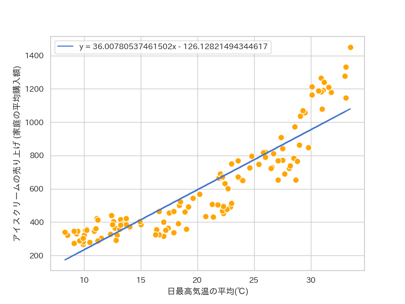

---

<!-- _header: 「勾配降下法」 -->

3. 複雑な関数である損失関数を最小にするために、
「勾配降下法」 を使ってパラメータを探索した

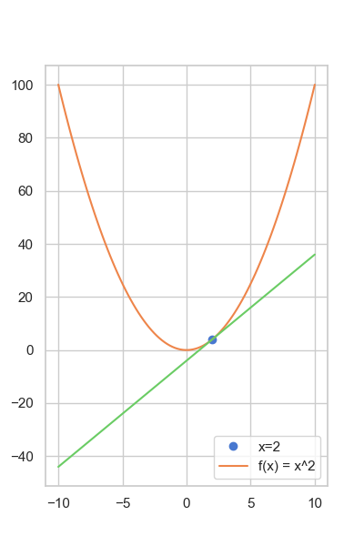

---

<!-- _header: 「自動微分」 -->

4. 自動微分を使うことで、手で微分をしなくて勾配を計算できるようになり、勾配降下法を使えるようになった

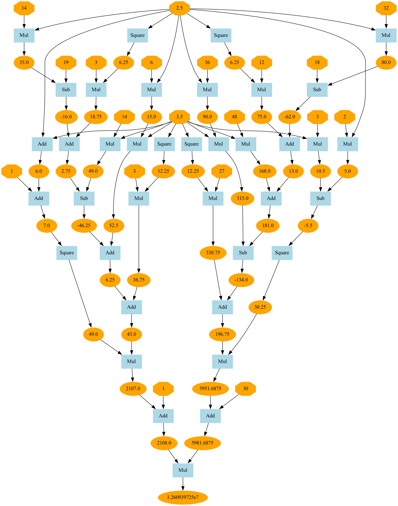

---

<!-- _header: 振り返りタイム -->

1. 予測をするには、「モデル」を作る必要があった
2. モデルのパラメータを決めるために、パラメータの関数である損失関数を導入した
3. 損失関数を最小にするパラメータを求めるために勾配降下法を導入した
4. 自動微分によって手で微分する必要がなくなった  [← 今ココ！]

---

<!-- _header: 第三回までのまとめ　-->

## われわれができるようになったこと

データさえあれば...誤差を小さくするパラメータを

- 例え複雑な式でも
- 例え自分で導関数を見つけられなくても

求められるようになった！
(== **学習ができるようになった！**)

---

<!-- _header: 線形回帰からの飛躍 -->

ここまでは $f(x) = ax + b$ のかたちを仮定してきた (線形回帰)

⇨ われわれの手法はこの仮定に依存しているか？ 🧐

　⇩

#  依存していない 

---

<!-- _header: 線形回帰からの飛躍 -->

 

我々の手法 (自動微分と勾配降下法による学習) で満たすべき条件だったのは...

# $L(a, b)$ が $a, b$ について
# 微分可能である

**のみ！**

⇨ この条件を満たす関数なら **どんなものでも** 学習できる！

---

<!-- _header: 今日のお話は... -->

##  $\large f$ を変えよう

$$
\LARGE
L(a, b) = \sum_{i=0}^{n-1} (y_i - \color{red}{\underline{f}}  \color{black}{(x_i)})^2
$$

---

<!-- _header: 線形回帰からの飛躍 -->

$f(x) = ax + b$　は、 $a, b$ をどんなに変えても常に直線
⇨ 直線以外の関係を表現できない

---

<!-- _header: どんな関数をつかうべきか? -->
 
$f(x) = ax^2 + bx + c$ でも大丈夫

$f(x) = \sin(ax + b)$ でも大丈夫

$f(x) = e^{ax + b}$  でも大丈夫

⇨ 直線以外を表現することはできるが

- 二次曲線
- sinカーブ
- 指数カーブ(?)

しか表現できない

---

<!-- _header: 複雑な関数を表現する方法を考えよう！ -->

これらのパラメータどんなにいじっても

👉 

みたいなものは表現できない

---

<!-- _header: 複雑さを生み出す方法 -->

#### ✅ アイデア1: 関数を合成する

$\exp, \sin, x^2 + x$ はそれぞれ単純な関数

👉 一方、合成した $h(x) = \exp(\sin(x^2 + x))$ は、

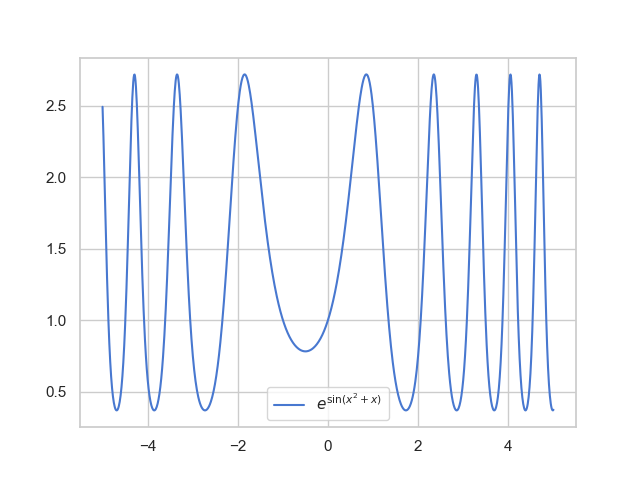

---

<!-- _header: 複雑さを生み出す方法 -->

#### ✅ アイデア2: 和をとる

---

<!-- _header: 複雑さを生み出す方法 -->

三角関数を 3つ用意

- $f_1(x) = \sin(0.5 x)$
- $f_2(x) = \cos(0.8 x)$
- $f_3(x) = \sin(0.75 x)$

それぞれは単純

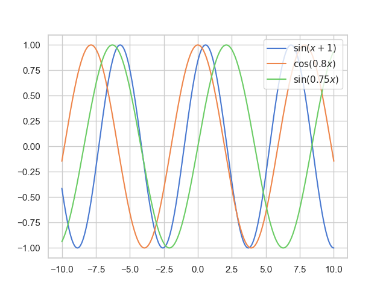

---

<!-- _header: 複雑さを生み出す方法 -->

一方、重み付き和をとると

$f(x) = 3  f_1(x) - 2 f_2(x) + f_3(x)$

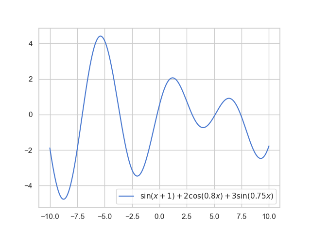

👉 そこそこ複雑

---
<!-- _header: ぐにゃっとした関数の表現のしかた -->

### ✅ 簡単めの関数の
### 1. 合成
### 2. 和
### を考えたら結構複雑なやつも表現できる

---

<!-- _header: パラメータを変えることによって幅広い表現が得られる確認 -->

パラメータとして
$\boldsymbol{a} = (a_1, a_2, a_3, a_4, a_5)$,
$\boldsymbol{b} = (b_1, b_2, b_3, b_4, b_5)$,
$\boldsymbol{c} = (c_1, c_2, c_3, c_4, c_5)$
をもつ
$$
f(x; \boldsymbol{a}, \boldsymbol{b}, \boldsymbol{c}) = \sum_{i=1}^5 a_i \sin(b_i x + c_i)
$$　

を考える

⇩

---

<!-- _header: パラメータを変えることによって幅広い表現が得られる確認 -->

$\boldsymbol{a} = (0.83, 0.27, 0.84, 0.28, 0.14)^T$
$\boldsymbol{b} = (0.71, 0.47, 0.56, 0.39, 0.94)^T$
$\boldsymbol{c} = (0.08, 0.92, 0.16, 0.44, 0.21)^T$　
のとき

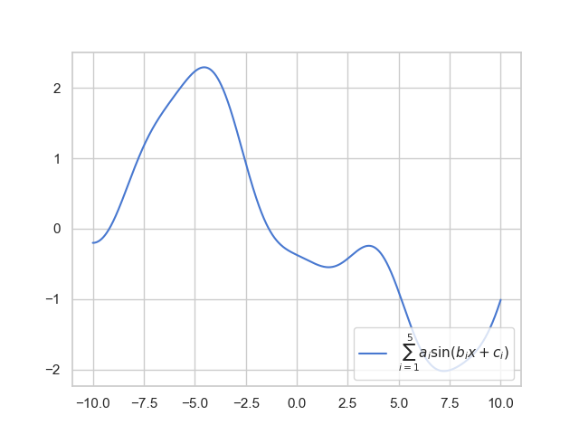

正確な値は `a = [ -6.4801085083, 6.1051318800, 7.9832160997, -8.3429947226, 5.3951834931 ], b = [ 0.0749141624, -0.0644060425, -0.2030537747, -0.2263950685, -0.0981644237 ], c = [ -2.5574982288, 11.9469148236, -9.5401909056, -9.7479688677, 8.6363494625 ]` です

---

<!-- _header: パラメータを変えることによって幅広い表現が得られる確認 -->

$\boldsymbol{a} = (0.39, -0.29, -0.67, -0.96, 0.92)^T$

$\boldsymbol{b} = (-0.35, 0.84, 0.22, -0.25, -0.04)^T$

$\boldsymbol{c} = (-0.61, -2.06, 3.97, 0.40, -3.85)^T$

のとき

正確な値は`a = [ 0.3902687779, -0.2931365774, -0.6719522358, -0.9616291983, 0.9248299981 ],b = [ -0.3522200005, 0.8488925592, 0.2250941117, -0.2574283604, -0.0413569962 ], c = [ -0.6140479386, -2.0554661015, 3.9653490740, 0.3968633932, -3.8504082926]` です

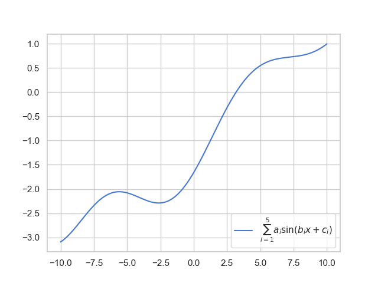

---

<!-- _header:  「基になる関数」はどう選ぶべきか？　-->

「基になる関数」 にどのような関数を選ぶべきか？

- 三角関数?
- 多項式関数?
- 指数関数?
- もっと別の関数?
...

これまでの我々のアプローチを思い出すと、

**変化させるのが可能なところはパラメータにして、学習で求める**」

---

<!-- _header:  「基になる関数」はどう選ぶべきか？　-->

# 「基になる関数」も
#  学習で求めよう

---

<!-- _header: ニューラルネットワーク -->

 

# ニューラルネットワーク

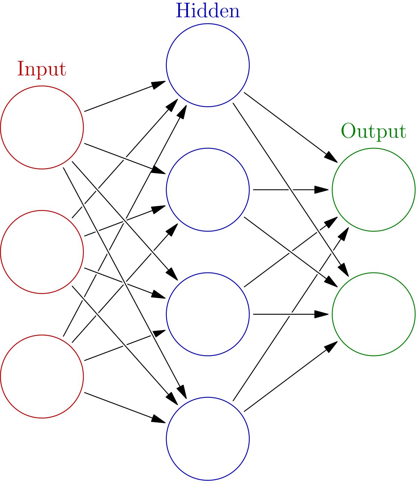

---

<!-- _header: ニューラルネットワーク -->

[事実1] 
**最近流行りの機械学習モデルはたいていニューラルネットワークをつかっている**

中央の画像は https://diamond.jp/articles/-/241828 より.
 Ponanza と佐藤天彦名人の対局

---

<!-- _header: ニューラルネットワーク -->

[事実2] 
**ある程度以上複雑なタスクでは、ニューラルネットワークが最も優れた性能を示すことが多い**

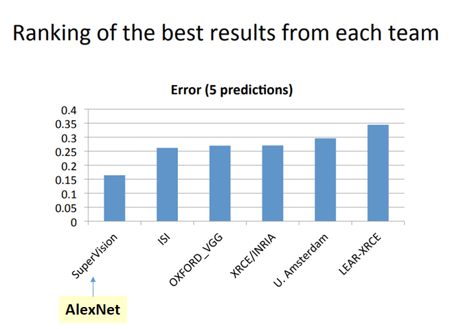

画像は https://medium.com/coinmonks/paper-review-of-alexnet-caffenet-winner-in-ilsvrc-2012-image-classification-b93598314160 から

---

<!-- _header: 今日の内容 -->

### 1. ニューラルネットワークの基本的な概念の整理
### 2. 全結合層の理解

---

<!-- _header: 基本的な概念 -->

**基本単位: レイヤー**

ニューラルネットワークは、「レイヤー(層)」と呼ばれる関数の合成によって構成されるモデル

---

<!-- _header: ニューラルネットワークの構造　-->

**基本単位: レイヤー**

ニューラルネットワークは、「レイヤー(層)」と呼ばれる関数の合成によって構成されるモデル

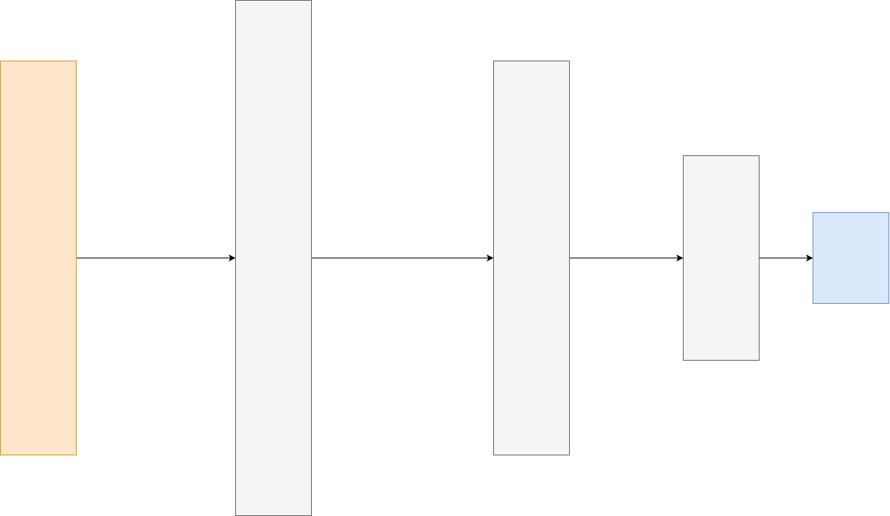

---

<!-- _header: ニューラルネットワークの構造　-->

 

- 入力層
入力を受け取る部分

- 出力層
出力を出力する部分

- 中間層(隠れ層, hidden layer)
それ以外

⇩

データの流れは、
**$x$ →入力層→中間層...→出力層 = $y$**

---

<!-- _header: いろいろなレイヤーがある -->

PyTorch本体ででデフォルトで定義されているものだけで 160個以上? [1]

[1] `torch.nn.Module` のサブクラスの数を数えました。正確な数でないかもしれません。

---

<!-- _header: 全結合層 (Linear, Dense層) -->

## もっとも普遍的・基本のレイヤー

## 全結合層 (Linear, Dense層)

パラメータ $W \in \mathbb{R}^{m \times n}, \ \boldsymbol{b} \in \mathbb{R}^m$ と 

各レイヤーが固有にもつ活性化関数 $\sigma$ を用いて

入力として $\boldsymbol{x} \in \mathbb{R}^n$ を受け取り、 $\sigma \left(W \boldsymbol{x} + \boldsymbol{b} \right)$ を出力する。

---

<!-- _header: 全結合層がしていること -->

1. $n$ 個の入力を受け取り、$m$ 個出力する

2. 複雑な関数を表現するアイデア...

   

   
   1. 合成
   2. 和をとる
   
   

    をする

---

<!-- _header: 全結合層がしていること -->

#### 1. $n$ 個の入力を受け取り、$m$ 個出力する

パラメータ $W \in \mathbb{R}^{m \times n}, \ \boldsymbol{b} \in \mathbb{R}^m$ と 

各レイヤーが固有にもつ活性化関数 $\sigma$ を用いて

入力として $\boldsymbol{x} \in \mathbb{R}^n$ を受け取り、 $\sigma \left(W \boldsymbol{x} + \boldsymbol{b} \right)$ を出力する。

---

<!-- _header: 全結合層がしていること -->

2. 複雑な関数を表現するアイデア...

   

   
   1. 合成
   2. 和をとる
   
   

    をする

---

<!-- _header: 活性化関数 -->

非線形関数
- シグモイド関数
  $\sigma(x) = \dfrac{1}{1 + \exp(-x)}$

- ReLU関数
$\mathrm{ReLU}(x) = \max(0, x)$

- tanh関数
$\tanh(x) = \dfrac{\exp(x) - \exp(-x)}{\exp(x) + \exp(-x)}$

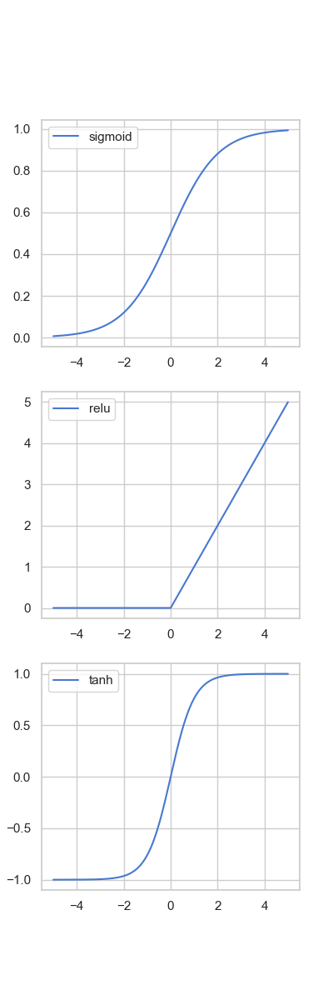

---

<!-- _header: アイデア1. 合成 -->

合成を繰り返す ⇨ 複雑な関数を表現

 

---

<!-- _header: アイデア2. 和をとる -->

$m$個の出力のひとつに注目してみる

$\boldsymbol{y} = \sigma \left(W \boldsymbol{x} + \boldsymbol{b} \right)$  

⇩

 $y_i = \sigma \left( \displaystyle{\sum_{j} W_{ij} x_j + b_i} \right)$

 

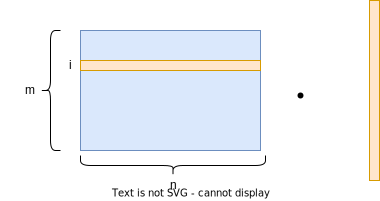

---

<!-- _header: 分解して考えると -->

$y_i = \sigma \left( \displaystyle{\sum_{j} W_{ij} x_j + b_i} \right)$

は、 

👉 と同じことをしている

---

<!-- _header: 分解して考えると -->

$y_i = \sigma \left( \displaystyle{\sum_{j} W_{ij} x_j + b_i} \right)$

この層の入力 $x_j$ はそれまでの層で $\sigma$ を通ってきたもの.

---

<!-- _header: 複雑な関数が生まれていた -->

$\sigma \left( \displaystyle{\sum_{j} W_{ij} x_j + b_i} \right)$

⬇︎

非線形関数の重みつき和

⬇︎

複雑な非線形関数を表現できる！ + さらにそれを非線形関数に通す

---

<!-- _header: 合成 -->

演算を $d$ 回繰り返す

($n$ 次元ベクトル → $m_1$, → $m_2$, → $\cdots$, → $m_d$ 次元ベクトルへと変換されながら
計算が進んでいく)

$$
\boldsymbol{u}^{(1)} = \sigma \left(W^{(1)} \boldsymbol{x} + \boldsymbol{b}^{(1)} \right)
$$

$$
\boldsymbol{u}^{(2)} = \sigma \left(W^{(2)} \boldsymbol{u}^{(1)} + \boldsymbol{b}^{(2)} \right)
$$

$$
\cdots
$$

$$
\boldsymbol{u}^{(d)} = \sigma \left(W^{(d)} \boldsymbol{u}^{(d-1)} + \boldsymbol{b}^{(n)} \right)
$$

---

<!-- _header: 出力層　-->

ここで、

#### 　$\boldsymbol{u}^{(i)}$ は非常に複雑な $\boldsymbol{x}$ の**非線形**な関数

## + これはパラメータによって変化する

---

<!-- _header: というわけで　-->

# 「基になる関数」も
#  学習で求めよう

---

<!-- _header: MLP -->

とくに、全結合層のみからなるニューラルネットワークを
**多層パーセプトロン (Multi Layer Perceptron, MLP)** という

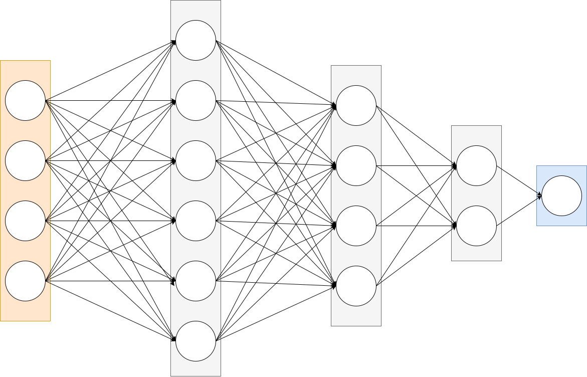

---

<!-- _header: そのほかの用語たち -->

<!-- DNN (Deep Neural Network) ... 複数の隠れ層を持つニューラルネットワーク
ANN (Artificial Neural Network) ... 人工ニューラルネットワーク。本来の意味のニューラルネットワーク(動物の神経回路) と区別するため -->

| 用語 | 意味 |
| --- | --- |
| MLP (Multi Layer Perceptron) | 全結合層のみからなるニューラルネットワーク |
| DNN (Deep Neural Network) | 複数の隠れ層を持つニューラルネットワーク |
| ANN (Artificial Neural Network) | 人工ニューラルネットワーク。本来の意味のニューラルネットワーク(動物の神経回路) と区別するためこういう名前が使われることがある |

---

<!-- _header: ニューラルネットワークの性質 -->

そもそもの動機: 
直線だけしか表現できないのは困る。いろいろな関数が表現できるようになりたい。

⇩

どれくらいの範囲の関数が表現できるようになったのか？

---

<!-- _header: ニューラルネットワークの万能近似性 -->

## 結論

# 直線 ⇨ なんでも ※ 

※ ざっくりとした表現です。

---

<!-- _header: ニューラルネットワークの万能近似 -->

### ニューラルネットワークの万能近似定理 (普遍性定理)

隠れ層を一つ持つニューラルネットワークは、
任意の連続関数を表現できる ※

※ ざっくりとした表現です。

---

<!-- _header: 今日のまとめ -->

- 我々の学習手法は、 $f(x) = ax + b$ というモデルの構造自体に直接依存しているわけではなかった

- そして、 $f(x) = ax + b$ というモデルの構造では直線しか表現することができないので、違う形を考えることにした
- 「基になる」簡単な関数の、合成と和を考えることでかなり複雑な関数も表現できることがわかった
- 「基になる」関数の選び方を考える上で、この関数自体もパラメータによって変化させるモデルとして、ニューラルネットワークを導入した
- ニューラルネットワークは非常に幅広い関数を表現できることがわかった

---

<!-- _header: 次回予告 -->

 

## 第5回 ニューラルネットワークの学習と評価

- He, Xavierの初期化
- 確率的勾配降下法
- 損失関数
- オプティマイザ
- バリデーションと性能評価
- ハイパーパラメータ

## Next ⇨ 第6回　ニューラルネットワークの実装

---

<!-- _header: 発展的話題:万能近似の(直感的な) 説明 -->

- ニューラルネットワークの表現能力は 1980年代後半 ~ 1990年代後半くらいまで盛んに研究されていた
- いろいろな条件でいろいろな結果を得ている
- ここではおそらく最も有名である Cybenko による定理 [1] を紹介する

[1] Cybenko, George. "Approximation by superpositions of a sigmoidal function." Mathematics of control, signals and systems 2.4 (1989): 303-314.

---

<!-- _header: 準備-->

 

**準備**

**定義1. シグモイド型関数**

$$
\sigma(x) \to \left\{
\begin{array}{ll}
0 & (x \to -\infty) \\
1 & (x \to \infty)
\end{array}
\right.
$$

を満たす関数を「シグモイド型関数」と呼ぶ。

$I = [0, 1]^d$ として、$C$ を $I$ 上の連続関数全体の集合とする。

---

<!-- _header: 主張　-->

**定理 (Cybenko, 1989)**

 

任意の $f \in C, \ \varepsilon > 0$ に対して、ある  $g(x) = \sum_{i=1}^{n} a_i \sigma(b_i x + c_i)$ が存在して

$$
\forall x \in I, \ |f(x) - g(x)| < \varepsilon
$$

 

---

<!-- _header: 主張　-->

平易に書くと、

**どんな連続関数も隠れ層が一つのニューラルネットワークで十分に近似できる**

---

<!-- _header: ステップ1. シグモイド型関数をつかった階段関数のつくりかた -->

$$
\large
g(x) = \sum_{i=1}^{n} a_i \sigma(b_i x + c_i)
$$

$$
\small
\left(\sigma(x) \to \left\{
\begin{array}{ll}
0 & (x \to -\infty) \\
1 & (x \to \infty)
\end{array}
\right. \ \right)
$$

 

$\sigma$ はシグモイド型関数 ⇨ $b_i$ をものすごく大きくするとどうなるか？

---

<!-- _header: 証明ステップ1 -->

$b_i = 9999999999999999999999999999999999999999$

とする。

すると、 $x_i - \dfrac{c_i}{b_i}$ が少しでも正なら 

$\sigma(b_i x + c_i) = 1$ 

負なら
$\sigma(b_i x + c_i) = 0$.

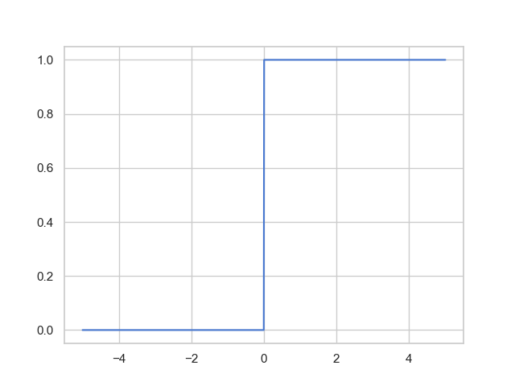

---

<!-- _header: 証明ステップ1 -->

$\sigma(b_ix + c_i)$ は $b_i = 999999999999999999999999999999999999999999999999999999999999999999999$

とすると、$x_i - \dfrac{c_i}{b_i}$ が少しでも正ならば $1$, そうでなければ $0$ になる。

⇨ $c_i$ を適当に調整すれば、 狙った点 $t$ で、

$$
\sigma(b_i x + c_i) = \left\{
\begin{array}{ll}
1 & (x > t) \\
0 & (x \leq t)
\end{array}
\right.
$$

とすることができる.　(例: $b_i = 10^{100}, c_i = 2 \times 10^{100}$ なら $t = 2$)

 
さらに、 $b_i$ を負の非常に大きい数にすると、 **逆のバージョンも作れる.**

---

<!-- _header: 証明ステップ2. 矩形関数の作り方 -->
 
 

✅ すると、 正の大きな数によってステップ関数にしたものと
負の大きな数によってステップ関数にしたものを足し合わせることで、
**矩形関数を作ることができる！**

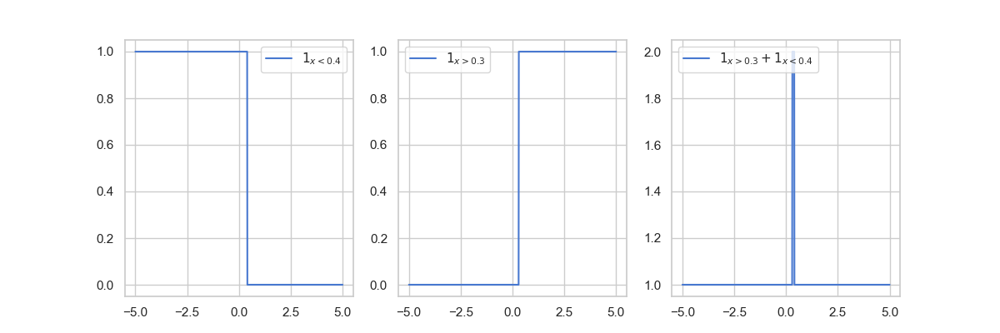

---

<!-- _header: 証明ステップ3. ウイニングラン -->

**✅　これさえできればもうOK**

連続関数を全て**矩形関数の和**としてみればよい.

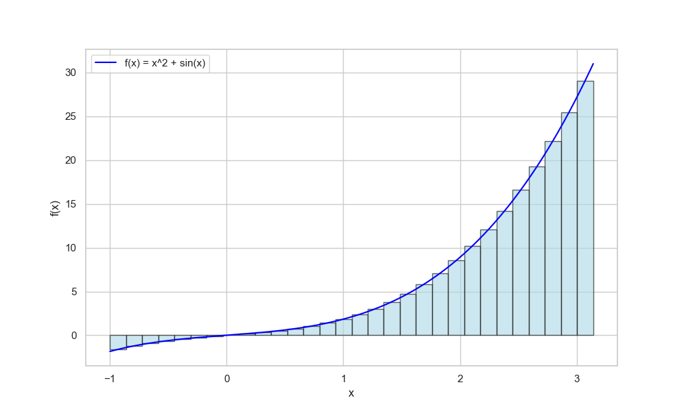

---

<!-- _header: 万能近似できるからいい？ -->

任意の連続関数を近似できるモデルはニューラルネットワークだけ？

⇨ **全然ふつうにNO.**

❌「万能近似ができるからニューラルネットワークがよくつかわれる」
 
 \+ あくまでそのような $a_i, b_i, c_i$ が存在するという主張であって、
  **それを求める方法については何ら保証していない**

⇩

ニューラルネットワークの優位性を考えるなら、もうすこし議論を進めていく必要がある

---

<!-- _header: 「深さ」は必要？ -->

<!-- 文字少し小さく -->

この結果の主張: 
**十分幅が広い「隠れ層」が一つあれば十分**

世の中の主張: 
**たくさんの層があるNNがよく機能する**

　
⇩　なぜ？

A. 層を深くすると指数関数的に表現力が上がり、幅を広くすると多項式的に表現力が上がる。 [1]

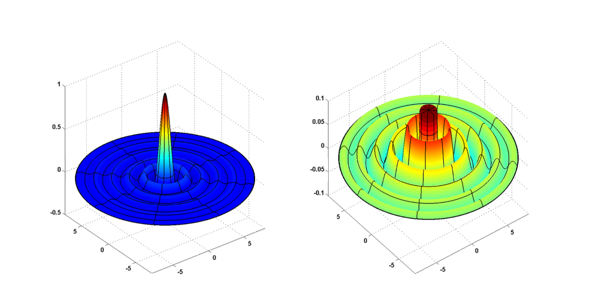

 

[1] 
Eldan, Ronen, and Ohad Shamir. "The power of depth for feedforward neural networks." Conference on learning theory. PMLR, 2016.

画像も同論文より

