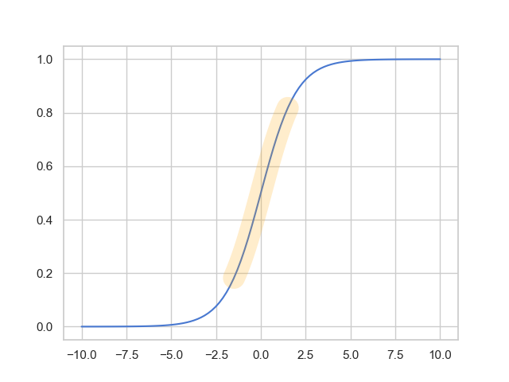

<!-- _class: lead-->

# 機械学習講習会 第五回
## - 「ニューラルネットワークの学習と評価」

**traP Kaggle班**
2024/07/03

---

<!-- _header: 振り返りタイム -->

- 我々の学習手法は, $f(x) = ax + b$ というモデルの構造自体に直接依存しているわけではなかった
- $f(x) = ax + b$ というモデルの構造では直線しか表現することができないので, 違う形を考えることにした
- 「基になる」簡単な関数の **合成** と **和** を考えることでかなり複雑な関数も表現できることがわかった
- 「基になる」関数の選び方を考える上で, この関数自体もパラメータによって変化させるモデルとしてニューラルネットワークを導入した
- ニューラルネットワークは非常に幅広い関数を表現できることがわかった

---

<!-- _header: DNNの学習はむずかしい？ -->

ニューラルネットワークは非常に多くのパラメータをもつ
(例: 全結合層はそれぞれ $W \in \mathbb{R}^{n \times m}$ と $b \in \mathbb{R}^m$ のパラメータを持つ)

⇩

**学習はそれなりに難しいタスク**

---

<!-- _header: DNNの学習はむずかしい？   -->

ニューラルネットワーク研究の歴史を遡ってみると...?

⇩

😯 実は真空管で計算をしている時代からニューラルネット(の原型)が作られて計算されていた

右は真空管を使ったパーセプトロンの計算機を作っている Frank Rosenblatt. 
10ニューロン程度のパーセプトロンを作っていたらしい. 
(画像は https://news.cornell.edu/stories/2019/09/professors-perceptron-paved-way-ai-60-years-too-soon より)

---

<!-- _header: DNNの学習はむずかしい？   -->

- 1986年ごろ: 多層パーセプトロン
  → ニューラルネットで全部表現できる！すごい！！
  → 数学的な研究も進み始める (Hecht-Nielsen, 1987 や Cybenko, 1989 など)

---

<!-- _header: DNNの学習はむずかしい？   -->

1990年 ~ 2000年代

- ニューラルネットワークを大きくしていくと学習がとたんに難しくなる 😔
 (= まともなパラメータを獲得してくれない)

⇩

研究も下火に

---

<!-- _header: 学習手法の進化 -->

## **Geoffrey  Hinton**

DBN (Deep Belief Network) やオートエンコーダに関する研究 [1][2] を通じて DNN の学習の安定化に大きく貢献

[1] Hinton, Geoffrey E., Simon Osindero, and Yee-Whye Teh. "A fast learning algorithm for deep belief nets." Neural computation 18.7 (2006): 1527-1554.
[2] Hinton, Geoffrey E., and Ruslan R. Salakhutdinov. "Reducing the Dimensionality of Data with Neural Networks." Science, vol. 313, no. 5786, 2006, pp. 504-507. doi:10.1126/science.1127647.

---

<!-- _header: 学習手法の進化 -->

活性化関数の進化 (ReLU)
Dropout
Batch Normalization
オプティマイザの進化 (Adam, RMSprop ...)

⇩

**✅ DNN の学習を比較的安定して行えるように**

---

<!-- _header: 今日のおしながき① -->

## ✅ DNN の学習を安定的に, 効率的に行う技法を知る

---

<!-- _header: 勾配降下法の復習 -->

### 微分係数

  $f'(x)$ は $x$ における接線の傾き

  ⬇︎

  

  
  
  $-f'(x)$ **方向に関数を
  すこし動かすと関数の値はすこし小さくなる**

  
  

---

<!-- _header: 勾配降下法の復讐 -->

## 勾配降下法

関数 $f(x)$ と初期値 $x_0$ が与えられたとき,
次の式で $\{x_k\}$ を更新するアルゴリズム

$$
x_{k+1} = x_k - \eta f'(x_k)
$$

($\eta$ は**学習率**と呼ばれる定数)

---

<!-- _header: 今日やること1. 「ニューラルネットワーク向け」の学習 -->

勾配降下法...  $x_{n+1} = x_n - \eta f'(x_n)$

をニューラルネットワークに適用するための色々な技法

🔲 初期化 ( $x_0$ を決める)

⇩

🔲 計算 ( $x_{n+1} = x_n - \eta f'(x_n)$ を計算する)

のそれぞれをカスタマイズします

---

<!-- _header: 今日やること1. 初期値  -->

勾配降下法...  $x_{n+1} = x_n - \eta f'(x_n)$

✅ $x_0$ は 自分でが決めなければいけなかった！

---

<!-- _header: 今日やること1. 初期値  -->

一般の $f$ を最小化するとき

⇨ 初期値として普遍的にいい値はない

⇨ **NNは構造が固定されているのでいい初期値を考えられる**

---

<!-- _header: 初期値の決め方 -->

## 1. Xavierの初期値
## 2. Heの初期値

---

<!-- _header: 初期値の決め方 -->

### Xavier (Glorot) の初期値

$$
\begin{cases}
W_{i, j} \sim \mathcal{U}\left(-\sqrt{\dfrac{6}{n + m}}, \sqrt{\dfrac{6}{n + m}}\right) \\

b_j = 0
\end{cases}
$$

Glorot, Xavier, and Yoshua Bengio. "Understanding the difficulty of training deep feedforward neural networks." Proceedings of the thirteenth international conference on artificial intelligence and statistics. JMLR Workshop and Conference Proceedings, 2010.

---

<!-- _header: Xavierの初期値: 気持ち -->

## 活性化関数にとって得意なところで計算が進んでほしい.

---

<!-- _header: シグモイド関数の性質 -->

- 出力が $0$ または $1$ に 貼り付く
- $|x|$ が大きいと勾配がほぼ $0$

---

<!-- _header: 勾配消失 -->

$$
x_{k+1} = x_k - \eta \color{red} f'(x_k)
$$
⇩

**勾配がほとんど $0$ だと**
**学習がなかなか進まなくなる❄️**

---

<!-- _header: 思い出すシリーズ: 複雑さを生む -->

 

### ✅ 全結合層は非線形関数の和をとって複雑な関数を作っていた

|                                           |                                        |
| ----------------------------------------- | -------------------------------------- |
|  |  |

---

<!-- _header: 思い出すシリーズ: 複雑さを生む -->

 

ほとんど同じような「基になる関数」をとっても効率がわるい

---

<!-- _header: 各層で分散を維持する -->

 **出力と勾配両方** について

- 上下に貼り付く (分散大)
- ほとんど同じ値 (分散小)

にならないように
$\Leftrightarrow$ 分散を維持するようにすると

$\mathcal{U}(-\sqrt{6/(n+m)}, \sqrt{6/(n+m)})$ 

がいい初期値になる

---

<!-- _header: 初期値の決め方 -->

シグモイド関数はよくない性質 ($=$ 勾配消失) がある！
⇨ 次第に $\textrm{ReLU}(x) = \max(0, x)$ が使われるようになる

⇩ **ReLU 向けの初期値** (導出は Xavier と一緒)

### He (Kaiming) の初期値

$$
W_{i, j} \sim \mathcal{N} \left(0, \sqrt{\dfrac{2}{n}}\right)
$$

He, Kaiming, et al. "Delving deep into rectifiers: Surpassing human-level performance on imagenet classification." Proceedings of the IEEE international conference on computer vision. 2015.

---

<!-- _header: 導出から自然にわかること -->

**モデルの構造 (とくに活性化関数) によって適切な初期値のとり方が変わってくる！**

例) SIREN [1] という活性化関数に $\sin$ を使うモデルは $\small \mathcal{U}\left(-\sqrt{6 / n}, \sqrt{6 / n}\right)$ がいいとされている

[1] Sitzmann, Vincent, et al. "Implicit neural representations with periodic activation functions." Advances in neural information processing systems 33 (2020): 7462-7473.
画像も同論文より引用

---

<!-- _header: ちゃぶ台ひっくり返し -->

1. 初期値で頑張る
2. モデルの中で直してしまう

---

<!-- _header: Batch Normalization -->

### Batch Normalization

- 入力をミニバッチごとに正規化するレイヤー

⇨ 学習の効率化にかなり役立ち **初期化の影響を受けにくくする**
 

Ioffe, Sergey, and Christian Szegedy. "Batch normalization: Accelerating deep network training by reducing internal covariate shift." International conference on machine learning. pmlr, 2015.

---

<!-- _header: おまけ: 「乱数」は初期値に必要か？ -->

### 実は決定論的にやってもよい？

## ⇨ **ZerO Initialization** [1]

✅ 乱数生成をやめると再現性が向上してうれしい.

[1] Zhao, Jiawei, Florian Schäfer, and Anima Anandkumar. "Zero initialization: Initializing neural networks with only zeros and ones." arXiv preprint arXiv:2110.12661 (2021).

---

<!-- _header: 初期値のまとめ -->

- 適切な初期値を選ぶことで学習の安定性を向上させることができる
- Xavierの初期値, Heの初期値などがよく使われる
- 一方, 近年は初期値にそこまで神経質にならなくてもよくなりつつある
  - さらに一方で (!?) 特殊なネットワークではそれに適した初期値を使うとよい

---

<!-- _header:  ミニバッチ学習 -->

☑️ 初期化 ( $x_0$ を決める)　← Done!

⇩

🔲 計算 ( $x_{n+1} = x_n - \eta f'(x_n)$ を計算する)

---

<!-- _header:  オプティマイザ -->

🔲 $x_{n+1} = x_n - \eta f'(x_n)$

$f(x_n)$ の計算はできるようになった

⇩

**われわれは自動微分が使えるので**
**これで $f'(x_n)$ も計算できる 🤗**

⇩

計算の過程もカスタマイズする！

---

<!-- _header:  確率的勾配降下法 -->

## 確率的勾配降下法 (SGD)

データの **一部** をランダムに選んで,
そのデータに対する勾配を使ってパラメータを更新する

---

<!-- _header: 思い出すシリーズ: 局所最適解 -->

**局所最適解** ... 付近で最小
**大域最適解** ... 全体で最小

---

<!-- _header: NNの「損失平面」 -->

https://www.telesens.co/loss-landscape-viz/viewer.html で見てみよう！

(⚠️🚨 実際に右の3次元空間上で探索しているわけではないです！！！)

Li, Hao, et al. "Visualizing the loss landscape of neural nets." Advances in neural information processing systems 31 (2018).

画像も同論文より

---

<!-- _header: 局所最適解にハマらないようにするには？ -->

谷からの脱出方法

### ⇨ ランダム性 を入れる

---

<!-- _header: 局所最適解にハマらないようにするには？ -->

データを選ぶときに
ランダム性が入る！

⇩

**局所最適解にトラップされない**

---

<!-- _header: 更新式の改善 -->

プレーン な勾配降下法の更新式

$$
x_{n+1} = x_n - \eta f'(x_n)
$$

---

<!-- _header: オプティマイザ -->

- 学習率に鋭敏でなく
- 安定して
- 高速に
- 高い性能を得る

ためにいろいろなオプティマイザが提案されている 

(PyTorch 本体には13個)

画像は https://pytorch.org/docs/stable/optim.html より (2024年7月3日)

---

<!-- _header: オプティマイザの工夫の例: Momentum -->

## Momentum

$$
\begin{cases}
v_{n+1} = \alpha v_n - \eta f'(x_n) \\
x_{n+1} = x_n + v_{n+1}
\end{cases}
$$

---

<!-- _header: Momentum -->

---

<!-- _header: 局所最適解の谷の例 -->

✅ $f(x, y) = \dfrac{x^2}{4} + 16y^2$ 

の最小値 

$x = 0, \  y = 0$

 を勾配降下法で求めてみる

---

<!-- _header: 局所最適解の谷の例 -->

谷を往復し続けて収束の効率がめちゃくちゃ悪い 😔

 

アニメーション:  https://abap34.github.io/ml-lecture/ch05/img/gradient_descent.gif

---

<!-- _header: 「勢い」の導入 -->

## Momentum

勢い を定義して,前の結果も使って更新する

$$
\begin{cases}
\color{red}v_{n+1} \color{black}  = \alpha \  \color{red}{v_n} \color{black}  -  \eta f'(x_n) \\
x_{n+1} = x_n + v_{n+1}
\end{cases}
$$

---

<!-- _header: Momentum による更新 -->

## ✅ なにもしない SGD より早く収束！

アニメーション:  https://abap34.github.io/ml-lecture/ch05/img/momentum.gif

momentum で遊べるサイトです. おすすめです
https://distill.pub/2017/momentum/

---

<!-- _header: 学習 -->

☑️ 初期化 ($x_0$ を決める)

⇩

☑️ 計算 ( $x_{n+1} = x_n - \eta f'(x_n)$ を計算する)

---

<!-- _header: モデルを「評価」する -->
<!-- _class: lead -->

# **✅ 「学習」部分は完了**

---

<!-- _header: 「良さ」を再考する -->

いよいよ本格的なモデルが作れそうになってきた！

⇨ その前に **モデルの「良さ」** についてもう一度考えてみる

---

<!-- _header: 「良さ」を再考する -->

### 例) アイスの予測ができるモデルが完成した！！！

⇨ こいつの「良さ」をどう定義するべきか？

---

<!-- _header: 今までの「良さ」　〜損失関数〜 -->

## [定義] これまでの「良さ」

モデルの「良さ」とは「損失関数の小ささ」である！

これはすでに観測された値をもとに計算されるパラメータの関数で,
学習によってこの良さをあげるのがわれわれの目的だ！

---

<!-- _header: 疑問 -->

## 本当にこれでよかったのか？

---

<!-- _header: 学習した後のことを考えよう -->

### 例) アイスの予測ができるモデルが完成した！！！

学習の際に使ったデータは
{(20℃, 300円), (25℃, 350円), (30℃, 400円), (35℃, 450円), (40℃, 500円)}

⇨ さぁこれを使ってアイスの値段を予測するぞ！
⇨ 来るデータは....

{22℃, 24℃, 25℃, $\cdots$}

## ※ 重要: これらのデータは学習段階では存在しない

---

<!-- _header: 真の目的は？ -->

> なんか来月の予想平均気温30度って気象庁が言ってたな.
> 来月の売り上げが予想できたらどのくらい牛乳仕入れたらいいかわかって嬉しいな.

⇩

## 本当の目的は 未知のデータに対して精度良く推論すること

---

## 実はわれわれが勝手にしていた非常に重要かつ大胆な仮定

# 「将来も同じような入力がくる 」

---

<!-- _header: われわれが本当にしていたこと -->

未知のデータ $X$ に対しての誤差 $\mathcal{L}(X; \boldsymbol{\theta})$ は最小化できない (未知だから)

## かわりに既知のデータ $x'$ に対しての誤差 $\hat{\mathcal{L}}(x'; \boldsymbol{\theta})$ を最小化する

### ⇩ なぜなら, 

## 将来のデータと過去のデータは大体変わらないだろうから.

---

<!-- _header: 「良さ」の再定義 -->

ほんとうに高めたいもの: **未知のデータへの予測性能**

これを新たに良さとしたい！！

---

<!-- _header: 未知のデータに対する性能を検証する -->

## バリデーション

学習データを分割して一部を学習に使い, 残りを検証に使う

 

---

<!-- _header: 未知のデータに対する性能を検証する -->

学習データ

{ (20℃, 300円), (25℃, 350円), (30℃, 400円), (35℃, 450円), (40℃, 500円) }

⇩ 分割

- 学習データ
{ (20℃, 300円), (25℃, 350円), (30℃, 400円) }

- 検証用データ
{ (35℃, 450円), (40℃, 500円) } 

---

<!-- _header: 未知のデータに対する性能を検証する -->

学習データ
{ (20℃, 300円), (25℃, 350円), (30℃, 400円) }

のみで学習をおこなう

⇩

(35℃, 450円), (40℃, 500円)に対して推論を行い,誤差を評価

400円,500円と推論したとすると,
「検証用データに対する」平均二乗誤差は

$$
\frac{1}{2} \left( (400 - 450)^2 + (500 - 500)^2 \right) = 1250
$$

---

<!-- _header: 未知のデータに対する性能を検証する -->

学習データ: { (20℃, 300円), (25℃, 350円), (30℃, 400円) } のみで学習!

検証用データはパラメータの更新に使わず誤差の計算だけ

⇩　つまり

#### 擬似的に 未知のデータ を作成して,「未知のデータに対する性能」を評価

---

<!-- _header: 何が起きたか？ -->

われわれの真の目標は **未知のデータをよく予測すること**

## ⇨ モデルの「良さ」は **「検証用データに対する性能」** 

---

<!-- _header: 損失関数と評価指標 -->

 

**これの計算結果に基づいてモデルを変更することはない. 単に評価するだけ**

⇩

計算さえできればいいので,われわれの学習手法で損失関数が満たす必要があった

- 微分可能

などの条件は必要ない！

⇩

もっといろいろなものが使える. 

例) 正解率, 絶対誤差　etc....

---

<!-- _header: 損失関数と評価指標 -->

この検証用データに対して定義される「良さ」を **「評価指標」** という.

つまり **損失関数の値を最小化することで「評価指標を改善する」のが目標.**

---

<!-- _header: 損失関数と評価指標 -->

注意⚠️: これらは学習とは全く独立した作業. 
⇨ **これの計算結果に基づいてモデルを変更することはない. 単に評価するだけ**

⇩

逆にいえば **評価指標は直接最適化されない！**

  

  
  ⇩
  
  

損失関数を最小化することで評価指標が改善するように損失関数を考える.

---

---

<!-- _header: ちょっとまとめ -->

- 損失関数の値はあくまで「訓練データに対してこれくらいの誤差になるよ」という値

- ほんとうに興味があるのは, 知らないデータに対してどれくらいうまく予測できるか

- これの検証のために擬似的に学習に使わない未知のデータを作り, 未知のデータに対する予測の評価をする

バリデーションの手法や切り方についてはいろいろあり, 話すとかなり長くなりますのでここでは割愛します.
例えば Cross Validation や時系列を意識した Validation, テストデータとバリデーションデータの性質を近づけるための手法などもあります。
詳しくは 8月に実施予定の講習会で扱われるはずです！

---

<!-- _header: バリデーションと過学習 -->

バリデーションデータは学習データからランダムにとってきたもの.
⇨ 学習データと評価の結果が異なることってあるの？　🤔💭

⇩

## はい. 

---

<!-- _header: 過学習 -->

<!-- 3 * x ** 3 - 2 * x ** 2 + 1 + 0.005 * np.random.randn(20, 1) -->

$f(x) = 3x^3 - 2x^2 + 1$ にちょっとだけ誤差を載せたもの 👉 

---

<!-- _header: 過学習 -->

学習データと検証データに分ける 👉

---

<!-- _header: 振り返り -->

NN の万能近似性から, 常に損失を $0$ にできる.

前期の線形代数の知識だけで証明できるので暇な人はやってみてください！
もう少し正確に書くと 「"矛盾のないデータ"　($x_i = x_j \Rightarrow y_i = y_j$　が成立している) なら任意の $i$ に対して $y_i = f(x_i)$ となる NN が存在する」 を示してください

---

<!-- _header: 過学習 -->

**学習データに対して損失関数を**
**最小化ヨシ！** ✍️

⇩

**損失関数は小さくできたが**
**バリデーションデータには全く**
**当てはまっていない！！**

---

<!-- _header: 過学習 -->

### 過学習 (過剰適合, overfitting, overlearning)

学習データに過剰に適合してしまい, 未知のデータに対する予測性能が低下してしまっている状態.

---

<!-- _header: 学習曲線 (learning curve) -->

### 学習曲線 
### (learning curve)

- 横軸に学習のステップ
- 縦軸に損失関数の値

をプロットしたもの

⇨ 学習曲線を見て過学習を見つける

---

<!-- _header: バリデーションの重要性について -->

**「AI作りました！ちなみにどのくらいの精度かはわからないです笑」**  
だと実運用はできない

⇩ 

きちんとバリデーションを行うことで, 
未知のデータに対する予測性能を評価することが大切.

**逆に, 適切にバリデーションを行なっていないが故の嘘に気をつけよう！！**

---

<!-- _header: 不適切なバリデーションの例 -->

2019年の京大の研究 [1]

「過去の気温のデータから気温変化を NN で予測して, 検証用データで 97% の精度で上がるか下がるかを的中できるようになりました！」というもの

Ise, T., & Oba, Y. (2019). Forecasting Climatic Trends Using Neural Networks: An Experimental Study Using Global Historical Data. Frontiers in Robotics and AI, 6, 446979. https://doi.org/10.3389/frobt.2019.00032

---

<!-- _header: 不適切なバリデーションの例 -->

Q. どこが不適切でしょう？

> ... Randomly selecting 25% of images for validation ....

---

<!-- _header: 不適切なバリデーションの例 -->

**A. 本来モデルが得るはずがない「未来の情報」が学習時に混入している！**

バリデーションはなぜ未知のデータに対する予測性能を疑似的に計算できていたか？
 $\Leftrightarrow$ 未知のデータを予測するときの状況を 擬似的に再現 していたから。

---

<!-- _header: 不適切なバリデーションの例 -->

時系列なら **未知の情報に対する精度 $\Leftrightarrow$ 2024年以降のデータに対する精度**

**1990年のデータが検証用データに入っているなら 1991年以降のデータが学習データに入っていると不当に性能を高く見積もってしまう**

---

<!-- _header: バリデーションの重要性について -->

Kaggle をはじめとするデータ分析コンペは,「未知の情報」を予測するモデルの精度を競う

⇨ 試行錯誤している手法の「未知の情報を予測する能力」をきちんと評価することが大切！ (詳しくは第七回)

---

<!-- _header: バリデーションの重要性について -->

 

 bestfitting はこう言っています

$$
\color{red} \LARGE\textrm{A  good   CV  is   half   of  success.}
$$

---

<!-- _header: 今日のまとめ -->

- ニューラルネットワークの学習は培われてきたいろいろな工夫があった
- バリデーションを行うことで未知のデータに対しての予測性能を評価することができる.
- バリデーションデータに対して行う評価は学習とは独立した作業なので, 微分可能であったり微分の性質が良い必要はなくいろいろな評価指標を用いることができる.
- 訓練データのみに過剰に適合した状態のことを「過学習」といい, 学習曲線に目を光らせるととでこれに気をつける必要があった
- 適切にバリデーションを行うのは **非常に重要**