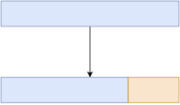

<!-- _class: lead-->

# 機械学習講習会 第六回
## - 「ニューラルネットワークの実装」


**traP アルゴリズム班 Kaggle部**
2023/7/3

---

<!-- _header: 振り返り -->

第一回: 学習
第二回: 勾配降下法
第三回: 自動微分
第四回: ニューラルネットワークの構造
第五回: ニューラルネットワークの学習と評価


## 第六回: ニューラルネットワークの実装

---

<!-- _header: 今日すること -->

- PyTorch を使って、実際にある情報を予測するニューラルネットワークを実装します
- データの読み込みから、モデルの構築、学習、予測までを一通りやってみます
- **お題として、今日から始めるコンペのデータを使います。**
  - <span class="lined">**1 Sub まで一気に行きます！！**</span> 


---


<!-- _header: コンペについて 〜 基本情報 ~ -->

<!-- - コンペサイト: [dacq-v2.trap.show](https://dacq-v2.trap.show/) -->
- お題: このあと発表
- 開始: 7/09 18:00~ よりサブミット可能
- 終了: 7/16 23:59:59 (JST) 
- サイト: [dacq-v2.trap.show](https://dacq-v2.trap.show/)


<div style="text-align: center;">

<span style="color: red;">**※ ⚠️ 注意事項があります！この後もちゃんと読んでください！**</span>
</div>

---

<!-- _header: コンペについて : DacQ -->

<br>

<br>

  < 部内データ分析コンペプラットフォームです. 

---

<!-- _header:  DacQ の使い方: Manual ページ-->

<br>


<div style="text-align: center;">


 < バグ報告待ってます.　(@abap34 の DM までお願いします)

稼働状況やバグのアナウンスは #event/workshop/machine-learning/system-announcement で


</div>


---

<!-- _header: Private LB と Public LB -->


⚠️コンペ期間中に見える LB は <span class="lined">**Public LB**</span> とよばれる <span class="dot-text">暫定スコア</span>　です. 

---


<!-- _header: Private LB と Public LB -->

期間中に見えるスコア $=$ 最終的なスコア　の場合...

1. 各行の値を変えたときのスコアを見ることで値を改善できてしまい不毛
2. 上振れを引くために、サブミットしまくるのが最適戦略になってしまい不毛

<div style="text-align: center;">

⇩

**コンペ中は暫定スコアを表示して、**
**最終結果は競技者が選んだサブミットに対して <span class="lined">裏で計算したスコア</span> を使う**


</div>


---

<!-- _header: Private / Public LB まとめ -->

<div style="text-align: center;">

<br>

運営があらかじめデータを 
Public 用 / Private 用に分割
↓
それぞれに対してスコアを計算し、Public Score だけが期間中見られる
↓
サブミットのうち数個を競技者が
期間中に選んでおき、
その Private Score で順位が決定


</div>

---

<!-- _header: DacQ における Private / Public LB -->

<span style="color: red;">**重要: DacQ では、最終スコアとして最後の 2つのサブミットが使われます。**</span>


---

<!-- _header: スコアの計算例 -->

<div class="columns">


| 投稿日 | Public Score | Private Score |
| --- | --- | --- |
| 7/17 | 0.7 | 0.9 |
| 7/16 | 0.9 | 0.8 |
| 7/14 | 0.99 | 0.95 |
| 7/13 | 0.6 | 0.7 |
| 7/12 | 0.5 | 0.6 | 

<div>

<br>

の場合、 Public LB の値は 

### 0.5→0.6→0.99→0.99→0.99 

Private LB に乗る値は

<div style="text-align: center;">


# **0.9**


</div>

</div>

</div>


<div style="text-align: center;">


<div class="box">

<span style="color: red;">**🚨 注意: 自信のある投稿を最後に再投稿することを忘れずに！！！！！！ 🚨**</span>

</div>


</div>

---

<!-- _header: 投稿に関する特別なルール -->


### 終了直前は、混雑によって <br> 投稿ができない可能性があります

<div style="text-align: center;">

⇩

</div>


1. なるべく余裕を持って提出してください
2. 次善策として、終了 3 時間前からに限り、 <span class="lined">**終了時刻前に @abap34 のDMへ送信されたものも提出として認めます**</span>


---


<!-- _header: 注意 -->

<span style="color: red;">**🚨最善を期しているつもりですが、不具合によって投稿データなどが失われる可能性があります。投稿ファイルは忘れずに、必ず手元にとっておいてください。🚨**</span>


---

<!-- _header: そのほかの細かいルールや注意事項について -->

<br>

<div style="text-align: center;">


<span style="color: red;">**Rules タブを、絶対に読んでください！！！　<br> 不明なことをしたくなったら @abap34 まで必ず連絡してください！**</span>

</div>


---

<!-- _header: 今回のコンペのお題 ~ あらすじ ~ -->

機械学習講習会用のオンラインジャッジを作った `@abap34` は困っていました。

攻撃はやめてくださいと書いてあるのに、ひっきりなしに攻撃が仕掛けられるからです。


部員の個人情報とサーバとモラルが心配になった `@abap34` は、飛んでくる通信について、機械学習を使って攻撃を試みる通信かどうかを判定することで、攻撃を未然に防ぐことにしました。

<br>


あなたの仕事は、これを高い精度でおこなえる機械学習モデルを作成することです。

<div class="cite">

※ 架空の話です
僕の知る限り、ジャッジサーバへの攻撃は今のところきていないです。 ご協力ありがとうございます。

</div>


---

<!-- _header: データ -->

通信ログから必要そうな情報を抽出したもの (<span class="lined">**詳細は Data タブから**</span>)

<div class="box">

- 接続時間
- ログイン失敗回数
- 過去2秒間の接続回数
- 特別なユーザ名 (`root`, `admin` `guest` とか) でログインしようとしたか？　

<div style="text-align: center;">


$\vdots$

</div>

</div>

---

<!-- _header: データ -->

<br>
<br>


- train.csv
  - 学習に使うデータ
- train_tiny.csv **(👈 時間と説明の都合上今日はこれを使います)**
  - 学習に使うデータの一部を取り出し、一部を削除
- test.csv
  - 予測対象のデータ
- test_tiny.csv **(👈 時間と説明の都合上今日はこれを使います)**
  - 予測対象のデータの欠損値を埋めて、一部のカラムを削除
- sample_suboldsymbolission.csv
  - 予測の提出方式のサンプル (値はでたらめ)


---


<!-- _header: 全体の流れ -->

1. データの読み込み
2. モデルの構築
3. モデルの学習
4. 新規データに対する予測
5. 順位表への提出


---

<!-- _header: 全体の流れ1 ~モデルに入力するまで -->

<br>
<br>

<div style="text-align: center;">

## 1-0. データのダウンロード

⇩

## 1-1. データの読み込み

⇩

## 1-2. データの前処理

⇩

## 1-2. PyTorchに入力できる形に

</div>

---

<!-- _header: 1-0. データのダウンロード -->

<div style="text-align: center;">

✅ セルに以下をコピペして実行

</div>

```bash
!curl https://www.abap34.com/trap_ml_lecture/public-data/train_tiny.csv -o train.csv
!curl https://www.abap34.com/trap_ml_lecture/public-data/test_tiny.csv -o test.csv
!curl https://www.abap34.com/trap_ml_lecture/public-data/sample_submission.csv -o sample_submission.csv
```


<div class="cite">

Jupyter Notebook では、先頭に `!` をつけることで、シェルコマンドを実行できます。

</div>

---


<!-- _header: 1-0. データのダウンロード -->


✅ 左の 📁 > train.csv, test.csv, sample_submission.csv で表が見えるようになっていたら OK！


---


<!-- _header: 1-1. データの読み込み -->


<div class="thm">

<div style="text-align: center;">

✅ `pd.read_csv(path)` で、`path` にあるcsvファイルを読み込める

</div>


</div>

```python
# pandas パッケージを `pd` という名前をつけてimport
import pandas as pd

# これによって、 pandas の関数を `pd.関数名` という形で使えるようになる
train = pd.read_csv("train.csv")
test = pd.read_csv("test.csv")
```


<div class="cite">


パスとは、コンピュータ上のファイルやフォルダへの経路のことです。
今回は、 train.csv と test.csv がノートブックと同じ階層にあるので、 train.csv と test.csv までの経路は、ファイル名をそのまま指定するだけで大丈夫です。
ほかにも、たとえば `../train.csv` と指定すると、ノートブックの一つ上の階層にある train.csv というファイルを読み込みます。


</div>

---

<!-- _header: 1-1. データの読み込み -->


<div class="cite">

<span class="lined">**セルに単に変数をかくと中身を確認できます！**</span>　(Jupyter Notebook の各セルは最後に評価された値を表示するため) 
さっとデバッグするときに便利です。中身がわからなくなったらとりあえず書いて実行してみましょう.

</div>

---

<!-- _header: 1-1. データの読み込み -->

<div style="text-align: center;">


今まで
⇩

</div>


```python
x = [1, 2, 3, 4, 5]
y = [2, 4, 6, 8, 10]

def loss(a):
...
```

<div style="text-align: center;">

⇩

今回も入力と出力 (の目標) にわけておく


</div>


---


<!-- _header: 1-1. データの読み込み -->

```python
train['カラム名']
```

で「カラム名」という名前の列を取り出せる 📝

<div style="text-align: center;">

⇩

</div>

今回の予測の目標は

```python
train['class']
```

<div style="text-align: center;">

⇩

</div>

---


<!-- _header: 1-1. データの読み込み -->


```python
train_y = train['class']
```

と入力して実行

⇨ **`train_y` に攻撃? or 通常? の列が入る🙌**


---

<!-- _header: 1-1. データの読み込み -->


機械学習モデルは <span class="dot-text">直接的には</span> 数以外は扱えないので、数に変換しておく.

```python
train_y = train['class'].map({
  'normal': 0,
  'attack': 1
})
```


---


<!-- _header: 1-1. データの読み込み -->

**逆に、モデルに入力するデータは、`train` から <span class="lined">さっきの列を除いたもの！**</span>
<span style="color: gray;">(と `id` を除いたもの) </span>

```python
train.drop(columns=['カラム名'])
```

を使うと、`train` から「カラム名」という名前の列を除いたものを取り出せる

<div style="text-align: center;">

⇩

今回は、 <span class="" style="font-size: 1.5em;">`train.drop(columns=['id', 'class'])`</span>

</div>


---

<!-- _header: 1-1. データの読み込み -->

セルに、

```python
train_x = train.drop(columns=['id', 'class'])
test_x = test.drop(columns=['id'])
```

と入力して実行

⇨ `train_x` にさっきの列と `id` を除いたもの、 `test_x` に `id` を除いたものが入る🙌


---


<!-- _header: 1-1. データの読み込み -->

### ✅ データの読み込みが完了!

<div class="def">

### 今の状況整理

- `train_x` $\cdots$ モデルに入力するデータ(接続時間、ログイン失敗回数、etc...)
- `train_y` $\cdots$  モデルの出力の目標(攻撃? 通常?)
- `test_x` $\cdots$ 予測対象のデータ


が入ってる

</div>


---

<!-- _header: 1-2. データの前処理 -->


✅ データをそのままモデルに入れる前に処理をすることで、
学習の安定性や精度を向上可能

(極端な例: 平均が $10^{18}$ の列があったらすぐオーバーフローしてしまうので、平均を引くなど)


今回は、各列に対して「<span class="dot-text">標準化</span>」をします


---

<!-- _header: 1-2. データの前処理 -->

<div class="def">

### 標準化

$$
\large x' = \dfrac{x - \mu}{\sigma} 
$$


<div style="text-align: center;">

( $\mu$ は平均, $\sigma$ は標準偏差)
</div>


</div>

1. 平均 $\mu_1$ のデータの全ての要素から $\mu_2$ を引くと、平均は $\mu_1 - \mu_2$
2. 標準偏差 $\sigma_1$ のデータの全ての要素を $\sigma_2$ で割ると、標準偏差は $\sigma_1/\sigma_2$
  
<div style="text-align: center;">

⇨ 標準化で <span class="lined">**平均を0、標準偏差を1**</span> にできる

</div>

<div class="cite">

初期化の際の議論を思い出すとこのようなスケーリングを行うことは自然な発想だと思います。
NN の入力の標準化については、 LeCun, Yann, et al. "E cient BackProp." Lecture Notes in Computer Science 1524 (1998): 5-50.　にもう少し詳しく議論が載っていたので気になる人は読んでみてください。

</div>

---

<!-- _header: 1-2. データの前処理 -->

✅ `scikit-learn` というライブラリの `StandardScaler` クラスを使うと、
簡単に標準化できる！

```python
# sklearn.preprocessing に定義されているStandardScalerを使う
from sklearn.preprocessing import StandardScaler

scaler = StandardScaler()

# 計算に必要な量 (平均、標準偏差) を計算
scaler.fit(train_x)

# 実際に変換
train_x = scaler.transform(train_x)
test_x = scaler.transform(test_x)
```

<div class="cite">

`scalar.fit` によって引数で渡されたデータの各列ごとの平均と標準偏差が計算され、`scalar` に保存されます。そして、`scalar.transform` によってデータが実際に標準化されます。勘がいい人は、「`test` に対しても `train_x` で計算した平均と標準偏差を使って標準化しているけど大丈夫なのか？」と思ったかもしれないですね。結論から言うとそうなのですが、意図しています。ここに理由を書いたら信じられないくらいはみ出てしまったので、省略します。興味がある人は「Kaggleで勝つデータ分析の技術」p.124 などを参照してみてください。

</div>

---


<!-- _header: 1-2. データの前処理 -->

```python
train_x
```

```python
test_x
```

などを実行してみると、確かに何かしらの変換がされている！ ✊
(ついでに、結果がテーブルから単に二次元配列 (`np.ndarray`) に変換されてる)


<div class="cite">

最初のテーブルっぽい情報を持ったまま計算を進めたい場合は、`train_x[:] = scaler.transform(train_x)`のようにすると良いです. 

</div>

---

<!-- _header: 1-2. データの前処理 -->

ので、`train_y` もここで中身を取り出して二次元配列にしておく。

1. `train_y.values` で 中身の値を取り出せる.
2. `arr.reshape(-1, 1)` で `arr` を $N \times 1$ の形に変換できる


```python
train_y = train_y.values.reshape(-1, 1)
```

<div class="cite">

`np.ndarray` のメソッド `reshape` はその名の通り、配列の形を変えるメソッドです。`-1` は「他の次元の要素数から自動的に決定する」という意味です。
例えば、 $3 \times 4$ の配列に対して `.reshape(-1, 2)` とすると $6 \times 2$ にしてくれます。


</div>


---


<!-- _header: 1-2. データの前処理 - バリデーション -->

<div style="text-align: center;">

## バリデーションのためにデータを分割しておく

<br>


</div>





<div class="cite">

バリデーションを前処理と呼ぶ人はまぁいないと思いますが、ここでやっておきます。

</div>

---

<!-- _header: 1-2. データの前処理 - バリデーション -->

`scikit-learn` の `train_test_split` を使うと、簡単にデータを分割できる！


```python
from sklearn.model_selection import train_test_split
train_x, val_x, train_y, val_y = train_test_split(train_x, train_y, test_size=0.3, random_state=34)
```


---

<!-- _header: 1-2. データの前処理 - バリデーション -->


<div class="box">

## `train_test_split` 関数による分割

`train_test_split(train_x, train_y, test_size=0.3, random_state=34)`

- `train_x`, `train_y`: 分割するデータ
- `test_size`: テストデータの割合
- `random_state`: <span class="lined">**乱数のシード**</span> **👈重要！！**


</div>

---


<!-- _header: 乱数シードを固定しよう！！ -->

<div style="text-align: center;">


乱数に基づく計算がたくさん

⇩

実行するたびに結果が変わって、
**めちゃくちゃ困る😥**

⇩

乱数シードを固定すると、
毎回同じ結果になって
<span class="dot-text">**再現性が確保 😄**</span>


</div>


<div class="cite">

実際はそんな素朴な世の中でもなく、環境差異であったり、並列計算、とくに GPU が絡んでくると単に乱数シードを固定するような見た目のコードを書いても実行毎に結果が変わりがちで、人は苦しんでいます。

</div>


---


<!-- _header: 1-2. データの前処理 - バリデーション -->


(`train_x`, `train_y`) を、学習データ:検証データ = 7:3 に分割


```python
from sklearn.model_selection import train_test_split
train_x, val_x, train_y, val_y = train_test_split(train_x, train_y, test_size=0.3, random_state=34)
```

結果を確認すると...


```python
train_x.shape
```

```python
val_x.shape
```

確かに 7:3 くらいに分割されていることがわかる

---

<!-- _header: 1-3. PyTorchに入力できる形に  -->


✅　**このあとこれらをPyTorchで扱うので、PyTorchで扱える形にする**


---
<!-- _header: 1-3. PyTorchに入力できる形に  -->

数として **Tensor型** を使って自動微分などを行う

```python
>>> x = torch.tensor(2.0, requires_grad=True)
>>> def f(x):
...     return x ** 2 + 4 * x + 3
... 
>>> y = f(x)
>>> y.backward()
>>> x.grad
tensor(8.)
```

( $f(x) = x^2 + 4x + 3$ の $x = 2$ における微分係数$8$)


⇨ **データをTensor型に直しておく必要あり**


---

<!-- _header: `Tensor` 型のつくりかた -->


<div class="box" style="border-width: 3px;">

## `torch.tensor(data, requires_grad=False)`

- `data`: 保持するデータ(配列**っぽい**ものならなんでも)
  - リスト、タプル、 <span style="color: red;">**Numpy配列**</span>, スカラ....
- `requires_grad`: 勾配 (gradient)を保持するかどうかのフラグ
  - デフォルトは `False`
  - 勾配の計算(自動微分)を行う場合は `True` にする 
  - このあとこいつを微分の計算に使いますよ〜という表明


</div>


---
<!-- _header: 1-3. PyTorchに入力できる形に  -->


<div style="text-align: center;">

⚠️ 我々が勾配降下法で使うのは、

### 各 **パラメータ** の損失に対する勾配

⇩

**入力データの勾配は不要なので `requires_grad=True` とする必要はないことに注意！**

</div>


---

<!-- _header: 1-3. PyTorchに入力できる形に  -->

## ✅　単にこれで OK！

```python
import torch

train_x = torch.tensor(train_x, dtype=torch.float32)
train_y = torch.tensor(train_y, dtype=torch.float32)
val_x = torch.tensor(val_x, dtype=torch.float32)
val_y = torch.tensor(val_y, dtype=torch.float32)
test = torch.tensor(test, dtype=torch.float32)
```

---

<!-- _header: 全体の流れ1 ~モデルに入力するまで -->

<br>
<br>

<div style="text-align: center;">

## ✅ 1-0. データのダウンロード

⇩

## ✅  1-1. データの読み込み

⇩

## ✅  1-2. データの前処理

⇩

## ✅  1-2. PyTorchに入力できる形に

</div>


---


<!-- _header: 全体の流れ -->

1. データの読み込み
2. モデルの構築
3. モデルの学習
4. 新規データに対する予測
5. 順位表への提出


---


<!-- _header: 2. モデルの構築-->


<div style="text-align: center;">

###### 今からすること... 


## $f(\boldsymbol{x}; \boldsymbol{\theta})$ をつくる


</div>


---


<!-- _header: 2. モデルの構築-->


<div class="box">


## torch.nn.Sequentialによるモデルの構築

**✅ `torch.nn.Sequential` を使うと、 <span class="dot-text">一直線</span> のモデルを簡単に定義できる.**


```python
import torch.nn as nn

model = nn.Sequential(
    nn.Linear(30, 32),
    nn.Sigmoid(),
    nn.Linear(32, 64),
    nn.Sigmoid(),
    nn.Linear(64, 1)
)
```


</div>

---


<!-- _header: 2. モデルの構築 ~ 二値分類の場合 -->


<div class="box">


## 二値分類の場合

⇨ 最後に **シグモイド関数** をかけることで出力を $[0, 1]$ の中に収める.


```python
import torch.nn as nn

model = nn.Sequential(
    nn.Linear(30, 32),
    nn.Sigmoid(),
    nn.Linear(32, 64),
    nn.Sigmoid(),
    nn.Linear(64, 1),
    nn.Sigmoid() # <- ここ重要！
)
```


</div>

---


<!-- _header: 2. モデルの構築-->

<div class="columns">

<div>

```python
import torch.nn as nn

model = nn.Sequential(
    nn.Linear(30, 32),
    nn.Sigmoid(),
    nn.Linear(32, 64),
    nn.Sigmoid(),
    nn.Linear(64, 1),
    nn.Sigmoid()
)
```

⇨ すでにこの時点でパラメータの初期化などは終わっている


</div>


<div>


**引数に層を順番に渡すことで、モデルを構築してくれる！**

👈 「全結合層($W \in \mathbb{R}^{30, 32}$) $\rightarrow$ シグモイド関数 $\rightarrow$ 全結合層 ($W \in \mathbb{R}^{32, 64}$) $\rightarrow$ シグモイド関数 $\rightarrow$ 全結合層($W \in \mathbb{R}^{64, 1}$)」
という MLP の定義


</div>


</div>

---


<!-- _header: 2. モデルの構築-->


`model.parameters()` または `model.state_dict()` で
モデルのパラメータを確認できる

```python
model.state_dict()
```

各全結合層のパラメータ ($W_i$, $\boldsymbol{b}_i$) が見える 👀 👉


---


<!-- _header: 2. モデルの構築 -->

**✅ 構築したモデルは、関数のように呼び出すことができる**

```python
import torch
dummy_input = torch.rand(1, 30)
model(dummy_input)
```

`torch.rand(shape)` で、形が `shape` のランダムな `Tensor` が作れる.


⇨ モデルに入力して計算できることを確認してみる！ 

(現段階では、乱数で初期化されたモデルに乱数を入力して、謎の出力が得られる(?))


---


<!-- _header: 2. モデルの構築 -->


<div style="text-align: center;">


## ✅ $f(\boldsymbol{x}; \boldsymbol{\theta})$ をつくる

⇩

### あとはこれを勾配降下法の枠組みで学習させる！


</div>


<div style="text-align: center;">
⇩

<br>

思い出すシリーズ　

## <span class="lined">確率的勾配降下法</span>

</div>

---


<!-- _header: 全体の流れ -->

1. ✅ データの読み込み
2. ✅  モデルの構築
3. モデルの学習
4. 新規データに対する予測
5. 順位表への提出


---

<!-- _header: 全体の流れ3. モデルの学習-->


<div style="text-align: center;">

## 3-1. 確率的勾配降下法の準備

⇩

## 3-2. 確率的勾配降下法の実装

</div>


---

<!-- _header:  確率的勾配降下法 -->

<div class="def">

## 確率的勾配降下法 (SGD)

データの **一部** をランダムに選んで、
そのデータに対する勾配を使ってパラメータを更新する


</div>


---

<!-- _header: 3-1. 確率的勾配降下法の準備 -->


整理: **我々がやらなきゃいけないこと**

👉 データをいい感じに選んで供給する仕組みを作る


---

<!-- _header: 3-1. 確率的勾配降下法の準備 -->


<div style="text-align: center;">

#  < 私がやろう


## ✅ `torch.utils.data.Dataset` と　`torch.utils.data.DataLoader`　を
## 使うと、簡単に実装できる！

</div>


<div class="cite">

を

</div>

---

<!-- _header: 3-1. 確率的勾配降下法の準備 -->

## 現状確認☝️

`train_x`, `train_y`, `val_x`, `val_y`, `test` にデータセットが `Tensor` 型で入っている


---

<!-- _header: 3-1. 確率的勾配降下法の準備 -->

### 1. Datasetの作成 (`Dataset`)
- データセット (データの入出力のペア $\mathcal{D} = \{(\boldsymbol{x}_i, y_i)\}$) を表現するクラス


---

<!-- _header: 3-1. 確率的勾配降下法の準備 -->


`TensorDataset` に

- モデルの入力データ(`train_x`)と
- 出力の目標データ(`train_y`)を渡すことで `Dataset` のサブクラスである `TensorDataset` が作れる！

```python
from torch.utils.data import TensorDataset

# データセットの作成

# 学習データのデータセット
train_dataset = TensorDataset(train_x, train_y)
# 検証データのデータセット
val_dataset = TensorDataset(val_x, val_y)
```


<div class="cite">

実際は `torch.utils.data.Dataset` を継承したクラスを作ることでも `Dataset` のサブクラスのオブジェクトを作ることができます。
この方法だと非常に柔軟な処理が行えるためこの方法が主流です。(今回は簡単のために `TensorDataset` を使いました。)


</div>


---

<!-- _header: 3-1. 確率的勾配降下法の準備 -->

### 1. DataLoaderの作成 (`DataLoader`)

- `Dataset`から一部のデータ (ミニバッチ) を取り出して供給してくれるオブジェクト


つまり....

<div class="proof">

整理: **我々がやらなきゃいけないこと**

👉 データをいい感じに選んで供給する仕組みを作る

</div>

をやってくれる

--- 

<!-- _header: 3-1. 確率的勾配降下法の準備 -->


### 1. DataLoaderの作成 (`DataLoader`)
- `Dataset`からミニバッチを取り出して供給してくれるオブジェクト

#### `DataLoader(dataset, batch_size=batch_size, shuffle=shuffle)`


```python
from torch.utils.data import DataLoader

batch_size = 32
train_dataloader = DataLoader(train_dataset, batch_size=batch_size, shuffle=True, drop_last=True)
val_dataloader = DataLoader(val_dataset, batch_size=batch_size, shuffle=False)
```

⇨ これを for文で回すことでデータを取り出すことができる

---


<!-- _header: 3-1. 確率的勾配降下法の準備 -->


<br>

### 1. DataLoaderの作成(`DataLoader`型)


```python
for inputs, targets in train_dataloader:
    print('inputs.shape', inputs.shape)
    print('targets.shape', targets.shape)
    print('-------------')
```

<div style="text-align: center;">


⇩

</div>

```python
inputs.shape torch.Size([32, 30])
targets.shape torch.Size([32, 1])
-------------
inputs.shape torch.Size([32, 30])
targets.shape torch.Size([32, 1])
...
```


---

<!-- _header: 3-1. 確率的勾配降下法の準備 -->


### ✅ DatasetとDataLoaderの作成

```python
from torch.utils.data import TensorDataset, DataLoader

# データセットの作成
train_dataset = TensorDataset(train_x, train_y)
val_dataset = TensorDataset(val_x, val_y)

# データローダの作成
batch_size = 32
train_dataloader = DataLoader(train_dataset, batch_size=batch_size, shuffle=True, drop_last=True)
val_dataloader = DataLoader(val_dataset, batch_size=batch_size, shuffle=False)
```

---


<!-- _header: 3-1. 確率的勾配降下法の準備 -->


整理: **我々がやらなきゃいけないこと**

👉 データをいい感じに選んで供給する仕組みを作る


<div style="text-align: center;">

## ✅ Done!

</div>

---

<!-- _header: 3.2 確率的勾配降下法の実装 -->

## ✅ データは回るようになった

⇨ あとは学習を実装すればOK！

### TODOリスト

1. 損失関数を設定する
2. 勾配の計算を行う
3. パラメータの更新を行う

---


<!-- _header: 3.2 確率的勾配降下法の実装: 損失関数の設定 -->

<br>
<br>


## 1. 損失関数は何のためにあるのか？


---

<!-- _header: 3.2 確率的勾配降下法の実装: 損失関数の設定 -->

今回の評価指標 👉 **正解率！**  

---

<!-- _header: 3.2 確率的勾配降下法の実装: 損失関数の設定 -->

今までは評価指標も損失関数も、すべて平均二乗和誤差だった


## 事実: $f(x)$ を最適化すると、 $f(x)$ が最適化できる。‼️‼️


⇨ 微分可能なので、損失関数を平均二乗誤差にすればよい.


---

<!-- _header: 3.2 確率的勾配降下法の実装: 損失関数の設定 -->

正解率は直接最適化できる？
# ⇨ <span style="color: red;">No!!</span> 

---

<!-- _header: 正解率の微分 -->

<br>


**パラメータを微小に変化させても
正解率は変化しない！**

⇨ 正解率は、

- **ほとんどの点で微分係数 $0$**
- **変わるところも微分不可能**

<div style="text-align: center;">

⇩
<span class="lined">**勾配降下法で最適化できない**</span>

</div>


<div class="cite">

右のグラフは、適当に作った二値分類をロジスティック回帰で解いたときのパラメータ平面上の正解率のプロットです。 ほとんど平坦 (勾配が $\boldsymbol{0}$) なのがよくわかると思います。

</div>

---

<!-- _header: 正解率を間接的に最適化する -->

### どうするか？

⇨ こういう分類を解くのに向いている損失関数を使って、間接的に正解率を上げる.


---

<!-- _header: Binary Cross Entropy Loss -->

<div class="def">

## 二値交差エントロピー損失 (Binary Cross Entropy Loss)

$$
\Large - \dfrac{1}{N} \sum_{i=1}^{N} \ y_i \log(\hat{y}_i) + (1 - y_i) \log(1 - \hat{y}_i)
$$

</div>


---


<!-- _header: Binary Cross Entropy Loss -->


<div class="box">

### 二値交差エントロピー損失 (Binary Cross Entropy Loss)

$$
- \dfrac{1}{N} \sum_{i=1}^{N} \ y_i \log(f(x_i)) + (1 - y_i) \log(1 - f(x_i))
$$

</div>

### 満たされていること

  <div style="text-align: center;">
  
  正解 $y_i$ と予測 $f(x_i)$ が近いほど、値は小さくなっている.

  ( $y_i \in \{0, 1\}$　なので、それぞれの場合について考えてみるとわかる)
   
  </div>


<div class="cite">

これもやはり、二乗和誤差のときと同様に同様に尤度の最大化として <span class="dot-text">導出</span> できます。

</div>

---

<!-- _header: Binary Cross Entropy Loss -->

## ✅ PyTorch では、 `torch.nn.BCELoss` で使える！

```python
import torch

criterion = torch.nn.BCELoss()

y = torch.tensor([0.0, 1.0, 1.0])
pred = torch.tensor([0.1, 0.9, 0.2])

loss = criterion(pred, y)
print(loss)   # => tensor(0.6067)
```  


---


<!-- _header: 3.2 確率的勾配降下法の実装 -->

### TODOリスト

☑️ 1. 損失関数を設定する
2. 勾配の計算を行う
3. パラメータの更新を行う

---

<!-- _header: 3.2 確率的勾配降下法の実装 -->

# 2. 勾配の計算を行う

<br>

<div style="text-align: center;">

やりかたは....？

</div>

---


<!-- _header: 3.2 確率的勾配降下法の実装 -->


定義→計算→backward(),   定義→計算→backward(),   定義→計算→backward(), 定義
定義→計算→backward(),   定義→計算→backward(),   定義→計算→backward(), 定義
定義→計算→backward(),   定義→計算→backward(),   定義→計算→backward(), 定義
定義→計算→backward(),   定義→計算→backward(),   定義→計算→backward(), 定義
定義→計算→backward(),   定義→計算→backward(),   定義→計算→backward(), 定義
定義→計算→backward(),   定義→計算→backward(),   定義→計算→backward(), 定義
定義→計算→backward(),   定義→計算→backward(),   定義→計算→backward(), 定義
定義→計算→backward(),   定義→計算→backward(),   定義→計算→backward(), 定義
定義→計算→backward(),   定義→計算→backward(),   定義→計算→backward(), 定義
定義→計算→backward(),   定義→計算→backward(),   定義→計算→backward(), 定義
定義→計算→backward(),   定義→計算→backward(),   定義→計算→backward(), 定義
定義→計算→backward(),   定義→計算→backward(),   定義→計算→backward(), 定義
定義→計算→backward(),   定義→計算→backward(),   定義→計算→backward(), 定義
定義→計算→backward(),   定義→計算→backward(),   定義→計算→backward(), 定義
定義→計算→backward(),   定義→計算→backward(),   定義→計算→backward(), 定義
定義→計算→backward(),   定義→計算→backward(),   定義→計算→backward(), 定義
定義→計算→backward(),   定義→計算→backward(),   定義→計算→backward(), 定義
定義→計算→backward(),   定義→計算→backward(),   定義→計算→backward(), 定義


---


<!-- _header: 損失に対するパラメータの勾配の計算例 -->

<br>


```python
# ここから
model = nn.Sequential(
    nn.Linear(30, 32),
    ...
)
# ここまでが "定義"

dummy_input = torch.rand(1, 30)
dummy_target = torch.rand(1, 1)

# "計算"
pred = model(dummy_input)
loss = criterion(pred, dummy_target)

# "backward()"
loss.backward()
```


---


<!-- _header: 3.2 確率的勾配降下法の実装 -->

### ✔︎ チェックポイント 
1. `loss` に対する勾配を計算している

```python
# backward
loss.backward()
```
2. 勾配は **パラメータ** に対して計算される

```python
for param in model.parameters():
    print(param.grad)
```

(`dummy_input`, `dummy_target`は`requires_grad=False`なので勾配は計算されない)


---


<!-- _header: 3.2 確率的勾配降下法の実装 -->

### TODOリスト

☑️ 1. 損失関数を設定する
☑️ 2. 勾配の計算を行う
3. パラメータの更新を行う


---

<!-- _header: 3.2 確率的勾配降下法の実装 -->

```python
for epoch in range(epochs):
    for inputs, targets in train_dataloader:
        # 計算
        outputs = model(inputs)
        loss = criterion(outputs, targets)

        # backward
        loss.backward()

        # -----------------------
        # ....
        # ここにパラメータの更新を書く
        # ....
        # -----------------------
```


---


<!-- _header: 3.2 確率的勾配降下法の実装 -->

これまでは、我々が手動(?)で更新するコードを書いていた

# ⇨  < 私がやろう


## ✅ torch.optimのオプティマイザを使うことで、簡単にいろいろな最適化アルゴリズムを使える


---


<!-- _header: 3.2 確率的勾配降下法の実装 -->

<br>
<br>


**(⚠️: 完成版ではない)**
 
```python
optimizer = optim.SGD(model.parameters(), lr=lr)

# 学習ループ
for epoch in range(epochs):
    for inputs, targets in train_dataloader:
        # 勾配の初期化
        optimizer.zero_grad()
        # 計算
        outputs = model(inputs)
        loss = criterion(outputs, targets)

        # backward
        loss.backward()
        
        # パラメータの更新
        optimizer.step()
```

---


<!-- _header: 3.2 確率的勾配降下法の実装 -->

<div class="def">

✅ **`optimizer = optim.SGD(params, lr=lr)` のようにすることで、 `params` を勾配降下法で更新するオプティマイザを作成できる！ (`lr` は学習率)**

</div>

ほかにも、たとえば Adam が使いたければ `optimizer = optim.Adam(params, lr=lr)` とするだけでOK！

<div style="text-align: center;">

⇩

</div>

勾配を計算したあと、 `optimizer.step()`　を呼ぶと、各 `Tensor` に載っている勾配の値を使ってパラメータを更新してくれる。

---


<!-- _header: 3.2 確率的勾配降下法の実装 -->

⚠️ 注意点

`optimizer.step()` で一回パラメータを更新するたびに
`optimizer.zero_grad()` で勾配を初期化する必要がある！

(これをしないと前回の`backward` の結果が残っていて、おかしくなる。)

---


⇩ 次のページ...

# 学習の全体像を貼ります！！！


---


<!-- _header: 3.2 確率的勾配降下法の実装 -->

<br>
<br>

```python
from torch import nn


model = nn.Sequential(
    nn.Linear(30, 32),
    nn.Sigmoid(),
    nn.Linear(32, 64),
    nn.Sigmoid(),
    nn.Linear(64, 1),
    nn.Sigmoid()
)

optimizer = torch.optim.SGD(model.parameters(), lr=1e-2)
criterion = torch.nn.BCELoss()

n_epoch = 100
for epoch in range(n_epoch):
    running_loss = 0.0

    for inputs, targets in train_dataloader:
        # 前の勾配を消す
        optimizer.zero_grad()

        # 計算
        outputs = model(inputs)
        loss = criterion(outputs, targets)

        # backwardで勾配を計算
        loss.backward()

        # optimizerを使ってパラメータを更新
        optimizer.step()

        running_loss += loss.item()

    val_loss = 0.0
    with torch.no_grad():
        for inputs, targets in val_dataloader:
            outputs = model(inputs)
            loss = criterion(outputs, targets)
            val_loss += loss.item()

    # エポックごとの損失の表示
    train_loss = running_loss / len(train_dataloader)
    val_loss = val_loss / len(val_dataloader)
    print(f'Epoch {epoch + 1} - Train Loss: {train_loss:.4f} - Val Loss: {val_loss:.10f}')
```

---


<!-- _header: 各行の解説 (for文以降) -->


- 1行目. `for epoch in range(n_epoch)` .... データ全体を `n_epoch` 回まわす
- 2行目. `running_loss = 0.0` .... 1エポックごとの訓練データの損失を計算するための変数
- 4行目. `for inputs, targets in train_dataloader` .... 訓練データを1バッチずつ取り出す(`DataLoader`の項を参照してください！)
- 6行目. `optimizer.zero_grad()` .... 勾配を初期化する。二つ前のページのスライドです！
- 9, 10行目.  `outputs = ...` .... 損失の計算をします。

---

<!-- _header: 3.2 確率的勾配降下法の実装 -->

- 13行目. `loss.backward()` .... 勾配の計算です。これによって`model`のパラメータに **損失に対する** 勾配が記録されます
- 16行目. `optimizer.step()` .... `optimizer`が記録された勾配に基づいてパラメータを更新します。
- 18行目. `running_loss += loss.item()` .... 1バッチ分の損失を`running_loss`に足しておきます。
  
- 20行目~25行目. 1エポック分の学習が終わったら、検証データでの損失を計算します。検証用データの内容は、学習に影響させないので勾配を計算する必要がありません。したがって、`torch.no_grad()`の中で計算します.

---


<!-- _header: 3.2 確率的勾配降下法の実装 -->

- 28行目〜30行目. 1エポック分の学習が終わったら、訓練データと検証データの損失を表示します。`len(train_dataloader)`は訓練データが何個のミニバッチに分割されたかを表す数、`len(val_dataloader)`は検証データが何個のミニバッチに分割されたかを表す数です。
  
- 32行目. 損失を出力します。

---


<!-- _header: 3.2 確率的勾配降下法の実装 -->

### TODOリスト

☑️ 1. 損失関数を設定する
☑️ 2. 勾配の計算を行う
☑️  3. パラメータの更新を行う

---

<!-- _header: バリデーション -->

バリデーションデータで、今回の評価指標である正解率がどのくらいになっているか計算しておく！

👉 これがテストデータに対する予測精度のめやす.


---

<!-- _header: バリデーション -->

1. $0.5$ 以上なら異常と予測する.

```python
val_pred = model(val_x) > 0.5
```

2. `torch.Tensor` から `numpy.ndarray` に変換する

```python
val_pred_np = val_pred.numpy().astype(int)
val_y_np = val_y.numpy().astype(int)
```


2. `sklearn.metrics` の `accuracy_score` を使って正解率を計算する

```python
from sklearn.metrics import accuracy_score
accuracy_score(val_y_np, val_pred_np) # => (乞うご期待)
```

---

<!-- _header: 3. 学習が完了！！！ -->

<br>

### \+ オプション　 学習曲線を書いておこう

1. 各エポックの損失を記録する配列を作っておく

```python
train_losses = []
val_losses = []
```

1. 先ほどの学習のコードの中に、損失を記録するコードを追加する

```python
train_loss = running_loss / len(train_dataloader)
val_loss = val_loss / len(val_dataloader)
train_losses.append(train_loss) # これが追加された
val_losses.append(val_loss)　# これが追加された
print(f'Epoch {epoch + 1} - Train Loss: {train_loss:.4f} - Val Loss: {val_loss:.10f}')
```

(各 エポックで正解率も計算すると、より実験がしやすくなる！)

---

<!-- _header: 3. 学習が完了！！！ -->

<br>

#### \+ オプション　 学習曲線を書いておこう

`matplotlib` というパッケージを使うことでグラフが書ける

```python
# matplotlib.pyplot を pltという名前でimport
import matplotlib.pyplot as plt
```

```python
plt.plot(train_losses, label='train')
plt.plot(val_losses, label='val')
plt.legend()
plt.xlabel('epoch')
plt.ylabel('loss')
plt.show()
```

⇨ いい感じのプロットが見れる.


---


<!-- _header: 全体の流れ -->

1. データの読み込み
2. モデルの構築
3. モデルの学習
4. 新規データに対する予測
5. 順位表への提出

---


<!-- _header: 4. 新規データに対する予測 -->

## そういえば 💡

`test` に予測したい未知のデータが入っている


```python
model(test)
```

⇨ 予測結果が出る

---


<!-- _header: 5. 順位表への提出 -->


```python
import csv

def write_pred(predictions, filename='submit.csv'):
    pred = predictions.squeeze().tolist()
    assert set(pred) == set([True, False])
    pred_class =  ["attack" if x else "normal" for x in pred]
    sample_submission = pd.read_csv('sample_submission.csv')
    sample_submission['pred'] = pred_class
    sample_submission.to_csv('submit.csv', index=False)
```

をコピペ
→ 

---

<!-- _header:  5. 順位表への提出 -->

予測結果 (`True`, `False` からなる `Tensor`)

```python
pred = model(test_x) > 0.5
```

を作って、

```python
write_pred(pred)
```

すると、

---

<!-- _header:  5. 順位表への提出 -->

📂 > submit.csv

ができる！

👉 ダウンロードして、 submit から投稿！ <span class="lined">**順位表に乗ろう!**</span>


---

<!-- _class: lead -->
<!-- _header: 5. 順位表への提出 -->

# めざせ　No.1！


