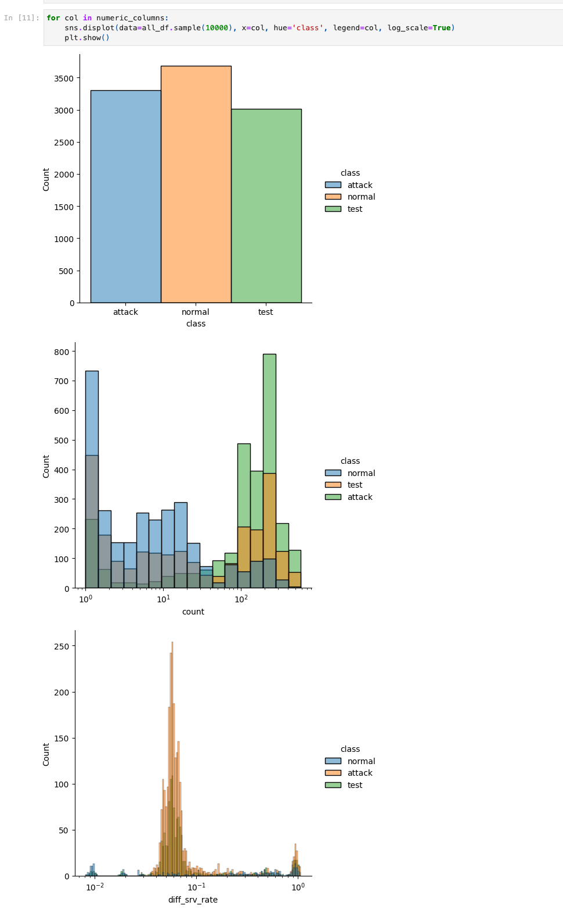
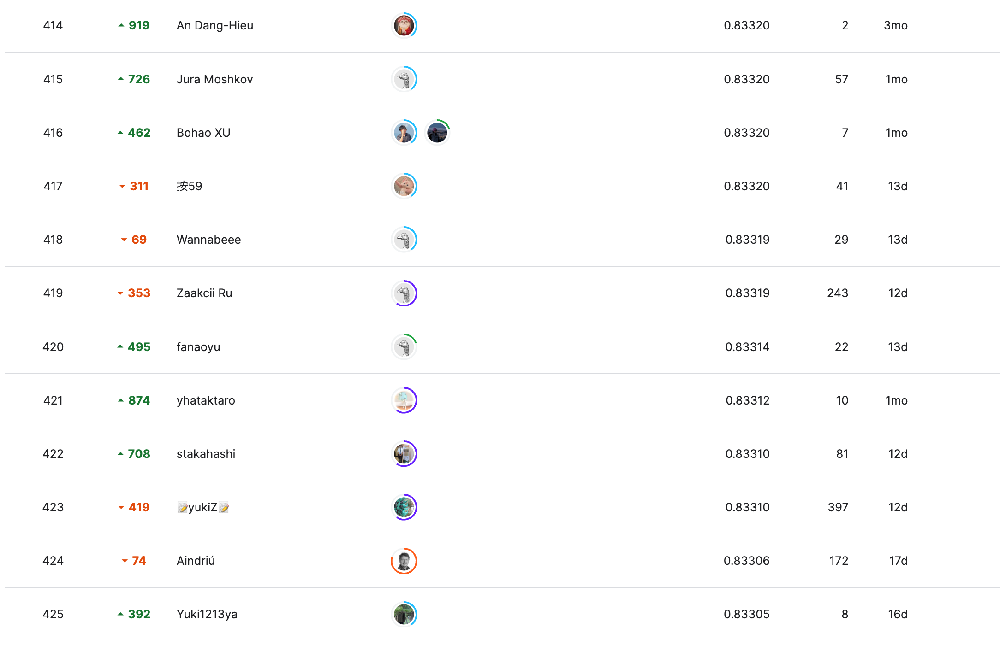
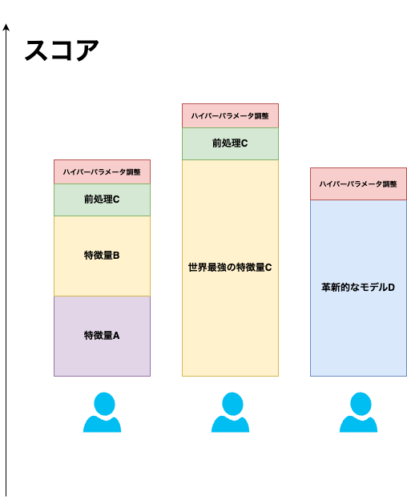

<!-- _class: lead-->

# 機械学習講習会 第七回
## - 「機械学習の応用,データ分析コンペ」

**traP Kaggle班**
2024/07/17

---

<!-- _header: 今日の内容 -->    

- **コンペの結果発表　🥳**
- データ分析コンペという競技について
- ポエム

---

<!-- _header: まずは -->

# # コンペの結果発表　🥳

 

⇨ https://abap34.github.io/ml-lecture/supplement/competetion-result.html

 

 
---

<!-- _header: データ分析コンペという競技について -->

Q. 今回のコンペでどんな取り組み方をしましたか？

---

<!-- _header: コンペの戦い方 1.EDA -->

✅ データ分析コンペにおける勝敗を分けるポイントのひとつ

# ⇨ データへの 理解度

---

<!-- _header: コンペの戦い方 1.EDA -->

あたり前に確認すべきこと...

1. データはどのくらいあるのか？
2. どういう形式なのか？

\+ **どのような情報が予測に役立つのか？**

---

<!-- _header: EDA: 探索的データ分析 (Exploratory Data Analysis) -->

## EDA: 探索的データ分析 (Exploratory Data Analysis)

事前に仮説やモデルを仮定せず,データの特徴や構造を理解する分析.

例) データの分布,欠損値の確認,各変数の組の相関係数　などなど...

---

<!-- _header: EDA: 今回のコンペを例に -->

## ものすごく簡単な例: ([abap34.com/ml-lecture/supplement/EDA.html](https://abap34.github.io/ml-lecture/supplement/EDA.html))

---

<!-- _header: コンペの戦い方 2.バリデーションについて -->

## Trust Your CV  ... <ruby>CV<rp>(</rp><rt>Cross  Validation</rt><rp>)</rp></ruby> を信じよという有名な信仰.

---

<!-- _header: バリデーション -->

Q. Public LeaderBoard に大量の提出を繰り返すとどうなる？

⇨ Public LB でのスコアが上振れる.

Q. するとどうなる？

## ⇨ **shake**  で死ぬ.

---

<!-- _header: shake  -->

# **shake** 
### Public LB と Private LB の順位が大きく異なる現象

写真はつい先日終わった Learning Agency Lab - Automated Essay Scoring 2.0 というコンペの順位表です. こちらのリンク (https://kaggle.com/competitions/learning-agency-lab-automated-essay-scoring-2/leaderboard) から見れます.恐怖. 

---

<!-- _header: shake の波を乗り切るにはどうするか？ -->

 

### ✅ Public LB に振り回されないために

1. スコアのブレの程度を把握しておく
   1. テストと同じくらいのサイズのバリデーションデータをとり,そのスコアのブレを見るなど
   2. **Public Score の上振れを引いても Private Score は上がらないので CV を上げることに専念**
2. バリデーションデータとテストデータの分布の乖離に気を付ける
   1. たいていのコンペでは参加者同士が CV と LB のスコアを比較するディスカッションが立っていがち. **これを必ず 確認する！**
   2. 分布の違いの原因を調べて, よりテストデータに近いバリデーションデータを作る方法を考える (例: adversarial validation)

---

<!-- _header: Public LB との向き合い方 -->

ただ, Public LB も 重要な情報

**👀 (ふつうの) 機械学習の枠組みでは絶対見られないテストスコアの一部が見られる**

⇩　以下のケースでは Public LB も **重要なスコアの指針**

1. Public LB 用のデータが学習データと同じ分布で同程度のサイズ 
2. 時系列で学習データとテストデータが分割されている
   1. Public / Private 間はランダムに分割 ← とくに重要な指針になる
   2. Public / Private も時系列で分割

---

<!-- _header: コンペの戦い方 3. ハイパーパラメータの調整 -->

**ハイパーパラメータ(学習率, 木の深さ, ... などの学習時の設定) の調整は大事！**　
だけど

## ⚠️ 最初からハイパーパラメータの調整に時間をかけすぎない ⚠️ 

---

<!-- _header: ハイパーパラメータの調整 -->

 

 

✅ **ハイパーパラメータの調整は決定的な差別化ポイントになりづらい！**

⇨ 調整はそこそこに
- データの理解
- 特徴量エンジニアリング

に時間を費やすのが　🙆

(もちろん, 確実にスコアを上げられる手段なので**終盤にはちゃんと調整**する)

---

<!-- _header:  テーブルコンペの全体的な流れ -->

1. まず与えられたデータに対して EDA を行い, データの基本的な性質や予測に役立つ情報を把握する
2. 信頼できるバリデーションの仕組みを構築する
3. 特徴量エンジニアリングを行い, 学習
4. 提出
5. ディスカッションを参考にしつつ, スコアの信頼性などを確かめる.終盤ならハイパーパラメータの調整などをしても良いかも.   
6. 3 に戻る↩︎

---

<!-- _header: ポエム -->

- この講習会で扱わなかったこと

---

<!-- _header: この講習会で扱わなかったこと -->
 
> **この講習会は機械学習の洞窟を全て探検することを目指しているのではなく、一旦ガイド付きで洞窟の最深部まで一気に駆け抜けることで二回目以降の探検をしやすくすることを目指しています。**

(前がきより)

---

<!-- _header: この講習会で扱わなかったこと -->

 

**✅　機械学習の世界はめちゃくちゃ広い！**

関連する
- 数学
- コンピュータサイエンス

の話題もたくさん (本当にたくさん)

解ける面白い問題もたくさん！

⇨ **必ず興味があるものに遭遇するはず!**

## **⇨ Kaggle 班で色々やりましょう！お疲れ様でした！**
