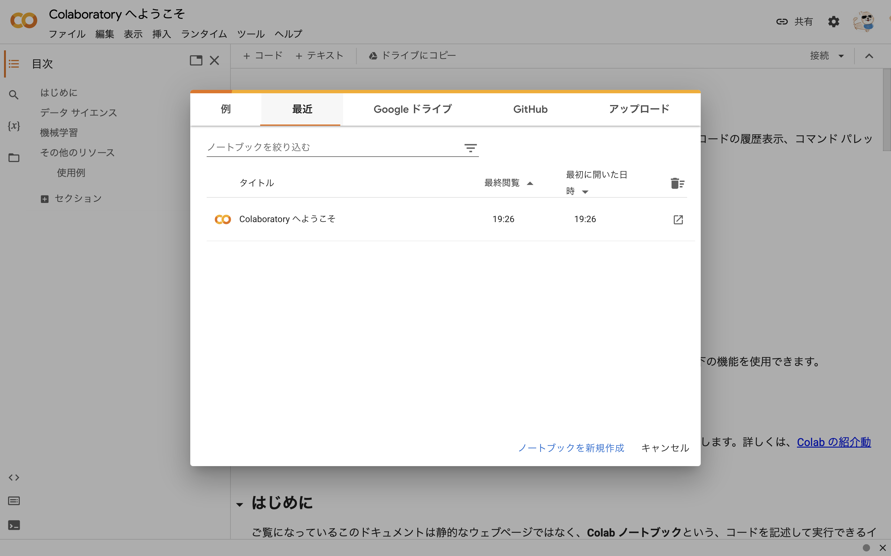
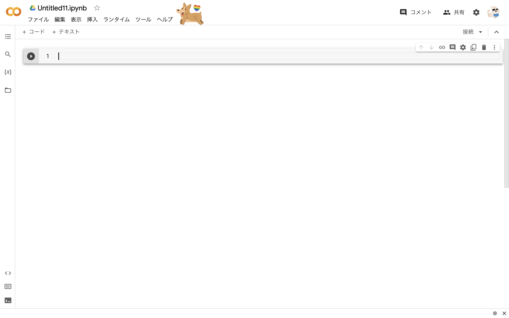

## 環境構築について
この講習会では、基本的に Python を使うことを想定しています。

また多くの場合、対話的な Python の実行環境である Jupyter Notebook を使うと便利な場面が多いです。

ここでは、環境構築にあまり慣れていない人むけに Google Colaboratory というサービスを使ってこれらを利用する方法を紹介します。

### Google Colaboratory の使い方

まずは、 [https://colab.research.google.com/?hl=ja](https://colab.research.google.com/?hl=ja) にアクセスしてみてください。


このような画面が出てきたかと思います。
まずは、右上の青い「ログイン」を押してください。




するとこのような画面になると思うので、
次に真ん中のポップアップの下にある青い文字の「ノートブックを新規作成」をクリックしてください。




このような画面になっていれば成功です！

それでは次にこの画面の意味や JupyterNotebook そのものについて見ていきます。
この画面は開いたままにして、次へ進んでください！

### Jupyter Notebook とは

いきなり馴染みのない画面に飛ばされて困惑している人もいるかもしれないですが、ひとまずこれが何者なのか確かめようと思います。

まず、先ほどの画面の「1」と書いてあるところの右をクリックしてみてください。
入力可能になっているかと思います。


そこに　`print('Hello Jupyter!')` と書き、左の再生ボタンをクリックしてみましょう。
(初めてこれをクリックした場合は、接続が入って少し待たされますが正常なのでじっと待ってください)


`Hello Jupyter` と表示されました！
いうまでもなく、これは Python のコードを実行した結果です。

このように、 JupyterNotebook では、
この入力可能な欄に Python のプログラムの書き込み、実行ができます。

もう少し進めてみましょう。
まずは、次の入力欄に次のようなコードを書きます。

`weather = '晴れ'`

これを実行して、そのまた次の入力欄に

`print('今日の天気は' + weather)` と書き、実行してみます。


すると、`今日の天気は晴れ` と表示されました。

このように、 Jupyter Notebook の各欄では変数などが共有されていて、全体として一つのプログラムのように振舞います。

それぞれの入力欄のことを「セル」と呼びます。つまり、今回は三つのセルに分けてコードを書いたわけです。

今後 JupyterNotebook を使い倒すことになると思うので、
色々なプログラムの実装を試してみて慣れておくとスムーズにいきそうです。


### なぜ Jupyter Notebook を使うのか？
他の言語の実行方法や、競技プログラミングに取り組んでいる人などからすると、"通常の" 実行方式、つまり
「ファイル作成 → `python {ファイル名}.py` 」 という方法を使えばいいじゃないか、と思うかもしれません。

しかし、 Jupyter Notebook はデータ分析・機械学習をに関わる多くのエンジニア・研究者にとって**必須**のツールになっています。

利点はさまざまありますが、簡単には次のようなところが支持されていると思います。

#### 1. 処理を簡単に切り分けられる
データ分析、機械学習は試行錯誤が多い作業です。

Jupyter Notebook を使うと、セルごとに処理を切り分けることで極めて簡単に試行錯誤をする
部分を小さくしていくことができます。

#### 2. データの可視化が簡単
これはその目で確かめるのがいいと思います。

次のコードを貼り付けて実行してみてください。

```python
import seaborn as sns
import matplotlib.pyplot as plt

sns.set(style="whitegrid", context="talk", palette="viridis")
titanic = sns.load_dataset('titanic')
plt.figure(figsize=(14, 8))

histplot = sns.histplot(data=titanic, x='age', hue='survived', multiple='stack', palette='viridis', kde=True)

plt.title('Age Distribution of Titanic Passengers', fontsize=20, fontweight='bold')
plt.xlabel('Age', fontsize=16)
plt.ylabel('Count', fontsize=16)
plt.legend(title='Survived', labels=['Not Survived', 'Survived'], fontsize=14, title_fontsize=16)
plt.grid(True, linestyle='--', linewidth=0.7, alpha=0.7)
plt.gca().set_facecolor('#f0f0f0')

plt.show()
```

真下に、なかなか綺麗なグラフが表示されると思います。

Jupyter Notebook は各セルの出力としてテキストだけでなく画像なども表示でき、対話的にデータを確認するのに非常に便利です。
(ちなみに、このグラフは有名なタイタニック号沈没事故の乗客の年齢分布を生存者と非生存者で比較したものです)


Jupyter Notebook をうまく活用して、データ分析や機械学習の作業を効率的に進めていきましょう。
