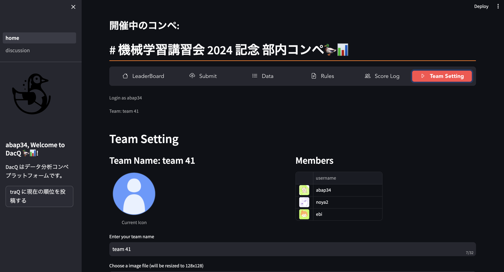
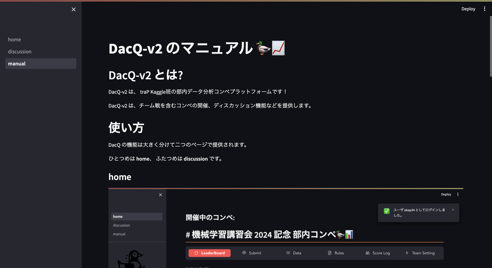
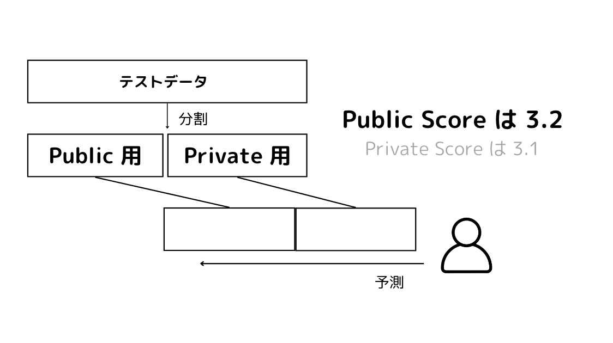
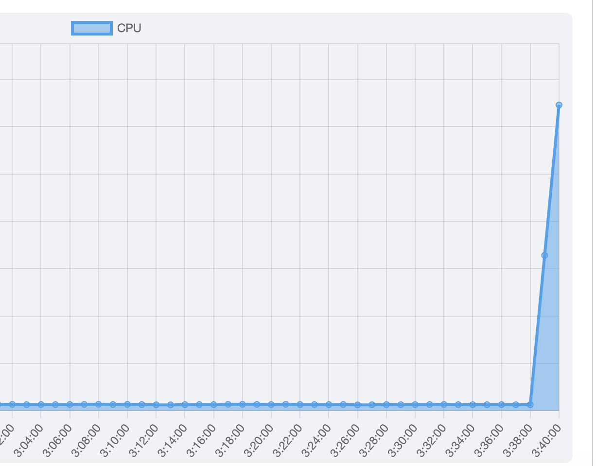
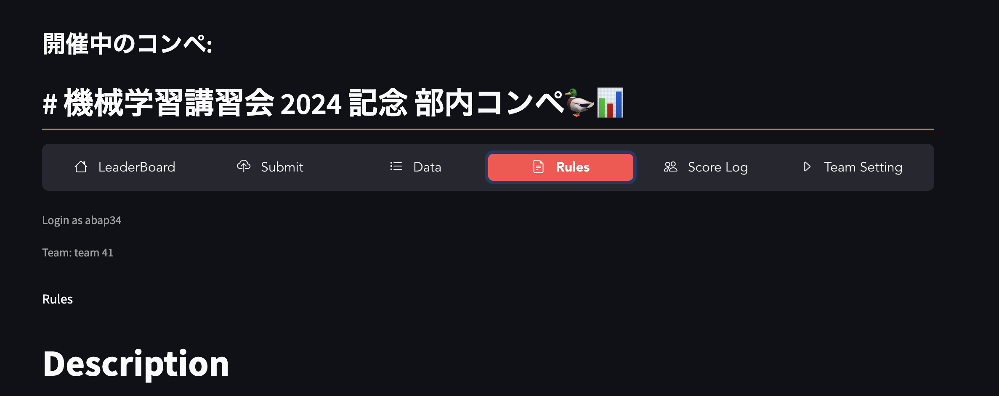

<!-- _class: lead -->

# コンペのルールについて

---

<!-- _header: コンペについて 〜 基本情報 ~ -->

- お題: このあと発表
- 開始: 7/09 18:00~ よりサブミット可能
- 終了: 7/16 23:59:59 (JST) 
- サイト: [dacq.abap34.com](https://dacq.abap34.com/)

**※ ⚠️ 注意事項があります！この後もちゃんと読んでください！**

---

<!-- _header: コンペについて : DacQ -->

 

 

  < データ分析コンペプラットフォームです. 

---

<!-- _header:  DacQ の使い方: Manual -->

 
 

**✅ サイドバーにある 「Manual」**
**から使い方を確認できます！**

(バグ報告は @abap34 の 
DM までお願いします)
稼働状況やバグのアナウンスは
#event/workshop/machine-learning/system-announcement でしています

---

<!-- _header: Private LB と Public LB -->

⚠️コンペ期間中に見える LB は **Public LB** とよばれる 暫定スコア　です. 

---

<!-- _header: Private LB と Public LB -->

期間中に見えるスコア $=$ 最終的なスコア　の場合...

1. 各行の値を変えたときのスコアを見ることで値を改善できてしまい不毛
2. 上振れを引くために、サブミットしまくるのが最適戦略になってしまい不毛

⇩

**コンペ中は暫定スコアを表示して**
**最終結果は競技者が選んだサブミットに対して 裏で計算したスコア を使う**

---

<!-- _header: Private / Public LB まとめ -->

 

運営があらかじめデータを 
Public 用 / Private 用に分割
↓
それぞれに対してスコアを計算しPublic Score だけが期間中見られる
↓
サブミットのうち数個を競技者が
期間中に選んでおき
その Private Score で順位が決定

---

<!-- _header: DacQ における Private / Public LB -->

**重要: DacQ では最終スコアとして最後の 2つのサブミットが使われます。**

---

<!-- _header: スコアの計算例 -->

| 投稿日 | Public Score | Private Score |
| --- | --- | --- |
| 7/17 | 0.7 | 0.9 |
| 7/16 | 0.9 | 0.8 |
| 7/14 | 0.99 | 0.95 |
| 7/13 | 0.6 | 0.7 |
| 7/12 | 0.5 | 0.6 | 

 

の場合、 Public LB の値は 

### 0.5→0.6→0.99→0.99→0.99 

Private LB に乗る値は

# **0.9**

**🚨 注意: 自信のある投稿を最後に再投稿することを忘れずに！！！！！！ 🚨**

---

<!-- _header: 投稿に関する特別なルール -->

### 終了直前は、混雑によって   投稿ができない可能性があります

⇩

1. なるべく余裕を持って提出してください
2. 次善策として、終了 3 時間前からに限り、 **終了時刻前に @abap34 のDMへ送信されたものも提出として認めます**

---

<!-- _header: 注意 -->

**🚨最善を期しているつもりですが、不具合によって投稿データなどが失われる可能性があります。投稿ファイルは忘れずに、必ず手元にとっておいてください。🚨**

---

<!-- _header: そのほかの細かいルールや注意事項について -->

 

**Rules タブを、絶対に読んでください！！！　  不明なことをしたくなったら @abap34 まで必ず連絡してください！**

