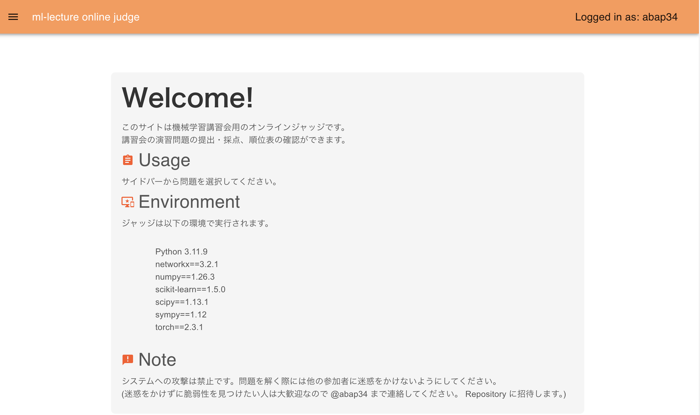
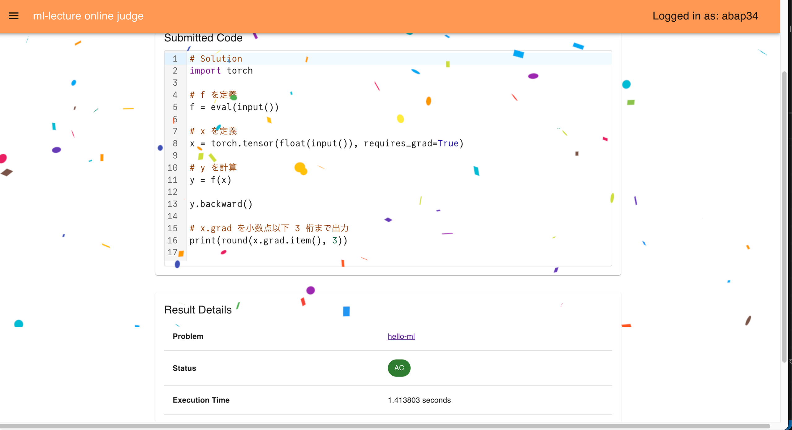
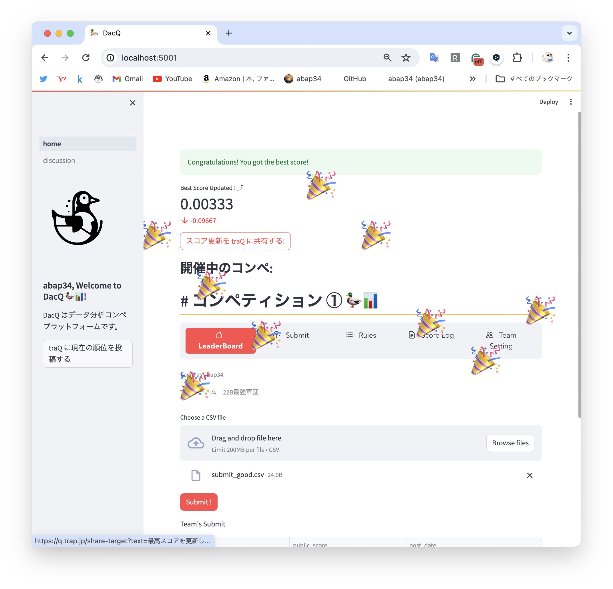

このページは、[東京工業大学デジタル創作同好会traP Kaggle班](https://trap.jp/kaggle/) の主催する、「機械学習講習会」 の資料です。　

## 機械学習講習会の目標
  
機械学習は、理論とそれを実際に動かすプログラムの二つが密接に結びついて成り立っています。

この講習会では、「理論だけで実際に問題解決の手段としては使えない」、あるいは「ライブラリの使い方をなぞるだけで背景は何も理解していない」とならないよう、
実装も理屈もバランスよく扱い、

1. **はじめて見た問題に対して、機械学習を使ってアプローチできるようになる**
2. **今後、機械学習のさまざまな手法を学ぶときに基礎になる力をつける**

ことを目指します。　

逆に、次のようなことは目標にしていません。

1. **機械学習のさまざまな手法を網羅的に学ぶ**
2. **性能向上のための繊細なテクニックや実装技法を身につける**

機械学習は非常に多くの手法、側面を持つ分野なので、全7回の講習会で全てを網羅しようとすると、
おそらくどれもよくわからないまま終わってしまいます。

そのため、この講習会ではとくに一部の題材をしっかりめに取り上げることで機械学習の基本的なアイデアを理解することにしています。
(ひとつの手法をきちんと理解できれば他の手法が学びやすくなると考えているからです) 

つまり、
**この講習会は機械学習の洞窟を全て探検することを目指しているのではなく、一旦ガイド付きで洞窟の最深部まで一気に駆け抜けることで二回目以降の探検をしやすくすることを目指しています。**

そして、とくに取り上げる題材としては 「ディープラーニング」 を選びました。

ディープラーニングは、インパクトのある成果を次々生み出している、
機械学習の中でも特に注目されている手法です。　

おそらく講習会に参加する人も興味がある人が多いと思います。

やはり興味があるものを学ぶのが一番楽しいと思うので、この講習会ではディープラーニングをとくに取り上げて、それを通じて機械学習の面白さを体験してもらえればと思います。

  
  **機械学習は、数学とコンピュータサイエンスの力を使って鮮やかに問題を解決することができる、**
  
  **とても面白い分野です。**

  **全7回、楽しんで頑張りましょう💪**

## 具体的な内容について

この講習会は以下のような構成です。

- 第一回 6/24 : 学習 
- 第二回 6/25 : 勾配降下法
- 第三回 6/28 : 自動微分とPyTorch 
- 第四回 7/01 : ニューラルネットワークの構造
- 第五回 7/03 : ニューラルネットワークの学習と評価
- 第六回 7/04 : ニューラルネットワークの実装 
- 第七回 7/12 : 機械学習の応用、データ分析コンペ

全体の流れとしては、まずは機械学習の枠組みを理解し、それに必要なアルゴリズムを学んだのち、
ニューラルネットワークについて詳しく扱い、具体的な実装までできるようにするつもりです。

## 演習問題とコンペ
#### 1. オンラインジャッジシステムについて
最初に書いたように、機械学習アルゴリズムを実際に使うには実装に習熟する必要があります。
(つまり、手を動かしてほしいです！)

そこでこの講習会のためのオンラインジャッジシステムを開発しました。

この講習会で扱ったアルゴリズムや、主要な機械学習に関連するパッケージの使用方法に関連する問題を用意しているので、
学んだことの実践の場として活用してください。

(更新予定: 講習会が終了次第、開発したオンラインジャッジシステムはOSSとして公開する予定です)

#### コンペについて
機械学習講習会で学んだ内容の実践の場として、最終課題としてデータ分析コンペを開催します。

このコンペは 3人チームで参加してもらう予定です。

上位チームには賞品を用意しています。

(更新予定: 講習会が終了次第、開発したコンペプラットフォームはOSSとして公開する予定です)

## 謝辞
この資料は、 [@abap34](https://x.com/abap34) が2023年度に作成したスライドを文字起こししたものです。

作成にあたり、多くの方に助言をいただきました。

とくに、資料の議論・チェックに協力していただいた東京工業大学情報理工学院情報工学系博士後期課程の @YumizSui さん (大上研究室)　と　前田航希さん (岡崎研究室, @Silviase) にお礼申し上げます。

内容についてのご指摘は [@abap34](https://x.com/abap34) までご連絡ください。

この講習会資料は [almo](https://github.com/abap34/almo) によって作成されました。

